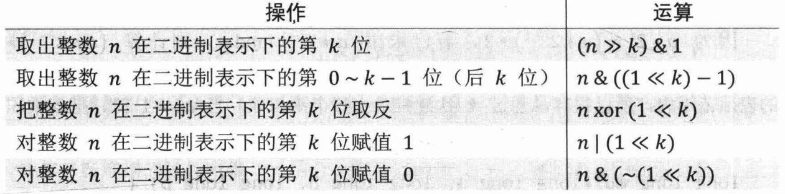

# 1. 魔法数值 0x3F

`0x3F3F3F3F`是一个很有用的数值，它是满足以下两个条件的大最整数：

- 整数的两倍不超过 `0x7FFFFFFF`，即`int`能表示的最大整数；
- 整数的每8位(每个字节)都是相同的。

我们在程序设计中经需要常使用`memset(a，val，sizeof(a))`初始化一个`int`数组`a`，该语句把数值`val(0x00~0xFF)`填充到数组`a`的每个字节上，而1个`int`占用4个字节，所以用`memset`只能赋值出“每8位都相同”的`int`。

综上所述，`0x7F7F7F7F`是用`memset`语句能初始化出的最大数值。不过当需要把一个数组中的数值初始化成正无穷时,为了避免加法算术上溢或繁琐的判断,我们经常用`memset(a，6x3f，sizeof(a))`给数组赋`0x3F3F3F3F`的值来代替。该语句在后续节章的参考程序中将会多次出现。

# 2. 移位运算

## 2.1 习题1: a^b

求 $a$ 的 $b$ 次方对 $p$ 取模的值，其中 $1 \le a,b,p \le 10^9$。

## 2.2 习题2：64位整数乘法

求 $a$ 乘 $b$ 对 $p$ 取模的值，其中 $1 \le a,b,p \le 10^{18}$。

注意，由于不存在一个可供强制转换的128位整数类型，所以需要一些特殊的处理办法。

# 3. 二进制状态压缩

二进制状态压缩，是指将一个长度为 $m$ 的 `bool` 数组用一个 $m$ 位二进制整数表示并存储的方法。利用下列位运算操作可以实现原 `bool` 数组中对应下标元素的存取。



这种方法运算简便，并且节省了程序运行的时间和空间。当 $m$ 不太大时，可以直接用使一个整数类型存储。当 $m$ 较大，时可以使若干用个整数类型(`int` 数组)，也可以直接利用 C++STL 为我们提供的 `bitset` 实现(第0x71节)。

熟悉了运算符优先级后可以省去一些括号


## 3.1 二进制枚举子集

通常，二进制状态压缩会和二进制枚举子集方法一起使用。

### 3.1.1 第一种方法

举个例子，假如要枚举`{1, 2, 3, 4, 5}`的所有子集，首先我们知道，其子集个数为 $2^5$ 个，也即从`00000`到`11111`共32个。有一个基本技巧，假设一个二进制数为`num`，我们只需要将`num`和`1 << j`进行`与（&）`操作，就能判断`num`的第`j`位数字是否为1。

```java
// 给定集合nums: [1, 2, 3]
int n = nums.length;
List<List<Integer>> res = new ArrayList<>();
// 大小为n的集合子集可用1 << n 种二进制数值表示, 取值区间为[0, 1 << n)
for (int i = 0; i < (1 << n); i++) { 
    List<Integer> list = new ArrayList<>();
    for (int j = 0; j < n; j++) {  
        if ((i & 1 << j) != 0) {   // 表示下标为j的元素是否被选取
            list.add(nums[j]);
        }
    }
    res.add(list);
}
```

### 3.1.2 第二种方法

假设我们有一个用二进制数`x`表示的集合（某一位为1代表集合含有对应元素，反之则代表集合中不含对应元素），我们应该如何来枚举它的子集？朴素的想法是，枚举所有小于等于该数的二进制数，逐个检查当前枚举到的`y`其是否是`x`的子集。而下面给出了一个最优解：

```java
for (int j = x; j; j = (j - 1) & x) {
        // ...
}
```

`j = (j - 1) & x` 将`j` 减1 后，把`j`最右边的1变成了0，然后把之后所有的0变成了1，再与`x` 求 `&`，就保证了得到的结果是`x`的子集，并且是小于前一个j的二进制数中最大的一个。利用这一方式，我们可以倒序枚举出`x`的所有子集，并且中间不会经过任何不合法的状态。

如果我们对`n`个元素的所有子集进行子集的枚举，下面的两重循环可以在$O(3^n)$的时间复杂度内完成。

```shell
for (int i = 1; i < (1 << n); ++i) {
    for (int j = i; j; j = (j - 1) & i) {
        // ...
    }
}
```

## 3.2 习题3：最短 Hamilton 路径

给定一张 $n(n \le 20)$ 个点的带权无向图，点从 $0 \sim n-1$ 标号，求起点0到终点 $n-1$ 的最短 Hamilton 路径。

Hamilton 路径定义的是从0到 $n-1$ 不重不漏地经过每个点恰好一次。 

## 3.3 习题4：起床困难综合症

一个boss的防御战线由 $n$ 扇防御门组成，其中第 $i$ 扇防御门的属性包括一个运算 $op_i$ 和一个参数 $t_i$，运算一定是 OR、XOR、AND 中的一种，参数是非负整数。

在未通过这扇防御门时攻击力为 $x$，则通过这扇防御门后攻击力将变为 $x\ op_i\ t_i$。最终boss受到的伤害玩家为初始的攻击力 $x_0$，依次经过所有 $n$ 扇防御门后得到的攻击力。

由于水平有限，玩家的初始攻击力只能为 $[0,m]$ 之间的一个整数。玩家希望通过选择合适的初始攻击力，使他的攻击能造成最大的伤害，求这个伤害值。

数据范围：$n \le 10^5，0 \le m,t_i \le 10^9$。

# 4. 成对变换 

通过计算可以发现，对于非负整数 `n`:

- 当 `n` 为偶数时，`n xor 1` 等于 `n+1`。
- 当 `n` 为奇数时，`n xor 1` 等于 `n-1`。

因此 ，“0 与 1”“2 与 3”“4 与 5”… 关于 `xor 1` 运算构成**“成对变换”**。 

这一性质经常用于图论邻接表中边集的存储。在具有无向边(双向边)的图中把一对正反方向的边分别存储在邻接表数组的第`n`与`n+1`位(其中`n`为偶数)，就可以通过`xor 1`的运算获得当前与边`(x,y)`反向的边`(y,x)`的存储位置。详细应用我们将讲解在邻接表(第0x13节)时给出。

# 5. lowbit 运算 

`lowbit(n)` 定义为非负整数`n`在二进表示制下“最低位的1及其后边所有的0”构成的数值。例如`n=10`的二进表示制为$(1010)_2$，则 $\mathrm{lowbit(n)}=2=(10)_2$。下面我们来推导`lowbit(n)`的公式。

设 `n>0`, `n` 的第 `k` 位是1，第 `0~k-1` 位都是0。

为了实现lowbit运算，先把 `n` 取反，此时第 `k` 位变为0，第 `0~k-1` 位都是1。再令 `n=n+1`，此时因为进位，第 `k` 位变为1,第 `0~k-1` 位都是0。

在上面的取反加1操作后，`n` 的第 k+1 到最高位恰好与原来相反，所以 `n & (~n+1)` 仅有第 k 位为1其余位都是0。而在补码表示下，`~n = -n-1`，因此:
$$
\mathrm{lowbit(n)} = n\&(\sim n+1) = n\&-n
$$
lowbit运算配合Hash(第0x14节)可以**找出整数二进制表示下所有是1的位**，所花费的时间与1的个数同级。为了达到这一目的，我们只需不断把 `n` 赋值为 `n = n - lowbit(n)`，直至 `n=0`。

例如 $n=9=(1001)_2$，则 `lowbit(9)=1` 。把 `n` 赋值为 $9-\mathrm{lowbit(9)}=8=(1000)_2$，则$\mathrm{lowbit(8)}=8=(1000)_2$。此时 `8-lowbit(8)=0`，停止循环。在整个过程中我们减掉了1和8两个数，它们恰好是 `n` 每一位上的1后面补0得到的数值。取1和8的对数 $\log_21$ 和 $\log_28$，即可得知 `n` 的第0位和第3位是1。

值得指出的是，lowbit运算也是树状数组(第0x42节)中的一个基本运算。

## 5.1 快速计算 2 次幂的指数

因为C++math.h库的 `log` 函数是以e为底实数的运算，并且复杂度常数较大，所以我们需要预处理一个数组，通过Hash的方法代替log运算。当 `n` 较小时，最简单直接的方法是建立一个数组 `H`，令 $H[2^k] = k$，如下面的程序所示。

```c++
const MAX_N = 1 << 20;
int H[MAX_N + 1];
for (int i = 0; i <= 20; i++) {
    H[1<<i] = i;
}

while (cin >> n) {
    while (n > 0) {
        cout << H[n & -n] << ' ';
        n -= n & -n;
    }
    cout << endl;
}
```

稍微复杂但效率更高的方法是建立一个长度为37的数组 `H`，令 $H[2^k\mod 37] = k$。这里利用了一个小的数学技巧: $\forall k \in [0,35]$，$2^k\mod 37$ 互不相等，且恰好取遍整数1~36。修改之后的程序为:

```c++
int H[37];
for (int i = 0; i < 36; i++) {
    H[(1LL << i) % 37] = i;
}

while (cin >> n) {
    while (n > 0) {
        cout << H[(n & -n) % 37] << ' ';
        n -= n & -n;
    }
    cout << endl;
}
```

# 6. 其他

## 6.1 n & (n - 1)

除了 `n - lowbit(n)`，还有一种能快速去除 `n` 二进制最后一个1的方法是 `n = n & (n - 1)`。

[LeetCode 338. 比特位计数](https://leetcode-cn.com/problems/counting-bits/)

## 6.2 异或技巧

[LeetCode 136. 只出现一次的数字](https://leetcode-cn.com/problems/single-number/)

[LeetCode 137. 只出现一次的数字 II](https://leetcode-cn.com/problems/single-number-ii/)

[LeetCode 260. 只出现一次的数字 III](https://leetcode-cn.com/problems/single-number-iii/)

## 6.3 分治算法

[LeetCode 190. 颠倒二进制位](https://leetcode-cn.com/problems/reverse-bits/)

[LeetCode 191. 位1的个数](https://leetcode-cn.com/problems/number-of-1-bits/)

## 6.4 前/后缀思想

[LeetCode 201. 数字范围按位与](https://leetcode-cn.com/problems/bitwise-and-of-numbers-range/)

[LeetCode 421. 数组中两个数的最大异或值](https://leetcode-cn.com/problems/maximum-xor-of-two-numbers-in-an-array/)

# 题解

## 习题1: a^b

根据数学常识，每一个正整数可以唯一表示为若干指数不重复的2的次幂的和。也就是说，如果 $b$ 在二进制表示下有 $k$ 位，其中第 $i(0 \le i < k)$ 位的数字是 $c_i$，那么:
$$
b = c_{k-1}2^{k-1} + c_{k-2}2^{k-2} + \cdots + c_02^0
$$
于是：
$$
a^b = a^{c_{k-1}2^{k-1}} * a^{c_{k-2}2^{k-2}} * \cdots * a^{c_02^0}
$$
因为 $k = \lceil \log_2(b+1) \rceil$，所以上式乘积项的数量不多于 $\lceil \log_2(b+1) \rceil$ 个。又因为 : 
$$
a^{2^i} = (a^{2^{i-1}})^2
$$
所以我们很容易通过  $k$ 次递推求出每乘积个项，当 $c_i = 1$ 时，把该乘积项累积到答案。$b\ \&\ 1$ 运算可以取出在二进制表示下的最低位，而 $b >> 1$ 运算可以舍去最低位，在递推的过程中将二者结合，就可以遍历 $b$ 在二进制表示下的所有数位 $c_i$。这就是快速幂算法，整个算法的时间复杂度为 $O(\log_2b)$。

```java
public int power(int a, int b, int p) {
    long aPowB = 1 % p;
    for (long aPow = a; b > 0; b >>= 1, aPow = aPow * aPow % p) {
        if ((b & 1) == 1) {
            aPowB = aPowB * aPow % p;
        }
    }

    return (int) aPowB;
}
```

注意，为了防止数字溢出，需要进行强制类型转换，从而得到正确的结果。有关取模运算的性质参见[这个链接](https://baike.baidu.com/item/%E5%8F%96%E6%A8%A1%E8%BF%90%E7%AE%97/10739384)。

## 习题2：64位整数乘法

### 方法1

类似练习题1的做法，把整数 $b$ 展开为 $k$ 位的表示：
$$
b = c_{k-1}2^{k-1} + c_{k-2}2^{k-2} + \cdots + c_02^0
$$
于是可得：
$$
a * b = a * c_{k-1}2^{k-1} + a* c_{k-2}2^{k-2} + \cdots + a* c_02^0
$$
因为 $a* 2^i = (a* 2^{i-1})* 2$，若已求出 $a* 2^{i-1}\mod p$，则计算 $(a* 2^{i-1})* 2 \mod p$ 时，运算过程中每一步结果的都超过不 $2*10^{18}$，仍然在64位整数的表示范围内，所以容易很通过 $k$ 次递推求出每个乘积项。当 $c_i=1$ 时，把该乘积项累加到答案中即可。时间复杂度为 $O(\log_2b)$。

```java
public long multi(long a, long b, long p) {
    long aMultiB = 0;
    for (; b > 0; b >>= 1, a = (a * 2) % p) {
        if ((b & 1) == 1) {
            aMultiB = (aMultiB + a) % p;
        }
    }

    return aMultiB;
}
```

### 方法2

利用 $a * b \mod p = a * b - \lfloor a * b / p \rfloor * p$。

首先 , 当 $a,b < p$ 时，$a * b/p$ 向下取整以后一定也小于 $p$。浮点数可以容纳非常大的数，我们可以用浮点数执行 $a * b/p$ 的运算，而不用关心小数点之后的部分。浮点类型 `long double` 在 c++ 中是 12 字节，在十进制下的有效数字有18~19位，足够胜任。当浮点数精度的足以不保存精确数值时，它会像科学计数法一样舍弃低位，正好符合我们的要求。

另外 , 虽然 $a * b$ 和 $\lfloor a * b / p \rfloor * p$ 可能很大，但是二者的差一定在 $0 \sim p-1$ 之间，我们只关心它们较低的若干位即可。所以，我们可以用 `long` 来保存 $a * b$ 和 $\lfloor a * b / p \rfloor * p$ 各自的结果。整数运算溢出相当于舍弃高位，也正好符合我们的要求。

```c++
long long multi(long long a,long long b){
    a %= p, b %= p;
    long long c = (long double) a * b / p; 
    long long ans = a*b - c*p;
    if (ans < 0) ans += p;
    else if (ans >= p) ans -= p;
    return ans;
}
```

## 习题3：最短 Hamilton 路径

很容易想到本题的一种“朴素”做法，就是枚举 $n$ 个点的全排列，计算路径长度取最小值，时间复杂度为 $O(n*n!)$，使用下面的二进状态制压缩DP可以优化到 $O(n^2*2^n)$。关于状态压缩动态规划，我们将在第0x56节详细讲解。

在任意时如何刻表示哪些点已经被经过,哪些点没有被经过?可以使用一个 $n$ 位二进制数，若其第 $i$ 位$(0\le i<n)$为1，则表示第 $i$ 个点已经被经过，反之未被经过。在任意时刻还需要知道当前所处的位置,因此我们可以使用 $F[i,j] (0\le i < 2^n,0 \le j < n)$ 表示“点被经过的状态”对应的二进制数为 $i$，且目前处于点 $j$ 时的最短路径。

在起点时，有 $F[1,0]=0$，即只经过了点0($i$ 只有第0位为1)，目前处于起点0，最短路长度为0。方便起见，我们将 $F$ 数组其他的值设为无穷大。最终目标是 $F[(1<<n)-1,n-1]$,即经过所有点($i$ 的所有位都是1),处于终点 $n-1$ 的最短路。

在任意时刻，有公式：
$$
F[i,j] = \min(F[i\ \mathrm{xor}\ 1<<j,k]+a[k,j])\\
其中\ 0 \le k < n\ 且\ (i\ \mathrm{xor}\ 1<<j) >> k \& 1 = 1 \\并且 ((i>>j)\&1)=1
$$
即当前时刻“被过经的点的状态”对应的二进制数为 $i$，处于点 $j$。因为 $j$ 只能恰好被经过一次，所以一定是刚刚经过的，故在上一时刻“被经过的点的状态”对应的二进制数的第 $j$ 位应该赋值为0，也就是 $i\ \mathrm{xor}\ (1<<j)$（当然 $i \& (\sim(1<<j))$ 也可以）。另外，上一时刻所处的位置可能是 $i\ \mathrm{xor}\ (1<<j)$ 中任意一个是1的数位 $k$，从 $k$ 走到 $j$ 需经过 $a[k,j]$ 的路程，可以考虑所有这样的 $k$ 取最小值。这就是该公式的由来。

```java
// 预先分配所需空间
private static final int[][] dp = new int[1 << 20][20];

public int shortestPath(int[][] a) {
    final int n = a.length;
    int statusLen = 1 << n;
    for (int i = 0; i < statusLen; i++) {
        for (int j = 0; j < n; j++) {
            dp[i][j] = 0x3f3f3f3f;
        }
    }
    dp[1][0] = 0;

    for (int i = 2; i < statusLen; i++) {
        for (int j = 0; j < n; j++) {
            if ((i & 1 << j) == 0) {
                continue;
            }
            for (int k = 0; k < n; k++) {
                if (((i ^ 1 << j) & 1 << k) == 0) {
                    continue;
                }
                dp[i][j] = Math.min(dp[i][j], dp[i ^ (1 << j)][k] + a[k][j]);
            }
        }
    }

    return dp[statusLen - 1][n - 1];
}
```

## 习题4：起床困难综合症

位运算的主要特点之一是**在二进表示制下不进位**。正因如此,在 $x_0$ 可以任意选择的情况下，参与位运算的各个位(bit)之间是独立无关的。换言之,对于任意的 $k(0 \le k < 30)$，“ans的第 $k$ 位是几”只与“$x_0$ 的第 $k$ 位是几”有关，与其他位无关。所以我们可以从高位到低位，依次考虑 $x_0$ 的每一位填0还是填1。也就是说下面我们根据 op 和 t 反推出最佳的 $x_0$。

$x_0$ 的第 $k$ 位应该填1，当且仅当同时满足下列两个条件：

1. 已经填好的更高位构成的数值上加 $1<<k$ 以后不超过 $m$。
2. 用每个参数的第 $k$ 位参与位运算。若初值为1，则 $n$ 次运算位后结果为1;若初值为0，则 $n$ 次运算位后结果为0。

如果不满足上述条件，要么填1会超过 $m$ 的范围，要么填1不如填0更优。这种情况下令 $x_0$ 的第 $k$ 位为0显然更好。确定 $x_0$ 的每一位以后，自然可以得到ans的值。

```java
public int attack(String[] op, int[] t, int m) {
    int x0 = 0, ans = 0;
    for (int bit = 29; bit >= 0; bit--) {
        int res0 = calc(op, t, bit, 0);
        int res1 = calc(op, t, bit, 1);
        if (x0 + (1 << bit) <= m && res0 < res1) {
            x0 += 1 << bit;
            ans += res1 << bit;
        } else {
            ans += res0 << bit;
        }
    }

    return ans;
}

/**
 * 计算某个 bit 位上的数字 now 和 op、t 进行运算后得到的位。
 */
private int calc(String[] op, int[] t, int bit, int now) {
    for (int i = 0; i < op.length; i++) {
        int x = t[i] >> bit & 1;
        if ("AND".equals(op[i])) {
            now &= x;
        } else if ("OR".equals(op[i])) {
            now |= x;
        } else {
            now ^= x;
        }
    }
    return now;
}
```

