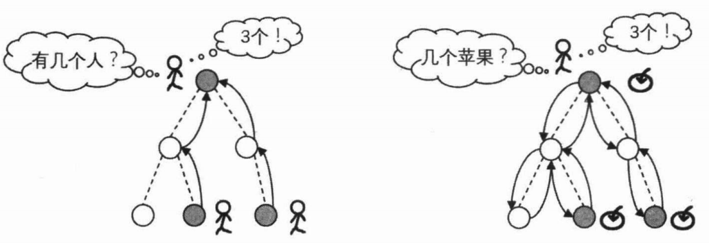
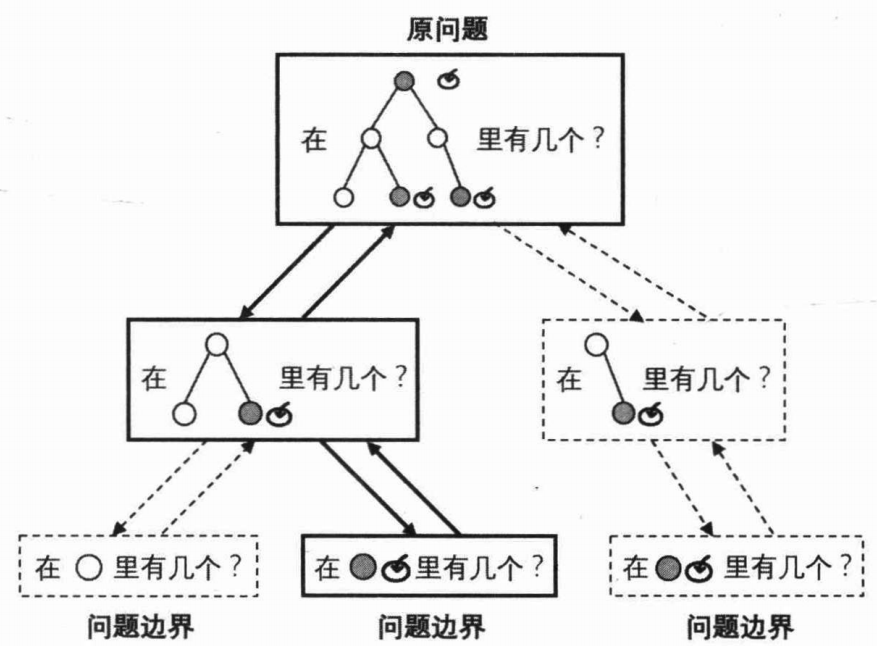
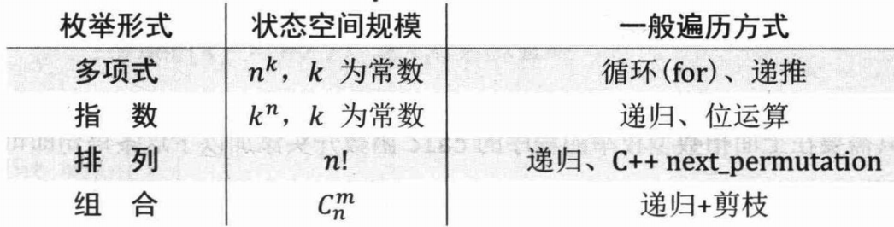
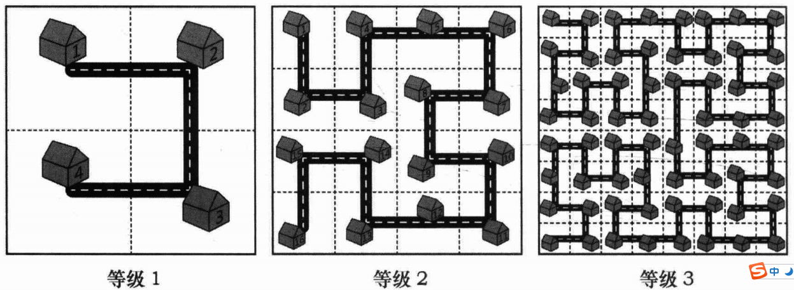

# 1. 递推与递归的宏观描述 

一个实际问题的各种可能情况构成集合的通常称为“状态空间”，而程序的运行则是对于状态空间的遍历，算法和数据结构则通过划分、归纳、提取、抽象来帮助提高程序遍历状态空间的效率。递推和递归就是程序遍历状态空间的两种基本方式。

对于一个待求解的问题，当它局限在某处边界、某个小范围或者某特殊种情形下时，其答案往往是已知的。如果能够将该解答的应用场景扩大到原问题状态的空间,并且扩展过程的每个步骤具有相似性，就可以考虑使用递推或者递归求解。

以已知的“问题边界”为起点向“原问题”正向推导的扩展方式就是递推。然而在很多时候,推导的路线难以确定,这时以“原问题”为起点尝试寻找状态把空间缩小到己知的“问题边界”的路线,再通过该路线反向回溯遍历的方式就是递归。我们通过下页两幅图表示来递推与递归的差别。



我们刚才也提到，使用递推或递归要“求原问题”与“问题边界”之间的每个变换步骤具有相似性,这样我们才能够设计一段程序实现这个步骤,将其重复作用于问题之中。换句话说,程序在每个步骤上应该面对相同种类的问题,这些问题都是原问题的一个子问题,可能仅在规模或者某些限制条件上有所区别,并且能够使用“求解原问题的程序”进行求解。

对于递归算法,有了上面这个前提,我们就可以让程序在每个变换步骤中执行三个操作:

1. 缩小问题状态空间的规模。这意味着程序尝试寻找在“原问题”与“问题边界”之间的变换路线，并正在向探索的路线上迈出一步。
2. 尝试求解规模缩小以后的问题，结果可能是成功，也可能是失败。
3. 如果成功，即找到了规模缩小后的问题的答案，那么答案将扩展到当前问题。如果失败，那么重新回到当前问题,程序可能继续会寻找当前问题的其他变换路线,直至最终确定当前问题无法求解。

在以上三个操作中有两点颇为关键。

1. 一是“如何尝试求解规模缩小以后的问题”。因为规模缩小以后的问题是原问题的一个子问题,所以我们可以把它视为一个新的“原问题”由相同的程序(上述三个操作)进行求解，这就是所谓的“**自身调用自身**”。
2. 二是如果求解子问题失败,程序需要重新到回当前问题去寻找其他变换的路线,因此把当前问题缩小为子问题时所做的对当前问题状态产生影响的事情应该全部失效，这就是所谓的“**回溯时还原现场**”。

上面这类程序就是“递归”的遍历方式，其整体流程如下页图所示。



可以看到，递归程序的基本单元是由“缩小”“求解”“扩展”组成的一种变换步骤,只是在“求解”时因为问题的相似性,不断重复使用了这样一种变换步骤,直至在已知问题的边界上直接确定答案。对于其中任意一条从“原问题”到“问题边界”的变换路线(图中实线圈出的路径)，横向来看，它的每一层是一次递归程序体的执行；纵向来看,它的左右两边分别是寻找路线和沿其推导的流程。为了保证每层的“缩小”与“扩展”能够衔接在同一形式的问题上，“求解”操作自然要保证在执行前后程序面对问题的状态是相同的，这也就是“还原现场”的必要性所在。

# 2. 递推与递归的简单应用

在使用枚举算法蛮力探索问题的整个“状态空间”时，经常需要递归。按照规模大小，有如下几种常见的枚举形式和遍历方式:



“多项式”型的枚举在程序设计中随处可见。上一节中最短Hamilton路径问题的朴素做法，是一种“排列”型的枚举。本节下面的例题“费解的开关”中的枚举则是一种“指数”型的枚举。

## 2.1 递归的小诀窍

递归代码最重要的两个特征：结束条件和自我调用。自我调用是在解决子问题，而结束条件定义了最简子问题的答案。

```c
int func(传入数值) {
  if (终止条件) return 最小子问题解;
  return func(缩小规模);
}
```

**明白一个函数的作用并相信它能完成这个任务，千万不要跳进这个函数里面企图探究更多细节，** 否则就会陷入无穷的细节无法自拔，人脑能压几个栈啊。

### 2.1.1 例1——汉诺塔

汉诺塔问题源自印度一个古老的传说，印度教的“创造之神”梵天创造世界时做了 3 根金刚石柱，其中的一根柱子上按照从小到大的顺序摞着 64 个黄金圆盘。梵天命令一个叫婆罗门的门徒将所有的圆盘移动到另一个柱子上，移动过程中必须遵守以下规则：

- 每次只能移动柱子最顶端的一个圆盘；
- 每个柱子上，小圆盘永远要位于大圆盘之上；

为了方便讲解，我们将 3 个柱子分别命名为起始柱、目标柱和辅助柱。实际上，解决汉诺塔问题是有规律可循的：

1. 当起始柱上只有 1 个圆盘时，我们可以很轻易地将它移动到目标柱上；
2. 当起始柱上有 2 个圆盘时，先将起始柱上的 1 个圆盘移动到辅助柱上，然后将起始柱上遗留的圆盘移动到目标柱上，最后将辅助柱上的圆盘移动到目标柱上。
3. 当起始柱上有 3 个圆盘时，移动过程如图 2 所示，仔细观察会发现，移动过程和 2 个圆盘的情况类似：先将起始柱上的 2 个圆盘移动到辅助柱上，然后将起始柱上遗留的圆盘移动到目标柱上，最后将辅助柱上的圆盘移动到目标柱上。

通过分析以上 3 种情况的移动思路，可以总结出一个规律：对于 n 个圆盘的汉诺塔问题，移动圆盘的过程是：

1. 将起始柱上的 n-1 个圆盘移动到辅助柱上；
2. 将起始柱上遗留的 1 个圆盘移动到目标柱上；
3. 将辅助柱上的所有圆盘移动到目标柱上。

根据这个规则，我们很容易写出递归代码：

```java
public class Demo {
    // 统计移动次数
    public static int i = 1;
    
    /**
     * num 表示移动圆盘的数量，source、target、auxiliary 分别表示起始柱、目标柱和辅助柱
     * 【函数定义】将 num 个圆盘从 sou 移动到 tar 上
     */
    public static void hanoi(int num, char sou, char tar, char sux) {
        // 如果圆盘数量仅有 1 个，则直接从起始柱移动到目标柱
        if (num == 1) {
            System.out.println("第" + i + "次:从" + sou + "移动到" + tar);
            i++;
        } else {
            // 递归调用 hanoi() 函数，将 num-1 个圆盘从起始柱移动到辅助柱上
            hanoi(num - 1, sou, sux, tar);
            // 将起始柱上剩余的最后一个大圆盘移动到目标柱上
            System.out.println("第" + i + "次:从" + sou + "移动到" + tar);
            i++;
            // 递归调用 hanoi() 函数，将辅助柱上的 num-1 圆盘移动到目标柱上
            hanoi(num - 1, sux, tar, sou);
        }
    }
    public static void main(String[] args) {
        // 以移动 3 个圆盘为例，起始柱、目标柱、辅助柱分别用 A、B、C 表示
        hanoi(3, 'A', 'B', 'C');
    }
}
```

### 2.1.2 例2——递归反转链表

例如反转链表的递归解法：

```c++
ListNode recursive(ListNode head) {
    // 基准条件
    if (head.next == null)
        return head;
    ListNode last = recursive(head.next);
    head.next.next = head;
    head.next = null;

    return last;
}
```

在理解这个递归方法的时候，不要试图去用脑子模拟压栈，这样没有效率且容易出错。对于递归算法，最重要的就是**明确递归函数的定义**。具体来说，我们的 `reverse` 函数定义是这样的：

> 输入一个节点 head，将「以 head 为起点」的链表反转，并返回反转之后的头结点。

比如说我们想反转这个链表：

```
head
  ↓
  1->2->3->4->5->NULL
```

那么输入 `reverse(head)` 后，会在这里进行递归：

```java
ListNode last = reverse(head.next);
```

不要跳进递归，而是要根据刚才的函数定义，来弄清楚这段代码会产生什么结果：

```
head
  ↓
  1->reverse(2->3->4->5->NULL)
```

这个 `reverse(head.next)` 执行完成后，整个链表就成了这样（由定义推得）：

```
head         last
  ↓           ↓
  1->2<-3<-4<-5
     ↓
     NULL
```

并且根据函数定义，`reverse` 函数会返回反转之后的头结点，我们用变量 `last` 接收了。

现在再来看下面的代码：

```java
head.next.next = head;
```

就有：

```
head         last
  ↓           ↓
  1<->2<-3<-4<-5
      ×
      NULL
```

接下来：

```java
head.next = null;
return last;
```

就有：

```
    head         last
      ↓           ↓
NULL<-1<-2<-3<-4<-5
```

## 2.2 习题5：递归实现指数型枚举

从 `1~n` 这 `n(n<20)` 个整数中随机选取任意多个，输出所有可能的选择方案。

## 2.3 习题6：递归实现组合型枚举

从 `1~n` 这 `n` 个整数中随机选出 `m(0<=m<=n<20)` 个，输出所有可能的选择方案。

## 2.4 习题7：递归实现排列型枚举

从 `1~n` 这 `n(n<10)` 个整数排成一行后随机打乱顺序，输出所有可能的次序。

## 2.5 习题8：费解的开关

在一个5*5的01矩阵中，点击任意一个位置，该位置以及它上、下、左、右四个相邻的位置中的数字都会变化(0变成1，1变成0)

- （原题）最少需要多少次点击才能把01矩阵变成全 0 矩阵。
- （牛客网）判断是否可能在6步以内使所有数字变为1。

## 2.6 习题9：Strange Towers of Hanoi

解出 `n` 个盘子 A、B、C 和 D 四座塔的Hanoi(汉诺塔)问题最少需要多少步?可以使用以下算法：

1. 首先，塔 A 下面的 `k >= 1` 个盘子是固定的，其余 `n-k` 个盘子使用四塔的算法从塔 A 移动到塔 B。
2. 然后使用三个塔的算法将塔 A 中剩下的 `k` 个盘子移动到塔 D。
3. 最后，使用四个塔的算法将塔 B 中的 `n-k` 个盘子再次移动到塔 D。
4. 对所有 `k ∈ {1, .... , n}` 执行此操作，并找到移动次数最少的 `k`。 

# 3. 分治

分治法把一个问题划分为若干个规模更小的同类子问题，对这些子问题递归求解，然后在回溯时通过它们推导出原问题的解。

## 3.1 习题10：Sumdiv

求 $A^B$ 的所有因数之和 mod 9901 ($1 \le A,B \le 5*10^7$)。

## 3.2 拓展练习

[LeetCode 241. 为运算表达式设计优先级](https://leetcode-cn.com/problems/different-ways-to-add-parentheses/)

[LeetCode 395. 至少有 K 个重复字符的最长子串](https://leetcode-cn.com/problems/longest-substring-with-at-least-k-repeating-characters/)

[LeetCode 932. 漂亮数组](https://leetcode-cn.com/problems/beautiful-array/)

[LeetCode 1274. 矩形内船只的数目](https://leetcode-cn.com/problems/number-of-ships-in-a-rectangle/)

[LeetCode 1982. 从子集的和还原数组](https://leetcode-cn.com/problems/find-array-given-subset-sums/)

# 4. 分形

分形，具有以非整数维形式填充空间的形态特征。通常被定义为“一个粗糙或零碎的几何形状，可以分成数个部分，且每一部分都（至少近似地）是整体缩小后的形状”，即具有自相似的性质。

## 4.1 习题11：Fractal Streets

城市扩建的规划是个令人头疼的大问题。规划师设计了一个极其复杂的方案:当城市规模扩大之后,把与原来城市结构一样的区域复制或旋转90度之后建设原来在的城市周围（详细地，说将原来的城市复制一放遍在原城市的上方，将顺时针旋转90度后的城市放在原城市的左上方，将逆时针旋转90度后的城市放在原城市的左方），再用道路将四部分首尾连接起来，如下图所示。



容易看出，扩建后的城市各的个房屋仍然由一条道路连接。定义 N 级城市为拥有 $2^{2N}$ 座房屋的城市。对于任意等级的城市，从左上角开始沿着唯一的道路走，依次为房屋标号,就能够到得每间房屋的编号了。

住在其中两间房屋里的两人想知道，如果城市发展到了一定等级，他俩各自所处的房屋之间的直线距离是多少。你可以认为图中的每个格子都是边长为10米的正方形，房屋均位于每个格子的中心点上。

T 次询问，每次输入等级 N，两个编号 S、D，求 S 与 D 之间的直线距离（$S,D < 2^{31}，T \le 10^4，N\le31$）。输出结果四舍五入为整数。

# 5. 递归的机器实现

递归在计算机中是如何实现的?换句话说，它最终被编译成什么样的机器语言?这就要从函数调用说起。实际上，一台典型的32位计算机采用“堆栈结构”来实现函数调用，它在汇编语言中，把函数所需的第 k 个,第 k-1 个…，第1个参数依次入栈，然后执行 call(address) 指令。该指令把返回地址(当前语句的下一条语句的地址)入栈，然后跳转到address位置的语句。在函数返回时，它执行 ret 指令。该指令把返回地址出栈，并跳转到该地址继续执行。

对函数于定义中的C++局部变量，在每次执行 call 与 ret 指令时，也会在“栈”中相应地保存与复原，而作用范围超过该函数的变量，以及通过 new 和 malloc 函数动态分配的空间则保存在另一块称为“堆”(注意,这个堆与我们所说的二叉堆是两个不同的概念)的结构。栈指针、返回值、局部的运算会借助CPU的“寄存器”完成。

由此我们可以得知:

- 局部变量在每层递归中都占有一份空间，声明多过或递归过深就会超过“栈”所能存储的范围，造成栈溢出。
- 非局部变量对于各层递归都共享同一份空间，需要及时维护、还原现场，以防止在各层递归之间存储和读取的数据互相影响。

了解了递归的机器实现之后,我们就可以使用模拟的方法,把递归程序改写为非递归程序。具体来说,我们可以使用一个数组来模拟栈,使用变量来模拟栈指针和返回值，使用 switch/case 或者 goto/label 来模拟语句跳转。

## 5.1 习题12：非递归实现组合型枚举

 把“递归实现组合型枚举”这道例题的程序通过模拟递归的方法改写为非递归版本。

# 题解

## 习题5：递归实现指数型枚举

这等价于每个整数可以选可以不选，所有可能方案的总数共有 $2^n$ 种。通过前两节的学习,我们已经知道可以进行一次循环,利用位运算来列举所有的选择方案。这一次我们使用递归来求解，在每次递归中分别尝试某个数“选”或“不选”两条分支，将尚未确定的整数数量减少1，从而转化为一个规模更小同类的问题。

```java
public List<List<Integer>> combination(int n) {
    ans = new ArrayList<>();
    path = new ArrayList<>();
    dfs(n, 1);

    return ans;
}

private List<List<Integer>> ans;
private ArrayList<Integer> path;

private void dfs(int n, int i) {
    if (i > n) {
        ans.add((List<Integer>) path.clone());
        return;
    }
    // 不选
    dfs(n, i + 1);
    // 选
    path.add(i);
    dfs(n, i + 1);
    path.remove(path.size() - 1);
}
```

## 习题6：递归实现组合型枚举

```java
public List<List<Integer>> combination(int n, int m) {
    this.n = n;
    this.m = m;
    ans = new ArrayList<>();
    path = new ArrayList<>(m);
    dfs(1);

    return ans;
}

private int n, m;
private List<List<Integer>> ans;
private ArrayList<Integer> path;

private void dfs(int i) {
    if (path.size() == m) {
        ans.add((List<Integer>) path.clone());
        return;
    }
    // 先添加
    path.add(i);
    dfs(i + 1);
    path.remove(path.size() - 1);
    // 后面数字足够的情况下不添加
    if (n - i >= m - path.size()) {
        dfs(i + 1);
    }
}
```

上面的程序和指数型枚举比起来增加了一个剪枝操作。寻找变换路线其实就是“搜索”的过程,如果能够及时确定当前问题一定是无解的，就不需要到达问题边界才返回结果。这条剪枝保证我们不会进入无解的分支,所以时间复杂度就从 $2^n$ 降低为 $C^m_n$。关于搜索及其剪枝，我们将从第0x20节开始用一章的篇幅详细讲解。

## 习题7：递归实现排列型枚举

### 方法1

该问题也被称为全排列问题，所有可能方案的总数有 `n!` 种。在这里，递归需要求解问题的是“把指定的 `n` 个整数按照任意次序排列”，在每次递归中,我们尝试把每个可用的数作为数列中的下一个数，求解“把剩余 `n-1` 个整数按照任意次序排列”这个规模更小的子问题。

```java
public List<List<Integer>> enumeration(int n) {
    this.n = n;
    ans = new ArrayList<>();
    visited = new boolean[n + 1];
    order = new int[n + 1];
    dfs(1);

    return ans;
}

private int n;
private List<List<Integer>> ans;
private boolean[] visited;
private int[] order;

private void dfs(int i) {
    if (i > n) {
        List<Integer> path = new ArrayList<>(n);
        for (int j = 1; j <= n; j++) {
            path.add(order[j]);
        }
        ans.add(path);
        return;
    }
    for (int j = 1; j <= n; j++) {
        if (visited[j]) {
            continue;
        }
        visited[j] = true;
        order[i] = j;
        dfs2(i + 1);
        visited[j] = false;
    }
}
```

### 方法2

通过交换和移位，避免每次需要 `n` 次遍历。

```java
public List<List<Integer>> enumeration(int n) {
    ans = new ArrayList<>();
    for (int i = 1; i <= n; i++) {
        path[i] = i;
    }
    dfs(1);

    return ans;
}

private List<List<Integer>> ans;
private int[] path = new int[10];

private void dfs(int i) {
    if (i >= n) {
        List<Integer> order = new ArrayList<>(n);
        for (int j = 1; j <= n; j++) {
            order.add(path[j]);
        }
        ans.add(order);
        return;
    }

    for (int j = i; j <= n; j++) {
        set(i, j);
        dfs(i + 1);
        unset(i, j);
    }
}

/**
  * 将 path[j] 放到 i 处，path[i] 放到 i+1 处，(i,j) 中的元素后移一位
  */
private void set(int i, int j) {
    if (i == j) {
        return;
    }
    int elemI = path[i];
    path[i] = path[j];
    System.arraycopy(path, i + 1, path, i + 2, j - i - 1);
    path[i + 1] = elemI;
}

/**
 * 执行和 set 相反的操作
 */
private void unset(int i, int j) {
    if (i == j) {
        return;
    }
    int elemJ = path[i];
    path[i] = path[i + 1];
    System.arraycopy(path, i + 2, path, i + 1, j - i - 1);
    path[j] = elemJ;
}
```

## 习题8：费解的开关

### 方法1

在上述规则的01矩阵的点击游戏中，很容易发现三个性质:

1. 每个位置至多只会被点击一次。
2. 若固定了第一行(不能改变再第一行)，则满足题意的点击方案至多只有1种。其原因是:当在第 `i` 行某一位为1时，若前 `i` 行已被固定，只能点击第 `i+1` 行该位置上的数字才能使第 `i` 行的这一位变成0。从上到下按行使用归纳法可得上述结论。
3. 点击的先后顺序不影响最终结果。

于是,我们不妨先考虑第一行如何点击。在枚举第一行的点击方法($2^5=32$ 种)后，就可认为以第一行“固定不动”，再考虑第2~5行如何点击。而按照上述性质2，此时第2~5行的点方案击是确定的——从第一行开始递推，当第 `i` 行某一位为1时，点击第 `i+1` 行该位置上的数字。若到达第 `n` 行时不全为0，说明这种点击方式不合法。在所有合法的点击方式中取点击次数最少的就是答案。对第一行的32次枚举涵盖了该问题的整个状态空间，因此该做法是正确。

对于第一行点击方法的枚举，可以采用位运算的方式，枚举0~31这32个5位二进制数，若二进制数的第 `k(0≤k<5)` 位为1，就点击01矩阵第1行上第 `k+1` 列的数字。

```java
public int play(int[][] grid) {
    int ans = Integer.MAX_VALUE;
    // 不能直接用 clone，因为是浅复制
    int[][] tmp = new int[5][5];
    for (int i = 0; i < 5; i++) {
        System.arraycopy(grid[i], 0, tmp[i], 0, 5);
    }
    for (int k = 0, status; k < 32; k++) {
        status = k;
        int cnt = 0;
        // 根据二进制位点击第0行
        while (status != 0) {
            cnt++;
            flip(tmp, 0, H[(status & -status) % 37]);
            status &= status - 1;
        }
        // 根据上一行点击下一行
        for (int i = 1; i < 5; i++) {
            for (int j = 0; j < 5; j++) {
                if (tmp[i - 1][j] == 0) {
                    cnt++;
                    flip(tmp, i, j);
                }
            }
        }
        // 判断是否全为1
        boolean finished = true;
        for (int i = 0; i < 5; i++) {
            for (int j = 0; j < 5; j++) {
                if (tmp[i][j] == 0) {
                    finished = false;
                    break;
                }
            }
        }
        if (finished) {
            ans = Math.min(ans, cnt);
        }
        // 复位tmp
        for (int i = 0; i < 5; i++) {
            System.arraycopy(grid[i], 0, tmp[i], 0, 5);
        }
    }

    // 满足牛客网的需求
    return ans < 7 ? ans : -1;
}

private static final int[] H = new int[37];
static {
    for (int i = 0; i < 36; i++) {
        H[(int) ((1L << i) % 37)] = i;
    }
}

private void flip(int[][] grid, int i, int j) {
    final int[][] dirs = {{0, 1}, {1, 0}, {0, -1}, {-1, 0}};
    grid[i][j] ^= 1;
    for (int[] dir : dirs) {
        int ni = i + dir[0], nj = j + dir[1];
        if (ni >= 0 && ni < 5 && nj >= 0 && nj < 5) {
            grid[ni][nj] ^= 1;
        }
    }
}
```

这种一行一行的处理方式类似于 [LeetCode 51. N 皇后](https://leetcode-cn.com/problems/n-queens/)。

### 方法2

我们可以把从全1的状态到6步以内的所有状态都搜索出来，然后判断当前状态是否在这个集合中。可以用一个 `int` 表示每个状态。

## 习题9：Strange Towers of Hanoi

首先考虑 `n` 个盘子3座塔的经典Hanoi问题，设 `d[n]` 表示求解该 `n` 盘3塔问题的最少步数，显然有 `d[n]=2*d[n-1]+1`，即把前 `n-1` 个盘子从A柱移动到B柱，然后把第 `n` 个盘子从A柱移动到C柱，最后把前 `n-1` 个盘子从B柱移动到C柱。

回到本题，设 `f[n]` 表示求解 `n` 盘4塔问题的最少步数，则:
$$
f[n] = \mathop{\min}_{1 \le i < n}\{ 2 * f[i] + d[n-i] \}
$$
其中 `f[1]=1`。上式的含义是，先把 `i` 个盘子在4塔模式下移动到B柱，然后把 `n-i` 个盘子在3塔模式下移动到D柱，最后把 `i` 个盘子在4塔模式下移动到D柱。考虑所有可能的 `i` 取最小值，就得了到上述递推公式。

在时间复杂度可以接受的前提下，上述做法可以推广到 `n` 盘 `m` 塔的计算。

```java
public int[] hanoi(int n) {
    int[] ans = new int[n + 1];
    Arrays.fill(ans, 0x3f3f3f3f);
    ans[0] = 0;
    ans[1] = 1;
    for (int i = 2; i <= n; i++) {
        for (int k = 1; k <= i; k++) {
            ans[i] = Math.min(ans[i], 2 * ans[i - k] + THREE[k]);
        }
    }

    return ans;
}

/**
 * 计算在三个柱子中，从一个柱子移动 n 个盘子到另一个柱子的移动次数
 */
private static final int[] THREE = new int[13];
static {
    THREE[1] = 1;
    for (int i = 2; i <= 12; i++) {
        THREE[i] = THREE[i - 1] * 2 + 1;
    }
}
```

## 习题10：Sumdiv

把 A 分解质因数，表示为 $p_1^{c_1}*p_2^{c_2}*\cdots*p_n^{c_n}$。那么 $A^B$ 表示为 $p_1^{B*c_1}*p_2^{B*c_2}*\cdots*p_n^{B*c_n}$。$A^B$ 的所有约数表示为集合 $\{p_1^{k_1}*p_2^{k_2}*\cdots*p_n^{k_n} \}$，其中 $0 \le k_i \le B*c_i\ (1 \le i \le n)$。

根据乘法分配律，$A^B$ 的所有约数之和就是：
$$
(1+p_1+p_1^2+\cdots+p_1^{B*c_1})*(1+p_2+p_2^2+\cdots+p_2^{B*c_2})*\cdots*(1+p_n+p_n^2+\cdots+p_n^{B*c_n})
$$
我们可以把该式展开，与约数集合比较。我们在0x31节和0x32节中将会详细介绍有关分解质因数和约数的内容。

上式中的每个括号内都是等比数列,如果使用等比数列求和公式，需要做除法。而答案还需要对9901取模，**mod运算只对加、减、乘有分配率**，不直接能对分子、分母分取别模后再做除法。我们可以换一种思路，使用分治法进行等比数列求和。

使用分治法求 $\mathrm{sum}(p,c)=1+p+p^2+\cdots+p^c=?$

若 $c$ 为奇数：
$$
\begin{aligned}
\mathrm{sum}(p,c) &= (1+p+\cdots+p^{\frac{c-1}{2}})+(p^{\frac{c+1}{2}}+\cdots+p^c) \\
&= (1+p+\cdots+p^{\frac{c-1}{2}})+p^{\frac{c+1}{2}}*(1+p+\cdots+p^{\frac{c-1}{2}}) \\
&= (1+p^{\frac{c+1}{2}})*\mathrm{sum}(p,\frac{c-1}{2})
\end{aligned}
$$
若 $c$ 为偶数，类似地：
$$
\mathrm{sum}(p,c) = (1+p^{\frac{c}{2}})*\mathrm{sum}(p,\frac{c}{2}-1)+p^c
$$
每次分治(递归之后)，问题规模均会缩小一半，配合快速幂即可在 $O(\log c)$ 的时间内求出等比数列的和。

```java
private static final int MOD = 9901;

public int sumdiv(int a, int b) {
    // 一定不能忘了边界条件！！
    if (a == 0) {
        return 0;
    }
    if (a == 1 || b == 0) {
        return 1;
    }

    // a 是质数，那么直接计算 a^b 的 sumdiv 即可
    if (isPrime(a)) {
        return geometricSum(a, b);
    }
    // 否则需要进行质因数分解
    List<int[]> primes = decomposeFactor(a);
    int ans = 1;
    for (int[] prime : primes) {
        ans = ans * geometricSum(prime[0], prime[1] * b) % MOD;
    }

    return ans;
}

private boolean isPrime(int n) {
    for (int i = 2; i * i <= n; i++) {
        if (n % i == 0) {
            return false;
        }
    }

    return true;
}

/**
 * 找出小于 n 并且是 n 的因数的所有质数，使用埃式筛算法。
 * 参见 https://leetcode-cn.com/problems/count-primes/solution/ji-shu-zhi-shu-by-leetcode-solution/
 */
private List<Integer> findPrimes(int n) {
    // 是否是合数
    boolean[] isCompose = new boolean[(int) Math.sqrt(n) + 1];
    List<Integer> result = new ArrayList<>();
    for (int i = 2; i * i <= n; i++) {
        if (!isCompose[i]) {
            if (n % i == 0) {
                // 将 i 和 n/i 都判断一下，这样 isCompose 只需要 sqrt(n) 长度就可以了
                result.add(i);
                if (isPrime(n / i)) {
                    result.add(n / i);
                }
            }
            for (int j = i * i; j < isCompose.length; j += i) {
                isCompose[j] = true;
            }
        }
        // 可能存在 偶数*奇数 == n 的情况
        else if (n % i == 0 && isPrime(n / i)) {
            result.add(n / i);
        }
    }

    return result;
}

/**
 * 分解质因数，每个数组表示 {质因数，指数}。
 */
private List<int[]> decomposeFactor(int n) {
    List<Integer> primes = findPrimes(n);
    List<int[]> result = new ArrayList<>();
    for (int prime : primes) {
        int[] pc = {prime, 0};
        while (n % prime == 0) {
            pc[1]++;
            n /= prime;
        }
        result.add(pc);
    }

    return result;
}

/**
 * 等比数列求和 mod 9901：
 * (1 + p + p^2 + ··· + p^c) % 9901
 */
private int geometricSum(int p, int c) {
    if (c == 0) {
        return 1;
    }
    if ((c & 1) == 1) {
        return (1 + aPowB(p, (c + 1) / 2)) * geometricSum(p, (c - 1) / 2) % MOD;
    } else {
        return ((1 + aPowB(p, c / 2)) * geometricSum(p, c / 2 - 1) + aPowB(p, c)) % MOD;
    }
}

/**
 * 快速幂法计算 a^b
 */
private int aPowB(int a, int b) {
    long aPowB = 1;
    for (long aPow = a; b > 0; b >>= 1, aPow = aPow * aPow % MOD) {
        if ((b & 1) == 1) {
            aPowB = aPowB * aPow % MOD;
        }
    }

    return (int) aPowB;
}
```

## 习题11：Fractal Streets

这就是著名的通过一定规律无限包含自身的“分形”图.为了计算方便,我们把题目中房屋的编号都减去1，即从0开始编号，并把 S 和 D 也都减掉1。

本关题键要是解决: 求编号为 M 的房屋(从0开始编号)在 N 级城市中的位置。把该问题记为 `calc(N,M)`，本题就是求 `calc(N,S)` 与 `calc(N,D)` 的距离。令左上角为坐标原点，往右的轴是 y 轴，往下是 x 轴。

不难看出，N(N>1) 级城市由四座 N-1 级城市组成，其中左上的 N-1 级城市顺时针旋转了90度,左下的 N-1 级城市逆时针旋转了 90 度。进一步观察，当这四座 N-1 级城市首尾相接后,左上、左下的 N-1 级城市的房屋编号顺序各自发生了颠倒，这相当于左上、左下两座城市旋转后又发生了“水平翻转”（也就是沿着垂直轴180°翻转）。也就相当于左上以主对角线为轴进行了180°翻转，左下以副对角线为轴进行了180°翻转。读者可根据以题目中等级1和等级2的两幅图验证。

在求解 `calc(N,M)` 时，因为 N-1 级城市有 $2^{2N-2}$ 座房屋，所以我们先递归地求解 $\mathrm{calc}(N-1,M\mod 2^{2N-2})$，记求出的位置为 (x,y)，其中x为行号，y为列号，从0开始编号。再根据 $M/2^{2N-2}$ 的大小，很容易确定编号为 M 的房屋处于四座 N-1 级城市中的哪一座。

1. 若于处左上的 N-1 级城市中,则需要把 (x,y) 所在的 N-1 级城市顺时针旋转90度，坐标变为 $(y,2^{N-1}-x-1)$，再水平翻转，坐标最终变为 (y,x)。这就是该房屋在 N 级城市中的位置。
2. 若处于右上的 N-1 级城市中，则该房屋在 N 级城市中的位置应为 $(x,y+2^{N-1})$。
3. 若处于右下的 N-1 级城市中，则该房屋在 N 级城市中的位置应为 $(x+2^{N-1},y+2^{N-1})$。
4. 若处于左下的 N-1级城市中,则需要把 (x,y) 所在的 N-1 级城市逆时针旋转 90 度再水平翻转，坐标变为 $(2^{N-1}-y-1,2^{N-1}-x-1)$。在 N 级城市中的位置要还把行号再加 $2^{N-1}$，最终得到 $(2^{N}-y-1,2^{N-1}-x-1)$。

```java
public long distance(long n, long s, long d) {
    long[] sPos = calc(n, s - 1), dPos = calc(n, d - 1);
    // +0.5为了四舍五入
    return (long) (Math.sqrt((sPos[0] - dPos[0]) * (sPos[0] - dPos[0])
                             + (sPos[1] - dPos[1]) * (sPos[1] - dPos[1])) * 10 + 0.5);
}

/**
 * 计算给定等级 n、标号 m（从 0 开始）的房屋的下标。
 * 注意坐标原点在左上角，往右是 x 轴，往下是 y 轴。
 */
private long[] calc(long n, long m) {
    if (n == 0) {
        return new long[]{0, 0};
    }
    long len = 1L << n - 1, cnt = 1L << 2 * n - 2;
    long[] subPos = calc(n - 1, m % cnt);
    long x = subPos[0], y = subPos[1];
    long area = m / cnt;
    // 左上
    if (area == 0) {
        subPos[0] = y;
        subPos[1] = x;
    } else if (area == 1) {  // 右上
        subPos[1] = y + len;
    } else if (area == 2) {  // 右下
        subPos[0] = x + len;
        subPos[1] = y + len;
    } else {  // 左下
        subPos[0] = 2 * len - y - 1;
        subPos[1] = len - x - 1;
    }

    return subPos;
}
```

## 习题12：非递归实现组合型枚举

非递归实现组合型枚举需要使用自己的栈保存额外参数，还需要保存每次函数调用的地址标号，以便函数调用结束之后能够复原到上一个状态。

```java
public List<List<Integer>> enumeration(int n, int m) {
    List<List<Integer>> ans = new ArrayList<>();
    ArrayList<Integer> path = new ArrayList<>();
    int address = 0;
    // 开始首次调用
    call(1, 0);
    while (!stack.isEmpty()) {
        // 获得参数
        int i = stack.get(1);
        switch (address) {
            case 0:
                if (path.size() == m) {
                    ans.add((List<Integer>) path.clone());
                    address = ret();
                    break;
                }
                // 先添加
                path.add(i);
                // 相当于 dfs(i+1)，返回后会从 case 1 继续
                call(i + 1, 1);
                // 回到 while 循环的开头，相当于开始新的递归
                address = 0;
                break;

            case 1:
                path.remove(path.size() - 1);
                // 后面数字足够的情况下不添加
                if (n - i >= m - path.size()) {
                    // 相当于 dfs(i+1)，返回后会从 case 2 继续
                    call(i + 1, 2);
                    address = 0;
                } else {
                    address = 2;
                }
                break;

            case 2:
                address = ret();
                break;
        }
    }

    return ans;
}

private LinkedList<Integer> stack = new LinkedList<>();

/**
 * 模拟汇编指令 call
 */
private void call(int i, int retAddr) {
    // 将参数 i 压入栈中
    stack.push(i);
    // 压入返回地址
    stack.push(retAddr);
}

/**
 * 模拟汇编指令 ret
 */
private int ret() {
    // 弹出返回地址
    int retAddr = stack.pop();
    // 弹出参数，恢复到上一次调用之前的状态
    stack.pop();
    return retAddr;
}
```

