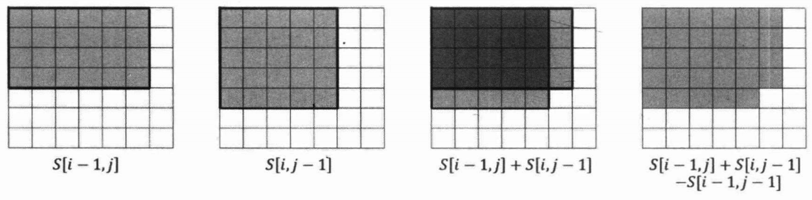

# 1. 前缀和

对于一个给定的数列 A，它的前缀和数列 S 是通过递推能求出基本的信息之一:
$$
S[i] = \sum_{j=1}^{i}A[j]
$$
一个部分和，即数列 A 某个下标区间内的数的和，可表示为前和缀相减的形式:
$$
\mathrm{sum}(l,r) = \sum_{i=l}^{r}A[i] = S[r]-S[l-1]
$$
注意，前缀和数列 $S$ 长度一般比 $A$ 大 1，这样可以方便地处理 $A(0,r)$ 的前缀和。

在二维数组(矩阵)中，可类似地求出二维前缀和，进一步计算出二维部分和。

## 1.1 习题13：激光炸弹

一种新型的激光炸弹，可以摧毁一个边长为 R 的正方形内的所有的目标。现在地图上有 $N(N \le 10^4)$ 个目标，用整数 $X_i,Y_i$(其值在闭区间[0,5000]之内)表示目标在地图上的位置，每个目标都有一个价值 $W_i$。

激光炸弹的投放是通过卫星定位的,但其有一个缺点，就是其爆破范围，即那个边长为 R 的正方形的边必须和   x,y 轴平行。若目标位于爆破正方形的边上，该目标不会被摧毁。求一颗炸弹最多能炸掉地图上总价值为多少的目标。

## 1.2 拓展练习

[LeetCode 437. 路径总和 III](https://leetcode-cn.com/problems/path-sum-iii/)

[LeetCode 523. 连续的子数组和](https://leetcode-cn.com/problems/continuous-subarray-sum/)

[LeetCode 525. 连续数组](https://leetcode-cn.com/problems/contiguous-array/)

[LeetCode 974. 和可被 K 整除的子数组](https://leetcode.cn/problems/subarray-sums-divisible-by-k/)

# 2. 差分

对于一个给定的数列 $A$，它的差分数列 $B$ 定义为:
$$
B[1] = A[1], B[i] = A[i] - A[i-1]\ (2 \le i \le n)
$$
容易发现，“前和缀”与“差分”是一对互逆运算，差分序列 $B$ 的前缀和序列就是原序列 $A$，前缀和序列 $S$ 的差分序列也是原序列 $A$。

把序列 $A$ 的区间 $[l,r]$ 加 $d$(即把 $A_l,A_{l+1},\cdots,A_r$ 都上加 $d$)，其差分序列 $B$ 的变化为 $B_l$ 加 $d$，$B_{r+1}$ 减$d$，其他位置不变。这有助于我们在很多题目中，把原序列上的“区间操作”转化为差分序列上的“单点操作”进行计算，降低求解难度。

在0x63节，我们还会继续探讨差分技巧在树上的应用。

## 2.1 习题14：IncDec Sequence

给定一个长度为 $n(n \le 10^5)$ 的数列 $\{a_1,a_2,\cdots,a_n \}$,每次可以选择一个区间 $[l,r]$，使下标在这个区内间的数都加1或者都减1。

求至少需要多少次操作才能使数列中的所有数都一样，并求出在保证最少次数的前提下，最终得到的数列可能有多少种。

## 2.2 习题15：Tallest Cow

有 $N$ 头牛站成一行。两头牛能够相互看见，当且仅当它们中间的牛身高都比它们矮。现在，我们只知道其中最高的牛是第 $P$ 头，它的身高是 $H$, 不知道剩余 $N - 1$ 头牛的身高。但是，我们还知道 $M$ 对关系，每对关系都指明了某两头牛 $A_i$ 和 $B_i$ 可以相互看见。求每头牛的身高最大可能是多少。

数据范围：$1 \le N,M \le 10^4, 1 \le H \le 10^6$。

## 2.3 拓展练习

[LeetCode 798. 得分最高的最小轮调](https://leetcode-cn.com/problems/smallest-rotation-with-highest-score/)

# 题解

## 习题13：激光炸弹

因为 $X_i,Y_i$ 的值在0~5000之间,所以我们可以建立一个二维数组 $A$，其中 $A[i][j]$ 就等于位置 $(i,j)$ 上的所有目标的价值之和。即于对每个目标，令 $A[X_i,Y_i] += W_i$。

接下来我们求出 $A$ 的二维前缀和 $S$，即:
$$
S[i,j] = \sum_{x=1}^{i}\sum_{y=1}^{j}A[x][y]
$$
如下图所示，我们再观察 $S[i,j],S[i-1,j],S[i,j-1],S[i-1,j-1]$ 的关系：



容易得到如下的递推式：
$$
S[i,j] = S[i-1,j] + S[i,j-1] - S[i-1,j-1] + A[i][j]
$$
同理，对于任意一个边长为 R 的正方形，我们有:
$$
\sum_{x=i-R+1}^{i}\sum_{y=j-R+1}^{j}A[x,y] = S[i,j]-S[i-R,j]-S[i][j-R]+S[i-R,j-R]
$$
因此,我们只需要 $O(N^2)$ 递推求出二维前缀和 $S$，然后 $O(N^2)$ 枚举边长为 $R$ 的正方形的右下角坐标 $(i,j)$，即可通过上式 $O(1)$ 计算出该正方形内所有目标价值之和，更新答案。注意，这两步其实可以同步。上面给出的两个式子蕴含的思想其实就是**“容斥原理”**，0x37节会详细探讨容斥原理的应用。

值得一提的是，上面我们把 $(X_i,Y_i)$ 作为一个“格子”，而原题中 $(X_i,Y_i)$ 是一个点，并且正方形边上的目标不会被摧毁。实际上，我们不认妨为这个点就处于“格子” $(X_i,Y_i)$ 的中心位置，格子的左上角坐标为 $(X_i-0.5,Y_i-0.5)$ ，右下角标坐为 $(X_i+0.5,Y_i+0.5)$，而正方形的右下角处于“格线交点”上，即一个值为“口.5”的坐标。这个转化与原问题是等价的。另外，本题内存限制较为严格，我们可以省略 $A$ 数组，读入直接时向 $S$ 中累加。

```java
public void bombardment() {
    Scanner in = new Scanner(System.in);
    while (in.hasNextInt()) {
        int n = in.nextInt(), r = in.nextInt();
        int[][] grid = new int[5002][5002];
        // 让最大边界值至少是 r，方便后面的操作
        int maxI = r, maxJ = r;
        // 读取数据，放入网格中
        for (int k = 0; k < n; k++) {
            int i = in.nextInt() + 1, j = in.nextInt() + 1;
            grid[i][j] = in.nextInt();
            maxI = Math.max(maxI, i);
            maxJ = Math.max(maxJ, j);
        }

        // 计算二维前缀和
        for (int i = 1; i <= maxI; i++) {
            for (int j = 1; j <= maxJ; j++) {
                grid[i][j] = grid[i][j] + grid[i - 1][j] + grid[i][j - 1] - grid[i - 1][j - 1];
            }
        }

        int ans = 0;
        // 计算区域 r 内的价值
        for (int i = r; i <= maxI; i++) {
            for (int j = r; j <= maxJ; j++) {
                ans = Math.max(ans, grid[i][j] - grid[i][j - r] - grid[i - r][j] + grid[i - r][j - r]);
            }
        }

        System.out.println(ans);
    }
}
```

## 习题14：IncDec Sequence

**【解法一】：**自己想出来的

```java
public long[] operation(int[] nums) {
    final int n = nums.length;
    /*
     这个问题可以转化为：对 nums 的差分数组 diff，至少多少次可以将 diff 变成 [num, 0, 0, ..., 0] 的序列。
     这样原来的区间操作转化为：
     1. [l,r]+1，相当于 diff[l]++，diff[r+1]--（r < n-1）；
     2. [l,r]-1，相当于 diff[l]--，diff[r+1]++（r < n-1）。

     先要找到一正一负的两个数（除开头），这样可以一次操作改两个数；
     等到除了 diff[0] 之外都是正数或都是负数，则最终结果数为 sum(abs(nonzero))+1
     */
    int[] diff = new int[n];
    diff[0] = nums[0];
    for (int i = 1; i < n; i++) {
        diff[i] = nums[i] - nums[i - 1];
    }

    long[] ans = {0, 1};
    for (int i = 1, j = 1;;) {
        // 找到第一个不等于 0 的数
        for (; i < n && diff[i] == 0; i++) {}
        if (i == n) {
            break;
        }
        // 找到第一个和 diff[i] 异号的数
        for (int negSignI = Integer.compare(0, diff[i]); j < n && Integer.compare(diff[j], 0) != negSignI; j++) {}
        if (j == n) {
            break;
        }
        // 将其中一个数变成 0，如果两个数绝对值相等，则都变成 0
        int change = Math.min(Math.abs(diff[i]), Math.abs(diff[j]));
        ans[0] += change;
        diff[i] = diff[i] > 0 ? diff[i] - change : diff[i] + change;
        diff[j] = diff[j] > 0 ? diff[j] - change : diff[j] + change;
        // 为下一次循环做准备
        if (diff[i] == 0 && diff[j] == 0) {  // 都等于 0，都重新找
            i++;
            j++;
        } else if (diff[i] == 0) {  // diff[i] 等于 0，把它和 j 换一下，j 重新找
            int tmp = i;
            i = j;
            j = tmp + 1;
        } else {  // diff[j] 等于 0，j 重新找
            j++;
        }
    }
    // 最终结果数为 sum(abs(nonzero))+1
    for (int i = 1; i < n; i++) {
        ans[0] += Math.abs(diff[i]);
        ans[1] += Math.abs(diff[i]);
    }

    return ans;
}
```

**【解法二】：**作者的思想

求出 $a$ 的差分序列 $b$, 其中 $b_1=a_1,b_i=a_i-a_{i-1}(2\le i\le n)$。令 $b_{n+1} = 0$。 题目对序列 $a$ 的操作，相当于每次可以选出 $b_1,b_2,\cdots,b_{n+1}$ 中的任意两个数，一个加 1，另一个减 1。 目标是把 $b_2,b_3,\cdots,b_n$ 变为全零。最终得到的数列 $a$ 就是由 $n$ 个 $b_1$ 构成的。 

从 $b_1,b_2,\cdots,b_{n+1}$ 中任选两个数的方法可分为四类：

1. 选 $b_i$ 和 $b_j$，其中 $2\le i,j\le n$。这种操作会改变 $b_2,b_3,\cdots,b_n$ 中两个数的值。应该在保证 $b_i$ 和 $b_j$ 一正一负的前提下，尽量多地采取这种操作，更快地接近目标。
2. 选 $b_1$ 和 $b_j$，其中 $2\le j\le n$。
3. 选 $b_i$ 和 $b_{n+1}$，其中 $2\le i\le n$。
4. 选 $b_1$ 和 $b_{n+1}$。这种情况没有意义，因为它不会改变 $b_2,b_3,\cdots,b_n$ 的值，相当于浪费了一次操作，一定不是最优解。

设 $b_2,b_3,\cdots,b_n$ 中正数总和为 $p$, 负数总和的绝对值为 $q$。首先以正负数配对的方式尽量执行第 1 类操作，可执行 $\min(p,q)$ 次。剩余 $|p - q|$ 个未配对，每个可以选与 $b_1$ 或 $b_{n+1}$ 配对，即执行第 2 或 3 类操作，共需 $|p-q|$次。 

综上所述，最少操作次数为 $\min(p, q) + |p - q| = \max(p, q)$次。根据 $|p - q|$ 次 2、3 类操作的选择情况，能产生 $|p - q| + 1$ 种不同的 $b_1$ 的值，即最终得到的序列 $a$ 可能有 $|p - q| + 1$ 种。

```java
public long[] oepration(int[] nums) {
    final int n = nums.length;
    int[] diff = new int[n];
    diff[0] = nums[0];
    for (int i = 1; i < n; i++) {
        diff[i] = nums[i] - nums[i - 1];
    }

    long p = 0, q = 0;
    for (int i = 1; i < n; i++) {
        if (diff[i] >= 0) {
            p += diff[i];
        } else {
            q += -diff[i];
        }
    }

    return new long[]{Math.max(p, q), Math.abs(p - q) + 1};
}
```

## 习题15：Tallest Cow
