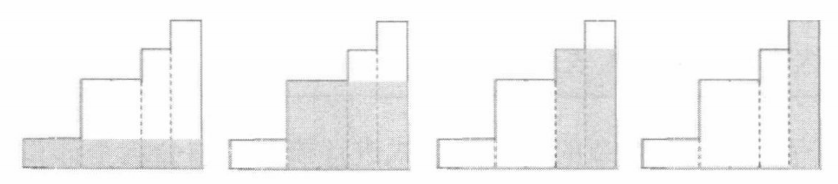
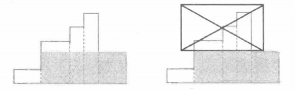

# 1. 介绍

栈是一种“后进先出”的线性数据结构。栈只有一端能够进出元素，我们一般称这一端为栈顶，另一端为栈底。添加或删除栈中元素时，我们只能将其插入到栈顶（进栈)，或者把栈顶元素从栈中取出（出栈)。

## 1.1 习题 41：Push, Pop, GetMin

实现一个栈，支持 Push (入栈）、Pop (出栈并输出栈顶）和 GetMin (查询钱中最小的值）三个橾作，要求时间复杂度均为 O(1)。

## 1.2 习题 42：Editor

你将要实现一个功能强大的整数序列编辑器。

在开始时，序列是空的。编辑器共有五种指令，如下：

1、`I x`，在光标处插入数值 $x$。
2、`D`，将光标前面的第一个元素删除，如果前面没有元素，则忽略此操作。
3、`L`，将光标向左移动，跳过一个元素，如果左边没有元素，则忽略此操作。
4、`R`，将光标向右移动，跳过一个元素，如果右边没有元素，则忽略此操作。
5、`Q k`，假设此刻光标之前的序列为 $a_1,a_2,\cdots,a_n$，输出 $max_{1\le i\le k}S_i$，其中 $S_i=a_1+a_2+\cdots+a_i$。

**数据范围**：

- $1\le Q \le 10^6$
- $|x|\le 10^3$
- $1\le k\le n$

## 1.3 习题 43：进出栈序列问题

给定 $1 \sim N$ 这 $N$ 个整数和一个无限大的栈，每个数都要进栈并出栈一次。如果进栈的顺序为 $1,2,\cdots,N$,  那么可能的出栈序列有多少种？

**数据范围**：

$1 \le N \le 60000$

# 2. 表达式计算

栈的一大用处是做算术表达式的计算。算术表达式通常有前缀、中缀、后缀三种表示方法。

- 中缀表达式，是我们最常见的表达式，例如：$3*(1-2)$。
- 前缀表达式，又称波兰式，形如 “$\mathrm{op}\ A\ B$”，其中 $\mathrm{op}$ 是一个运算符，$A,B$ 是另外两个前缀表达式。例如：$*\ 3-1\ 2$。
- 后缀表达式，又称逆波兰式，形如 “$A\ B\ \mathrm{op}$”，例如：$1\ 2 - 3\ *$。

## 2.1 后缀表达式求值

前缀和后缀表达式的值的定义是，先递归求出 $A,B$ 的值，二者再做 $\mathrm{op}$ 运算的结果。这两种表达式不需要使用括号，其运算方案是唯一确定的。对于计算机来讲，它最容易理解后缀表达式，我们可以使用栈来 $\mathrm{O}(N)$ 地求出它的值。

1. 建立一个用于存数的栈，逐一扫描该后缀表达式中的元素。
   1. 如果遇到一个数，则把该数入栈。
   2. 如果遇到运算符，就取出栈顶的两个数进行计算，把结果入栈。
2. 扫描完成后，栈中恰好剩下一个数，就是该后缀表达式的值。

## 2.2 中缀表达式转后缀表达式

如果想让计算机求解我们人类常用的中缀表达式的值，最快的办法就是把中缀表达式转化成后缀表达式，再使用上述方法求值。这个转化过程同样可以使用栈来 $\mathrm{O}(N)$ 地完成。

1. 建立一个用于存运算符的栈，逐一扫描该中缀表达式中的元素。
   1. 如果遇到一个数，输出该数。
   2. 如果遇到左括号，把左括号入栈。
   3. 如果遇到右括号，不断取出栈顶并输出，直到桟顶为左括号，然后把左括号出栈。
   4. 如果遇到运算符，只要栈顶符号的优先级不低于新符号，就不断取出栈顶并输出，最后把新符号进栈。优先级为乘除>加减>左括号。
2. 依次取出并输出栈中的所有剩余符号，最终输出的序列就是一个与原中缀表达式等价的后缀表达式。

以上例子中包含的都是一位数，如果是多位数，并且表达式是使用字符串逐字符存储的，我们只需要稍加判断，把连续的一段数字看成一个数即可。

## 2.3 中缀表达式的递归法求值

当然，我们也可以不转化成后缀表达式，而是使用递归法直接求解中缀表达式的值，时间复杂度为 $\mathrm{O}(N^2)$。

目标：求解中缀表达式 $S[1\sim N]$ 的值。子问题：求解中缀表达式 $S$ 的子区间表达式 $S[L\sim R]$ 的值。

1. 在 $L\sim R$ 中考虑没有被任何括号包含的运算符：
   1. 若存在加减号，选其中最后一个，分成左右两半递归，结果相加减，返回。
   2. 若存在乘除号，选其中最后一个，分成左右两半递归，结果相乘除, 返回。
2. 若不存在没有被任何括号包含的运算符：
   1. 若首尾字符是括号，递归求解 $S[L+1\sim R -1]$, 把结果返回。
   2. 否则，说明区间 $S[L\sim R]$ 是一个数，直接返回数值。

# 3. 单调栈

从名字上就听的出来，单调栈中存放的数据应该是有序的，所以单调栈也分为**单调递增栈**和**单调递减栈**。

单调栈则主要用于 $\mathrm{O}(n)$ 解决**NGE问题**（Next Greater Element），也就是，对序列中每个元素，找到下一个比它大的元素。（当然，“下一个”可以换成“上一个”，“比它大”也可以换成“比他小”，原理不变。）

我们维护一个栈，表示“**待确定NGE的元素**”，然后遍历序列。当我们碰上一个新元素，我们知道，越靠近栈顶的元素离新元素位置越近。所以不断比较新元素与栈顶，如果新元素比栈顶大，则可断定新元素就是栈顶的NGE，于是弹出栈顶并继续比较。直到新元素不比栈顶大，再将新元素压入栈。显然，这样形成的栈是单调递减的。

## 3.1 习题 44：Largest Rectangle in a Histogram[^1]

直方图是由在公共基线处对齐的一系列矩形组成的多边形。矩形具有相等的宽度，但可以具有不同的高度。

例如，图例左侧显示了由高度为 $2,1,4,5,1,3,3$ 的矩形组成的直方图，矩形的宽度都为 $1$：


现在，请你计算在公共基线处对齐的直方图中最大矩形的面积。图例右图显示了所描绘直方图的最大对齐矩形。

**输入格式：**

1. 输入包含几个测试用例。每个测试用例占据一行，用以描述一个直方图，并以整数 $n$ 开始，表示组成直方图的矩形数目。
2. 然后跟随 $n$ 个整数 $h_1,\cdots,h_n$。这些数字以从左到右的顺序表示直方图的各个矩形的高度。
3. 每个矩形的宽度为 1。

4. 同行数字用空格隔开。

5. 当输入用例为 $n=0$ 时，结束输入，且该用例不用考虑。

**输出格式：**

1. 对于每一个测试用例，输出一个整数，代表指定直方图中最大矩形的区域面积。

2. 每个数据占一行。

3. 请注意，此矩形必须在公共基线处对齐。

**数据范围：**

1. $1\le n\le 100000$

2. $0\le h_i\le 1000000000$

**输入样例：**

```
7 2 1 4 5 1 3 3
4 1000 1000 1000 1000
0
```

**输出样例：**

```
8
4000
```

# 题解

## 习题 41：Push,Pop, GetMin

空间换时间，每次 push 的时候，都额外记录当前的最小值。

```java
public static class MinStack implements IMinStack {

    private int[][] stack;
    private int top = -1;

    public MinStack() {
        stack = new int[16][2];
    }

    @Override
    public void push(int x) {
        if (top == stack.length - 1) {
            int[][] newStack = new int[stack.length * 2][2];
            System.arraycopy(stack, 0, newStack, 0, stack.length);
            stack = newStack;
        }
        stack[++top][0] = x;
        stack[top][1] = Math.min(x, top > 0 ? stack[top-1][1] : x);
    }

    @Override
    public void pop() {
        top--;
    }

    @Override
    public int top() {
        return stack[top][0];
    }

    @Override
    public int getMin() {
        return stack[top][1];
    }
}
```

## 习题 42：Editor

### 解法一

```java
public interface IEditor {

    void insert(int i);

    void delete();

    void moveLeft();

    void moveRight();

    int query(int k);
}

public static class Editor implements IEditor {

    private final List<int[]> seq;
    private int cursor;

    public Editor() {
        seq = new ArrayList<>();
    }

    public void insert(int i) {
        if (cursor > 0) {
            int[] prev = seq.get(cursor - 1);
            seq.add(cursor, new int[]{i, prev[1] + i, Math.max(prev[1] + i, prev[2])});
        } else {
            seq.add(cursor, new int[]{i, i, i});
        }
        cursor++;
    }

    public void delete() {
        if (cursor > 0) {
            seq.remove(--cursor);
        }
    }

    public void moveLeft() {
        if (cursor > 0) {
            cursor--;
        }
    }

    public void moveRight() {
        // 每次往右移就更新 maxQuery，防止之前删除的脏数据
        if (cursor < seq.size() && ++cursor > 1) {
            int[] prev = seq.get(cursor - 2), cur = seq.get(cursor - 1);
            cur[1] = prev[1] + cur[0];
            cur[2] = Math.max(cur[1], prev[2]);
        }
    }

    public int query(int k) {
        return seq.get(k - 1)[2];
    }
}

public void execute(IEditor editor) {
    try {
        BufferedReader in = new BufferedReader(new InputStreamReader(System.in));
        int n = Integer.parseInt(in.readLine());
        for (int i = 0; i < n; i++) {
            String s = in.readLine();
            char operator = s.charAt(0);
            switch (operator) {
                case 'I':
                    editor.insert(Integer.parseInt(s.substring(2)));
                    break;

                case 'D':
                    editor.delete();
                    break;

                case 'L':
                    editor.moveLeft();
                    break;

                case 'R':
                    editor.moveRight();
                    break;

                case 'Q':
                    System.out.println(editor.query(Integer.parseInt(s.substring(2))));
                    break;
            }
        }
    } catch (IOException e) {
        e.printStackTrace();
    }
}

public void editorExecute() {
    execute(new Editor());
}
```

### 解法二

本题的特殊点在于，I,D,L,R 四种操作都在光标位置处发生，并且操作完成后光标至多移动 1 个位置。根据这种“始终在序列中间某个指定位置进行修改”的性质，再联想到上一章我们动态维护中位数的“对顶堆”算法，我们不难想到一个类似的**“对顶栈”**做法。

```java
public static class StackEditor implements IEditor {

    private static class Seq {

        private final List<Integer> list = new ArrayList<>();

        public int get(int i) {
            return list.get(i);
        }

        public void set(int i, int num) {
            if (i >= list.size()) {
                list.add(num);
            } else {
                list.set(i, num);
            }
        }
    }

    // 保存光标前数字的栈，和光标后数字的栈
    private final Deque<Integer> prevStack, nextStack;
    private final Seq prefix, max;

    public StackEditor() {
        prevStack = new ArrayDeque<>();
        nextStack = new ArrayDeque<>();
        prefix = new Seq();
        max = new Seq();
    }

    public void insert(int i) {
        prevStack.push(i);
        if (prevStack.size() == 1) {
            prefix.set(0, i);
            max.set(0, i);
        } else {
            int prev = prevStack.size() - 2, cur = prevStack.size() - 1;
            int sum = prefix.get(prev) + i;
            prefix.set(cur, sum);
            max.set(cur, Math.max(sum, max.get(prev)));
        }
    }

    public void delete() {
        if (!prevStack.isEmpty()) {
            prevStack.pop();
        }
    }

    public void moveLeft() {
        if (!prevStack.isEmpty()) {
            nextStack.push(prevStack.pop());
        }
    }

    public void moveRight() {
        if (!nextStack.isEmpty()) {
            insert(nextStack.pop());
        }
    }

    public int query(int k) {
        return max.get(k - 1);
    }
}
```

## 习题 43：进出栈序列问题

### 方法一

搜索法，模拟压栈出栈的情况。

除最后一个数字外，其他每个数字入栈的时候，可以选择：

1. 不弹出自己
2. 弹出自己
3. 不但弹出自己，还弹出栈中已有的数字。假设有 $m$ 个，则有 $[1..m]$ 这 $m$ 种选择

如果是最后一个数字入栈，那就只有一种选择，就是弹出栈中所有数字。

注意，下面的实现只考虑了 `long` 所能容纳的范围

```java
public long sequences(int n) {
    return dfs(1, n, 0);
}

long dfs(int i, int n, int stack) {
    /*
        除最后一个数字外，其他每个数字入栈的时候，可以选择：
        1. 不弹出自己
        2. 弹出自己
        3. 不但弹出自己，还弹出栈中已有的数字。假设有 m 个，则有 [1,m] 种选择

        如果是最后一个数字入栈，那就只有一种选择，就是弹出栈中所有数字
         */

    if (i == n) {
        return 1;
    }

    // 由于只需要知道结果数量，所以栈中存什么元素无所谓
    long ans = dfs(i + 1, n, ++stack);
    ans += dfs(i + 1, n, --stack);

    int size = stack;
    for (int j = 1; j <= size; j++) {
        stack -= j;
        ans += dfs(i + 1, n, stack);
        // 注意回溯
        stack += j;
    }

    return ans;
}
```

### 方法二

在方法一的基础上，我们很容易得出动态规划的解法，以及优化。注意，下面的实现只考虑了 `long` 所能容纳的范围。

**基础 DP**

```java
public long dpMethod(int n) {
    /*
     dp[i][stack] = dp[i+1][stack + 1] + dp[i+1][stack] + dp[i+1][[0..stack)]
     */
    long[][] dp = new long[n+1][n+1];
    Arrays.fill(dp[n], 1);

    for (int i = n - 1; i >= 1; i--) {
        for (int stack = i; stack >= 0; stack--) {
            for (int k = 0; k <= stack + 1; k++) {
                dp[i][stack] += dp[i+1][k];
            }
        }
    }

    return dp[1][0];
}
```

**状态压缩后的 DP**

```java
public long compressedDpMethod(int n) {
    long[] dp = new long[n+1];
    Arrays.fill(dp,1);

    for (int i = n - 1; i >= 1; i--) {
        long right = dp[i + 1];
        for (int stack = i; stack >= 0; stack--) {
            long sum = right;
            // 下面的求和可以改为前缀和，从而使时间复杂度降低为 O(N^2)
            for (int k = 0; k <= stack; k++) {
                sum += dp[k];
            }
            right = dp[stack];
            dp[stack] = sum;
        }
    }

    return dp[0];
}
```

**使用前缀和优化的 DP**

```java
public long dpPrefixMethod(int n) {
    long[] dp = new long[n];
    Arrays.fill(dp,1);

    for (int i = n - 2; i >= 0; i--) {
        for (int j = i; j >= 0; j--) {
            dp[j] += dp[j + 1];
        }
    }

    return dp[0];
}
```

### 方法三

本题只要求我们计算出可能出栈序列有多少种，并不关心具体方案，于是我们可以使用递推直接进行统计。设 $S_N$ 表示进栈顺序为 $1,2,\cdots,N$ 时可能的出栈序列总数。根据递推的理论，我们需要想办法把问题分解成若干个类似的子问题。  

考虑“1”这个数排在最终出栈序列中的位置，如果最后“1”这个数排在第 $k$ 个，那么整个序列的进出栈过程就是：

1. 整数 1 入栈。
2. 整数 $2\sim k$ 这 $k-1$ 个数按某种顺序进出栈。
3. .整数 1 出栈，排在第 $k$ 个。
4. 整数 $k+1\sim N$ 这 $N-k$ 个数按某种顺序进出栈。

于是整个问题就被“1”这个数划分成了 “$k-1$ 个数进出栈”和“$N-k$ 个数进出栈”这两个子问题，得到递推公式：
$$
S_N = \sum_{k=1}^{N}S_{k-1}*S_{N-k}
$$

```java
public long iterMethod(int n) {
    long[] s = new long[n+1];
    s[0] = 1;

    for (int i = 1; i <= n; i++) {
        for (int k = 1; k <= i; k++) {
            s[i] += s[k-1] * s[i-k];
        }
    }

    return s[n];
}
```

### 方法四

首先规定 1 表示栈中进入一节车厢，0 表示栈中弹出一节车厢，那么每种火车进出栈方案都能用一串 01 序列来表示。

由于每节车厢都要进栈一次出栈一次，所以每种方案所对应的 01 序列的长度都是 $2N$。那么火车进出栈方案的总数量就可以看成是所有**合法的 01 串**的个数。

那咋算是合法的嘞？要有车厢出栈，那么栈中就必须要有车厢。在 01 序列中，就对应了在任意位置，**其前面的 1 的个数大于等于其前面 0 的个数**。

该问题等价于求第 $N$ 项 **Catalan 数**，即 $C^N_{2N}/(N+1)$。我们将在第 0x36 节详细介绍，可以参见[这篇博客](https://blog.csdn.net/sherry_yue/article/details/88364746)。我们只需求卡特兰数即可，但高精和卡时让这题恶心了很多。

首先我们要求高精的 $\frac{C^N_{2N}}{N+1}$，也就是高精的 $\frac{(2n)!}{(n!)(n!)(N+1)}$。最快的办法是求出这玩意所有的质因数，然后求所有数乘积即可。求出它所有质因数的方法可以参考 [AcWing 197. 阶乘分解](https://www.acwing.com/solution/content/4960/) 这题的做法。

可以直接在筛质数的时候处理，更好写一些，且效率更高。然后在乘所有数的乘积的时候，注意到每个数字的次数都不会太多，可以先求出 $质数^{因数}$ 结果，再乘到答案里面去，效率更高。此外，我们使用了[线性筛算法](https://leetcode.cn/problems/count-primes/solution/ji-shu-zhi-shu-by-leetcode-solution/)。

```java
public String catalanMethod(int n) {
    int[] primes = new int[(2 * n + 1) / 2];
    int[] factors = new int[primes.length];
    int cnt = 0;
    boolean[] isNotPrime = new boolean[2 * n + 1];

    // 对 catalan 数分解质因数
    for (int i = 2; i <= 2 * n; i++) {
        if (!isNotPrime[i]) {
            primes[cnt] = i;
            // 计算 (2n)! 对于质数 i 的因数
            for (int j = 2 * n / i; j > 0; j /= i) {
                factors[cnt] += j;
            }
            // 减去 (n!)**2 对于质数 i 的因数
            for (int j = n / i; j > 0; j /= i) {
                factors[cnt] -= j * 2;
            }
            // 减去 n+1 对于质数 i 的因数
            for (int j = n + 1; j % i == 0; j /= i) {
                factors[cnt]--;
            }
            cnt++;
        }
        // 线性筛算法，参见 https://leetcode.cn/problems/count-primes/solution/ji-shu-zhi-shu-by-leetcode-solution/
        for (int j = 0; j < cnt && primes[j] <= 2 * n / i; j++) {
            isNotPrime[primes[j] * i] = true;
            if (i % primes[j] == 0) {
                break;
            }
        }
    }

    // 使用大数乘法乘质因数
    List<Long> res = new ArrayList<>();
    res.add(1L);
    for (int i = 0; i < cnt; i++) {
        if (factors[i] > 0) {
            multi(res, qmi(primes[i], factors[i]));
        }
    }

    StringBuilder ans = new StringBuilder(9 * res.size());
    ans.append(res.get(res.size() - 1));
    for (int i = res.size() - 2; i >= 0; i--) {
        print(res.get(i), DIGITS, ans);
    }

    return ans.toString();
}

/**
 * 快速幂
 */
public int qmi(int a, int b) {
    int res = 1;
    for (; b > 0; b >>= 1, a *= a) {
        if ((b & 1) == 1) {
            res *= a;
        }
    }

    return res;
}

public static long BASE = (long) 1e9;
public static int DIGITS = 9;

/**
 * 大数乘法，其实就是 BASE 进制数的乘法
 */
public void multi(List<Long> num, int b) {
    long carry = 0;
    for (int i = 0; i < num.size(); i++) {
        long a = num.get(i) * b + carry;
        num.set(i, a % BASE);
        carry = a / BASE;
    }
    while (carry > 0) {
        num.add(carry % BASE);
        carry /= BASE;
    }
}

/**
 * 快速生成 digit 位
 */
public void print(long x, int digit, StringBuilder sb) {
    if (digit == 0) {
        return;
    }
    print(x / 10, digit - 1, sb);
    sb.append((char) (x % 10 + '0'));
}
```

## 习题 44：Largest Rectangle in a Histogram

我们先来思考这样一个问题：如果矩形的高度从左到右单调递增，那么答案是多少？显而易见，我们可以尝试以每个矩形的高度作为最终矩形的高度，并把宽度延伸到右边界，得到一个矩形，在所有这样的矩形面积中取最大值就是答案。如下图所示：



如果下一个矩形的高度比上一个小，那么该矩形想利用之前的矩形一起构成一块较大的面积时，这块面积的高度就不可能超过该矩形自己的高度。换句话说，在考虑完上图中的四种情况后，下图中打叉的那部分形状就没有丝毫用处了。



既然没有用处，为什么不把这些比该矩形高的矩形都删掉，用一个宽度累加、高度为该矩形自己的高度的新矩形（就是上图中的阴影部分）代替呢？这样并不会对后续的计算产生影响。于是我们维护的轮廓就变成了一个高度始终单调递增的矩形序列，问题变得可解了。

详细地说，我们建立一个栈，用来保存若干个矩形，这些矩形的高度是单调递增的。我们从左到右依次扫描每个矩形：

1. 如果当前矩形比栈顶矩形高，直接进栈。
2. 否则不断取出栈顶，直至栈为空或者栈顶矩形的高度比当前矩形小。在出栈过程中，我们累计被弹出的矩形的宽度之和，并且每弹出一个矩形，就用它的高度乘上累计的宽度去更新答案。整个出栈过程结束后，我们把一个高度为当前矩形高度、宽度为累计值的新矩形入栈。

整个扫描结束后，我们把栈中剩余的矩形依次弹出，按照与上面相同的方法更新答案。为了简化程序实现，也可以增加一个高度为 0 的矩形 $a[n +1]$, 以避免在扫描结束后栈中有剩余矩形。

```java
```


[^1]: https://www.acwing.com/problem/content/133/
