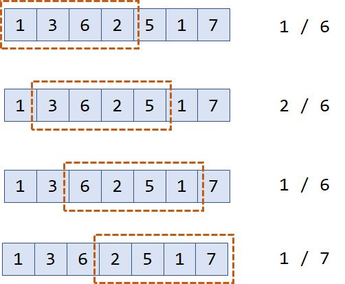
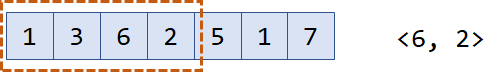
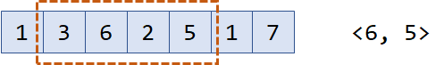
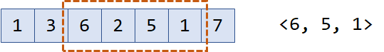
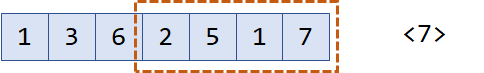

# 介绍

队列是一种“先进先出”的线性数据结构。一般来讲，元素从右端进入队列（入队)，从左端离开队列（出队)。于是我们称队列的左端为队头，右端为队尾。

元素进行多次入队、出队后，用于实现队列结构的数组的开头部分空间就会被严重浪费，所以我们经常将其优化为**“循环队列”**，也就是把队列看作一个首尾相接的环，只要队列中的元素个数在任意时刻都不超过环长，那么随着入队和出队操作的进行，存储元素的那一段位置就像沿着环不停地移动，重复利用着历史上曾被占用过的空间。C++ STL 中的 queue 就是一个循环队列，也是我们在代码中最常见的队列实现方式。

## 习题 45：Team Queue[^1]

有 $n$ 个小组要排成一个队列，每个小组中有若干人。

当一个人来到队列时，如果队列中已经有了自己小组的成员，他就直接插队排在自己小组成员的后面，否则就站在队伍的最后面。

请你编写一个程序，模拟这种小组队列。

- **输入格式**：

1. 输入将包含一个或多个测试用例。对于每个测试用例，第一行输入小组数量 $t$。

2. 接下来 $t$ 行，每行输入一个小组描述，第一个数表示这个小组的人数，接下来的数表示这个小组的人的编号。编号是 0 到 999999 范围内的整数。

3. 一个小组最多可包含 1000 个人。

4. 最后，命令列表如下。 有三种不同的命令：
   1. `ENQUEUE x` - 将编号是 $x$ 的人插入队列；
   2. `DEQUEUE` - 让整个队列的第一个人出队；
   3. `STOP` - 测试用例结束

5. 每个命令占一行。当输入用例 $t=0$ 时，代表停止输入。
6. 需注意：测试用例最多可包含 200000（20 万）个命令，因此小组队列的实现应该是高效的：入队和出队都需要使用常数时间。

- **输出样例**：

1. 对于每个测试用例，首先输出一行 `Scenario #k`，其中 $k$ 是测试用例的编号。

2. 然后，对于每个 `DEQUEUE` 命令，输出出队的人的编号，每个编号占一行。

3. 在每个测试用例（包括最后一个测试用例）输出完成后，输出一个空行。

- **数据范围**：

1. $1≤t≤1000$

- **输入样例**：

```
2
3 101 102 103
3 201 202 203
ENQUEUE 101
ENQUEUE 201
ENQUEUE 102
ENQUEUE 202
ENQUEUE 103
ENQUEUE 203
DEQUEUE
DEQUEUE
DEQUEUE
DEQUEUE
DEQUEUE
DEQUEUE
STOP
2
5 259001 259002 259003 259004 259005
6 260001 260002 260003 260004 260005 260006
ENQUEUE 259001
ENQUEUE 260001
ENQUEUE 259002
ENQUEUE 259003
ENQUEUE 259004
ENQUEUE 259005
DEQUEUE
DEQUEUE
ENQUEUE 260002
ENQUEUE 260003
DEQUEUE
DEQUEUE
DEQUEUE
DEQUEUE
STOP
0
```

- **输出样例**：

```
Scenario #1
101
102
103
201
202
203

Scenario #2
259001
259002
259003
259004
259005
260001

```

## 习题 46：蚯蚓[^2]

蛐蛐国最近蚯蚓成灾了！隔壁跳蚤国的跳蚤也拿蚯蚓们没办法，蛐蛐国王只好去请神刀手来帮他们消灭蚯蚓。

蛐蛐国里现在共有 $n$ 只蚯蚓，第 $i$ 只蚯蚓的长度为 $a_i$，所有蚯蚓的长度都是非负整数，即可能存在长度为 0 的蚯蚓。

每一秒，神刀手会在所有的蚯蚓中，准确地找到最长的那一只，将其切成两段。若有多只最长的，则任选一只。

神刀手切开蚯蚓的位置由有理数 $p$ 决定。一只长度为 $x$ 的蚯蚓会被切成两只长度分别为 $⌊px⌋$ 和 $x−⌊px⌋$ 的蚯蚓。特殊地，如果这两个数的其中一个等于 0，则这个长度为 0 的蚯蚓也会被保留。

此外，除了刚刚产生的两只新蚯蚓，其余蚯蚓的长度都会增加一个非负整数 $q$。

蛐蛐国王知道这样不是长久之计，因为蚯蚓不仅会越来越多，还会越来越长。蛐蛐国王决定求助于一位有着洪荒之力的神秘人物，但是救兵还需要 $m$ 秒才能到来。

蛐蛐国王希望知道这 $m$ 秒内的战况。具体来说，他希望知道：

1. $m$ 秒内，每一秒被切断的蚯蚓被切断前的长度，共有 $m$ 个数。
2. $m$ 秒后，所有蚯蚓的长度，共有 $n+m$ 个数。

- **输入格式**：

1. 第一行包含六个整数 $n,m,q,u,v,t$，其中：$n,m,q$ 的意义参考题目描述；$u,v,t$ 均为正整数；你需要自己计算 $p=u/v$（保证 $0<u<v$）；$t$ 是输出参数，其含义将会在输出格式中解释。
2. 第二行包含 $n$ 个非负整数，为 $a_1,a_2,…,a_n$，即初始时 $n$ 只蚯蚓的长度。
3. 同一行中相邻的两个数之间，恰好用一个空格隔开。

- **输出格式**：

1. 第一行输出 $⌊m/t⌋$ 个整数，按时间顺序，依次输出第 $t$ 秒，第 $2t$ 秒，第 $3t$ 秒，……被切断蚯蚓（在被切断前）的长度。

2. 第二行输出 $⌊(n+m)/t⌋$ 个整数，输出 $m$ 秒后蚯蚓的长度；需要按从大到小的顺序，依次输出排名第 $t$，第 $2t$，第 $3t$，……的长度。

3. 同一行中相邻的两个数之间，恰好用一个空格隔开。
4. 即使某一行没有任何数需要输出，你也应输出一个空行。
5. 请阅读样例来更好地理解这个格式。

- **数据范围**：

1. $1≤n≤10^5$,
2. $0≤ai≤10^8$,
3. $0<p<1$,
4. $0≤q≤200$,
5. $0≤m≤7∗10^6$,
6. $0<u<v≤10^9$,
7. $1≤t≤71$

- **输入样例**：

```
3 7 1 1 3 1
3 3 2
```

- **输出样例**：

```
3 4 4 4 5 5 6
6 6 6 5 5 4 4 3 2 2
```

- **样例解释**：

1. 样例中，在神刀手到来前：3 只蚯蚓的长度为 3,3,2。

2. 1 秒后：一只长度为 3 的蚯蚓被切成了两只长度分别为 1 和 2 的蚯蚓，其余蚯蚓的长度增加了 1。最终 4 只蚯蚓的长度分别为 (1,2),4,3。 括号表示这个位置刚刚有一只蚯蚓被切断。
3. 2 秒后：一只长度为 4 的蚯蚓被切成了 1 和 3。5 只蚯蚓的长度分别为：2,3,(1,3),4。
4. 3 秒后：一只长度为 4 的蚯蚓被切断。6 只蚯蚓的长度分别为：3,4,2,4,(1,3)。
5. 4 秒后：一只长度为 4 的蚯蚓被切断。7 只蚯蚓的长度分别为：4,(1,3),3,5,2,4。
6. 5 秒后：一只长度为 5 的蚯蚓被切断。8 只蚯蚓的长度分别为：5,2,4,4,(1,4),3,5。
7. 6 秒后：一只长度为 5 的蚯蚓被切断。9 只蚯蚓的长度分别为：(1,4),3,5,5,2,5,4,6。
8. 7 秒后：一只长度为 6 的蚯蚓被切断。10 只蚯蚓的长度分别为：2,5,4,6,6,3,6,5,(2,4)。
9. 所以，7 秒内被切断的蚯蚓的长度依次为 3,4,4,4,5,5,6。
10. 7 秒后，所有蚯蚓长度从大到小排序为 6,6,6,5,5,4,4,3,2,2。

## 习题 47：双端队列[^3]

达达现在碰到了一个棘手的问题，有 $N$ 个整数需要排序。达达手头能用的工具就是若干个双端队列。

她从 1 到 $N$ 需要**依次处理**这 $N$ 个数，对于每个数，达达能做以下两件事：

1. 新建一个双端队列，并将当前数作为这个队列中的唯一的数；
2. 将当前数放入已有的队列的头之前或者尾之后。

对所有的数处理完成之后，达达将这些队列按一定的顺序连接起来后就可以得到一个非降的序列。

请你求出最少需要多少个双端序列。

- **输入格式**：

1. 第一行输入整数 $N$，代表整数的个数。
2. 接下来 $N$ 行，每行包括一个整数 $D_i$，代表所需处理的整数。

- **输出格式**：

1. 输出一个整数，代表最少需要的双端队列数。

- **数据范围**：

1. $1≤N≤200000$

- **输入样例**：

```
6
3
6
0
9
6
3
```

- **输出样例**：

```
2
```

## 拓展练习

1. [LeetCode 622. 设计循环队列](https://www.acwing.com/problem/content/description/137/)

# 单调队列

**单调队列**是一种主要用于解决**滑动窗口**类问题的数据结构，即，在长度为 $n$ 的序列中，求每个长度为 $m$ 的区间的区间最值。它的时间复杂度是 $O(n)$ ，在这个问题中比 $O(nlog⁡n)$ 的[ST表](https://zhuanlan.zhihu.com/p/105439034)和[线段树](https://zhuanlan.zhihu.com/p/106118909)要优。



单调队列的基本思想是，维护一个双向队列（deque），遍历序列，仅当一个元素**可能**成为某个区间最值时才保留它。

形象地打个比方，上面的序列可以看成学校里各个年级XCPC选手，数字越大代表能力越强。每个选手只能在大学四年间参赛，毕业了就没有机会了。那么，每一年的王牌选手都在哪个年级呢？

一开始的时候，大三大四的学长都比较菜（年级顺序和图中红框顺序相反），大二的最强，而大一的等大二的毕业后还有机会上位，所以队列里有两个数。



一年过去了，原本大一的成为大二，却发现新进校的新生非常强，自己再也没有机会成为最大值了，所以弹出队列。



又过了一年，新入校的新生尽管能力只有1，但理论上只要后面的人比他还菜，还是可能成为区间最大值的，所以入队。



终于，原本的王牌毕业了，后面的人以为熬出头了，谁知道这时一个巨佬级别的新生进入了集训队，这下其他所有人都没机会了。



总之，观察就会发现，我们维护的这个队列总是单调递减的。如果维护区间最小值，那么维护的队列就是单调递增的。这就是为什么叫**单调**队列。

## 习题 48：最大子序和[^4]

输入一个长度为 $n$ 的整数序列，从中找出一段长度不超过 $m$ 的连续子序列，使得子序列中所有数的和最大。**注意：** 子序列的长度至少是 1。

- **输入格式**：

1. 第一行输入两个整数 $n,m$。

2. 第二行输入 $n$ 个数，代表长度为 $n$ 的整数序列。

3. 同一行数之间用空格隔开。

- **输出格式**：

1. 输出一个整数，代表该序列的最大子序和。

- **数据范围**：

1. $1≤n,m≤300000$

- **输入样例**：

```
6 4
1 -3 5 1 -2 3
```

- **输出样例**：

```
7
```

## 拓展练习

1. [LeetCode 239. 滑动窗口最大值](https://leetcode-cn.com/problems/sliding-window-maximum/)
2. [LeetCode 1438. 绝对差不超过限制的最长连续子数组](https://leetcode-cn.com/problems/longest-continuous-subarray-with-absolute-diff-less-than-or-equal-to-limit/)

# 题解

## 习题 45：Team Queue

```java
public static abstract class AbstractQueue {

    protected Map<Integer, Integer> no2team;
    protected int[] teamSize;

    public AbstractQueue(Map<Integer, Integer> no2team, int[] teamSize) {
        this.no2team = no2team;
        this.teamSize = teamSize;
    }

    public abstract void enqueue(int no);

    public abstract int dequeue();
}

public void execute(BiFunction<Map<Integer, Integer>, int[], AbstractQueue> factory) {
    Scanner in = new Scanner(System.in);
    int caseNo = 1;
    for (;; caseNo++) {
        int t = in.nextInt();
        if (t == 0) {
            break;
        }

        Map<Integer, Integer> no2team = new HashMap<>();
        int[] teamSize = new int[t];
        for (int i = 0; i < t; i++) {
            int cnt = in.nextInt();
            teamSize[i] = cnt;
            for (int j = 0; j < cnt; j++) {
                no2team.put(in.nextInt(), i);
            }
        }
        AbstractQueue queue = factory.apply(no2team, teamSize);

        System.out.println("Scenario #" + caseNo);
        // 跳过换行符
        in.nextLine();
        for (String line = in.nextLine(); !line.equals("STOP"); line = in.nextLine()) {
            if (line.startsWith("ENQUEUE")) {
                queue.enqueue(Integer.parseInt(line.split(" ")[1]));
            } else {
                System.out.println(queue.dequeue());
            }
        }
        System.out.println();
    }
}

public static class Queue extends AbstractQueue {

    private final Deque<Integer>[] team2queue;
    private final Deque<Deque<Integer>> queue;

    public Queue(Map<Integer, Integer> team, int[] teamSize) {
        super(team, teamSize);
        team2queue = new Deque[teamSize.length];
        for (int i = 0; i < teamSize.length; i++) {
            team2queue[i] = new ArrayDeque<>(teamSize[i]);
        }
        queue = new ArrayDeque<>(teamSize.length);
    }

    @Override
    public void enqueue(int no) {
        Deque<Integer> q = team2queue[no2team.get(no)];
        if (q.isEmpty()) {
            queue.add(q);
        }
        q.add(no);
    }

    @Override
    public int dequeue() {
        Deque<Integer> q = queue.element();
        int no = q.remove();
        if (q.isEmpty()) {
            queue.remove();
        }

        return no;
    }
}
```

## 习题 46：蚯蚓

如果 $q = 0$ , 即蚯蚓不会变长，那么本题相当于维护一个集合，支持查询最大值、删除最大值、插入新的值。这是二叉堆（第 0x17 节）能够完成的基本操作，时间复杂度约为 $\mathrm{O}(m\log n)$。

当 $q > 0$ 时，除了最大值拆成的两个数之外，集合中的其他数都会增加 $q$。设最大值为 $x$。我们不妨认为产生了两个大小为 $\lfloor px \rfloor -q$ 和 $x - \lfloor px \rfloor -q$ 的新数，然后再把整个集合都加上 $q$。这与之前的操作是等价的。

于是，我们可以维护一个变量 $delta$ 表示整个集合的“偏移量”，集合中的数加上 $delta$ 是它的真实数值。起初，$delta = 0$。对于每一秒：

1. 取出集合中的最大值 $x$，令 $x = x +delta$。
2. 把 $\lfloor px \rfloor -delta -q$ 和 $x - \lfloor px \rfloor -delta -q$ 插入集合。
3. 令 $delta = delta + q$。

重复上述步骤 $m$ 轮，即可得到最终集合中所有数的值。然而，本题中 $m$ 的范围过大，我们需要一种线性算法来更快地求解。

注意到 $p,q$ 是固定常数，$0 <p <1$ 且 $q$ 是非负整数。设 $x_1,x_2$ 为非负整数，当 $x_1 \ge x_2$ 时，有 $\lfloor px_1 \rfloor + q = \lfloor px_1 + q \rfloor \ge \lfloor px_2 + pq \rfloor = \lfloor p(x_2 + q) \rfloor$。上式第一个等号成立的原因是整数可以自由移入、移出取整符号而不改变式子的值。

又因为 $x_1-x_2 \ge p(x_1-x_2)$，所以 $x_1-px_1 \ge x_2-px_2 \ge x_2-p(x_2+q)$。进一
步有 $x_1-\lfloor px_1 \rfloor + q = \lfloor x_1 - px_1 \rfloor + q \ge \lfloor x_2 - p(x_2+q) \rfloor + q = x_2 + q - \lfloor p(x_2+q) \rfloor$。

上面两段分析的意义是：若 $x_1$ 在 $x_2$ 之前被取出集合，则在一秒以后，$x_1$ 分成的两个数 $\lfloor px_1 \rfloor + q$ 和 $x_1-\lfloor px_1 \rfloor + q$ 分别不小于 $x_2 + q$ 分成的两个数 $\lfloor p(x_2+q) \rfloor$ 和 $x_2+q-\lfloor p(x_2+q) \rfloor$。换言之，**不仅从集合中取出的数是单调递减的，新产生的两类数值也分别随着时间单调递减**。

我们可以建立三个队列 $A,B,C$，共同构成需要维护的集合。队列 $A$ 保存初始的 $n$ 个数，从大到小排序。队列 $B$ 保存每秒新产生的 $\lfloor px \rfloor$ 那一段数值。队列 $C$ 保存每秒新产生的 $x-\lfloor px \rfloor$ 那一段数值。起初队列 $B,C$ 为空，新产生的数从队尾插入。根据之前的结论，$B,C$ 单调递减。因此，每个时刻集合中最大的数就是队列 $A,B,C$ 的三个队首之一。再配合集合的偏移量 $delta$, 整个算法的时间复杂度为 $\mathrm{O}(m+n\log n)$。

```java
public void cut() {
    Scanner in = new Scanner(System.in);
    int n = in.nextInt(), m = in.nextInt(), q = in.nextInt(), u = in.nextInt(), v = in.nextInt(),
    t = in.nextInt();
    int[] earthworm = new int[n];
    for (int i = 0; i < n; i++) {
        earthworm[i] = in.nextInt();
    }
    Arrays.sort(earthworm);

    int[] ei = {n-1};
    int delta = 0;
    Deque<Integer> splitPartOne = new ArrayDeque<>(m);
    Deque<Integer> splitPartTwo = new ArrayDeque<>(m);
    for (int i = 1; i <= m; i++) {
        int max = getMax(earthworm, ei, splitPartOne, splitPartTwo) + delta;
        int px = (int) ((long) max * u / v), cpx = max - px;
        splitPartOne.add(px - delta - q);
        splitPartTwo.add(cpx - delta - q);
        if (i % t == 0) {
            System.out.print(max);
            if (i + t <= m) {
                System.out.print(" ");
            }
        }

        delta += q;
    }
    System.out.println();

    for (int i = 1; i <= m + n; i++) {
        int max = getMax(earthworm, ei, splitPartOne, splitPartTwo) + delta;
        if (i % t == 0) {
            System.out.print(max);
            if (i + t <= m + n) {
                System.out.print(" ");
            }
        }
    }
    System.out.println();
}

int getMax(int[] earthworm, int[] ei, Deque<Integer> splitPartOne, Deque<Integer> splitPartTwo) {
    int e = ei[0] >= 0 ? earthworm[ei[0]] : Integer.MIN_VALUE;
    int one = !splitPartOne.isEmpty() ? splitPartOne.element() : Integer.MIN_VALUE;
    int two = !splitPartTwo.isEmpty() ? splitPartTwo.element() : Integer.MIN_VALUE;
    int max;
    if (e >= one && e >= two) {
        max = e;
        ei[0]--;
    } else if (one >= e && one >= two) {
        max = one;
        splitPartOne.remove();
    } else {
        max = two;
        splitPartTwo.remove();
    }

    return max;
}
```

## 习题 47：双端队列

这个问题很难直接求解，因为在不知道后面会有哪些数的情况下，我们作出的局部决策很可能造成某个数 $P$ 与 $Q$ 在同一个队列中，这样只要后面出现了介于 $P$ 和 $Q$ 之间的数，不管放到哪里都会导致无解（无法把队列连成一个有序序列)。这种情况启发我们，必须考虑按照数值的大小顺序而不是读入的顺序进行计算。

因为达达最后会把队列连成一个非降序列，所以**我们不妨反过来思考，先把 $N$ 个数 $A[1\sim N]$ 从小到大排序，然后分成尽量少的几段，让每一段对应原问题中一个合法的双端队列**。

每一段需要满足什么条件才能对应原问题中的双端队列呢？我们可以依次取出排序后的所有数在原始数组 $A$ 中的下标，构成一个新的数组 $B$。

例如样例数据 $A = [3\ 6\ 0\ 9\ 6\ 3]$, 下标分别是 $[1\ 2\ 3\ 4\ 5\ 6]$。排序后得到 $A'= [0\ 3\ 3\ 6\ 6\ 9]$, 对应原数组下标 $B = [3\ 1\ 6\ 2\ 5\ 4]$。

经过分析可以发现，如果 $B$ 中的一段满足**单谷性质（先单调递减，后单调递增）**，那么这一段就可以对应为原问题的双端队列（$B$ 中保存的是下标，这一段的谷点就相当于第一个入队，递减的一段相当于从队头插入，递增的一段相当于从队尾插入)。

还需要注意的一点是，如果 $A$ 中存在几个相等的数，那么这几个数在排序时顺序是不定的，我们可以任意交换它们的顺序，使得 $B$ 数组能够分成更少的段数。

所以我们最终的算法是，按照 $A'$ 中数值的异同，把 $B$ 看作若干个区间：
$$
A = [[0],[3\ 3],[6\ 6],[9]],\ B = [[3],[1\ 6],[2\ 5],[4]]
$$
一个区间一个区间地对 $B$ 进行处理，最终拼成包含尽量少的段数的序列，其中每一段都具有单谷性质。我们可以用一个变量记录当前拼成的序列末尾处于递增状态还是递减状态，并用贪心策略尝试把当前区间递增或递减地接在序列末尾。以样例数据为例:

1. 第一个区间始终看作递减区间插入序列，当前序列为 $[3]$, 正处于递减状态。
2. 第二个区间 $[1\ 6]$，因为 $6 > 3$, 无法继续递减，只能以递增形式 $[1\ 6]$ 插入序列，产生拐点，当前序列为 $[3\ 1\ 6]$, 正处于递增状态。
3. 第三个区间 $[2\ 5]$，因为 $2 <6$, 无法继续递增，只能以递减形式 $[5\ 2]$ 插入序列，产生拐点，单谷段数加 1。当前序列为 $[3\ 1\ 6\ 5\ 2]$, 正处于递减状态。
4. 第四个区间 $[4]$，因为 $4 > 2$,无法继续递减，只能以递增形式 $[4]$ 插入序列。

最终得到序列 $[3\ 1\ 6\ 5\ 2\ 4]$，包含 $[3\ 1\ 6],[5\ 2\ 4]$ 两个单谷段，所以对应到原问题，需要 2 个双端队列。

```java
public void minDequeNum() {
    Scanner in = new Scanner(System.in);
    int n = in.nextInt();
    int[][] nums = new int[n][2];
    for (int i = 0; i < n; i++) {
        nums[i][0] = in.nextInt();
        nums[i][1] = i;
    }
    Arrays.sort(nums, (a, b) -> {
        int cmp = Integer.compare(a[0], b[0]);
        return cmp != 0 ? cmp : a[1] - b[1];
    });

    boolean isDown = true;
    int deque = 1;
    for (int i = 0, j = 1; j < n; j++) {
        if (nums[i][0] != nums[j][0]) {
            // [i,j) 是一段相等区间，[j,k) 是一段相等区间
            int k = j + 1;
            for (; k < n && nums[k][0] == nums[j][0]; k++);
            if (isDown) {
                // 如果不能继续递减，则开始递增
                if (nums[i][1] < nums[k-1][1]) {
                    isDown = false;
                }
            } else {
                // 如果不能继续递增，则开始递减，并产生一段单谷序列
                if (nums[j-1][1] > nums[j][1]) {
                    isDown = true;
                    deque++;
                }
            }
            i = j;
        }
    }
    System.out.println(deque);
}
```

## 习题 48：最大子序和

计算“区间和”的问题，一般转化为“两个前缀和相减”的形式进行求解。我们先求出 $S[i]$ 表示序列里前 $i$ 项的和，则连续子序列 $[L,R]$ 中数的和就等于 $S[R] - S[L - 1]$。那么原问题可以转化为：找出两个位置 $x,y$，使 $S[y]-S[x]$ 最大并且 $y -x \le M$。

首先我们枚举右端点 $i$, 当 $i$ 固定时，问题就变为：找到一个左端点 $j$，其中 $j \in [i-m,i-1]$ 并且 $S[j]$ 最小。

不妨比较一下任意两个位置 $j$ 和 $k$，如果 $k<j<i$ 并且 $S[k] \ge S[j]$, 那么对于所有大于等于 $i$ 的右端点，$k$ 永远不会成为最优选择。这是因为不但 $S[k]$ 不小于 $S[j ]$, 而且 $j$ 离 $i$ 更近，长度更不容易超过 $M$，即 $j$ 的生存能力比 $k$ 更强。所以当 $j$ 出现后，$k$ 就完全是一个无用的位置。

以上比较告诉我们，可能成为最优选择的策略集合一定是一个**“下标位置递增、对应的前缀和 S 的值也递增”**的序列。我们可以用一个队列保存这个序列。随着右端点变从前向后扫描，我们对每个 $i$ 执行以下三个步骤：

1. 判断队头决策与 $i$ 的距离是否超出 $M$ 的范围，若超出则出队。
2. 此时队头就是右端点为 $i$ 时，左端点 $j$ 的最优选择。
3. 不断删除队尾决策，直到队尾对应的 $S$ 值小于S[i]。然后把 $i$ 作为一个新的决策入队。

这就是著名的单调队列算法，因为每个元素至多入队一次、出队一次，所以整个算法的时间复杂度为 $\mathrm{O}(N)$。它的思想也是**在决策集合（队列）中及时排除一定不是最优解的选择**。单调队列是优化动态规划的一个重要手段，我们在 0x59 节会详细讲解。

```java
public void maxSum() {
    Scanner in = new Scanner(System.in);
    int n = in.nextInt(), m = in.nextInt();
    long[] prefix = new long[n + 1];
    for (int i = 0; i < n; i++) {
        prefix[i+1] = prefix[i] + in.nextInt();
    }
    long ans = Long.MIN_VALUE;
    Deque<Integer> deque = new ArrayDeque<>(m+1);
    // 哨兵
    deque.addLast(0);
    for (int i = 1; i <= n; i++) {
        if (!deque.isEmpty() && i - deque.getFirst() > m) {
            deque.removeFirst();
        }
        // 即使 prefix[i] 小于 prefix[deque.getFirst()] 也没有关系，结果不会错
        // 注意，不能 ans = Math.max(ans, prefix[i])，这种相当于 [0,i] 范围内的序列和
        ans = Math.max(ans, prefix[i] - prefix[deque.getFirst()]);
        while (!deque.isEmpty() && prefix[deque.getLast()] >= prefix[i]) {
            deque.removeLast();
        }
        deque.addLast(i);
    }
    System.out.println(ans);
}
```


[^1]: https://www.acwing.com/problem/content/134/
[^2]: https://www.acwing.com/problem/content/135/
[^3]: https://www.acwing.com/problem/content/136/
[^4]: https://www.acwing.com/problem/content/137/