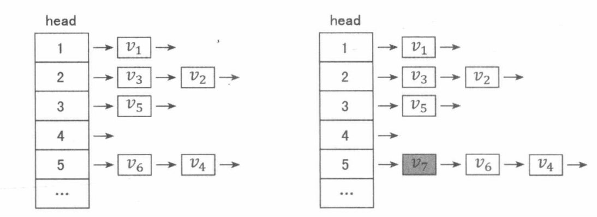

# 1. 链表

数组是一种支持随机访问，但不支持在任意位置插入或删除元素的数据结构。与之相对应，链表支持在任意位置插入或删除，但只能按顺序依次访问其中的元素。我们可以用一个 `struct` 表示链表的节点，其中可以存储任意数据。另外用 `prev` 和 `next` 两个指针指向前后相邻的两个节点，构成一个常见的双向链表结构。

为了避免在左右两端或者空链表中访问越界，我们通常建立额外的两个节点 `head` 与 `tail` 代表链表头尾，把实际数据节点存储在 `head` 与 `tail` 之间，来减少链表边界处的判断，降低编程复杂度。

## 1.1 习题 49：邻值查找[^1]

给定一个长度为 $n$ 的序列 $A$，$A$ 中的数各不相同。

对于 $A$ 中的每一个数 $A_i$，求 $min_{1≤j<i}|A_i−A_j|$，以及令上式取到最小值的 $j$（记为 $P_i$）。

若最小值点不唯一，则选择使 $A_j$ 较小，$P_i$ 较大的那个。

- **输入格式**：

1. 第一行输入整数 $n$，代表序列长度。

2. 第二行输入 $n$ 个整数 $A_1…A_n$, 代表序列的具体数值，数值之间用空格隔开。

- **输出格式**：

1. 输出共 $n−1$ 行，每行输出两个整数，数值之间用空格隔开。分别表示当 $i$ 取 $2∼n$ 时，对应的 $min_{1≤j\le i}|A_i−A_j|$ 和 $P_i$ 的值。

- **数据范围**：

1. $n≤10^5$
2. $|Ai|≤10^9$

- **输入样例**：

```
6
1 5 1 3 1 2
```

- **输出样例**：

```
4 1
0 1
2 3
0 3
1 5
```

## 1.2 习题 50：Running Median[^2]

依次读入一个整数序列，每当已经读入的整数个数为奇数时，输出已读入的整数构成的序列的中位数。

- **输入格式**：

1. 第一行输入一个整数 $P$，代表后面数据集的个数，接下来若干行输入各个数据集。

2. 每个数据集的第一行首先输入一个代表数据集的编号的整数。

3. 然后输入一个整数 $M$，代表数据集中包含数据的个数，$M$ 一定为奇数，数据之间用空格隔开。

4. 数据集的剩余行由数据集的数据构成，每行包含 10 个数据，最后一行数据量可能少于 10 个，数据之间用空格隔开。

- **输出格式**：

1. 对于每个数据集，第一行输出两个整数，分别代表数据集的编号以及输出中位数的个数（应为数据个数加一的二分之一），数据之间用空格隔开。

2. 数据集的剩余行由输出的中位数构成，每行包含 10 个数据，最后一行数据量可能少于 10 个，数据之间用空格隔开。

3. 输出中不应该存在空行。

- **数据范围**：

1. $1≤P≤1000$
2. $1≤M≤99999$
3. 所有 $M$ 相加之和不超过 $5×10^5$

- **输入样例**：

```
3 
1 9 
1 2 3 4 5 6 7 8 9 
2 9 
9 8 7 6 5 4 3 2 1 
3 23 
23 41 13 22 -3 24 -31 -11 -8 -7 
3 5 103 211 -311 -45 -67 -73 -81 -99 
-33 24 56
```

- **输出样例**：

```
1 5
1 2 3 4 5
2 5
9 8 7 6 5
3 12
23 23 22 22 13 3 5 5 3 -3 
-7 -3
```

## 1.3 拓展练习

1. [LeetCode 19. 删除链表的倒数第 N 个结点](https://leetcode.cn/problems/remove-nth-node-from-end-of-list/)
2. [LeetCode 23. 合并K个升序链表](https://leetcode-cn.com/problems/merge-k-sorted-lists/)
3. [LeetCode 25. K 个一组翻转链表](https://leetcode.cn/problems/reverse-nodes-in-k-group/)
4. [LeetCode 61. 旋转链表](https://leetcode.cn/problems/rotate-list/)
5. [LeetCode 82. 删除排序链表中的重复元素 II](https://leetcode-cn.com/problems/remove-duplicates-from-sorted-list-ii/)
6. [LeetCode 138. 复制带随机指针的链表](https://leetcode.cn/problems/copy-list-with-random-pointer/)
7. [LeetCode 141. 环形链表](https://leetcode.cn/problems/linked-list-cycle/)
8. [LeetCode 142. 环形链表 II](https://leetcode-cn.com/problems/linked-list-cycle-ii/)
9. [LeetCode 143. 重排链表](https://leetcode-cn.com/problems/reorder-list/submissions/)
10. [LeetCode 148. 排序链表](https://leetcode-cn.com/problems/sort-list/)
11. [LeetCode 160. 相交链表](https://leetcode.cn/problems/intersection-of-two-linked-lists/)
12. [LeetCode 234. 回文链表](https://leetcode.cn/problems/palindrome-linked-list/)
13. [LeetCode 430. 扁平化多级双向链表](https://leetcode.cn/problems/flatten-a-multilevel-doubly-linked-list/)
14. [LeetCode 708. 循环有序列表的插入](https://leetcode.cn/problems/insert-into-a-sorted-circular-linked-list/)
15. [LeetCode 1171. 从链表中删去总和值为零的连续节点](https://leetcode-cn.com/problems/remove-zero-sum-consecutive-nodes-from-linked-list/)

# 2. 邻接表

在与链表相关的诸多结构中，邻接表是相当重要的一个。它是树与图结构的一般化存储方式，还能用于实现我们在下一节中即将介绍的开散列 Hash 表。实际上，**邻接表可以看成“带有索引数组的多个数据链表”构成的结构集合**。在这样的结构中存储的数据被分成若干类，每一类的数据构成一个链表。每一类还有一个代表元素，称为该类对应链表的“表头”。所有“表头”构成一个表头数组，作为一个可以随机访问的索引，从而可以通过表头数组定位到某一类数据对应的链表。为了方便起见，本书将这类结构统称为“邻接表”结构。

如下图左侧所示，这是一个存储了 6 个数据节点 $v_1\sim v_6$ 的邻接表结构。这 6 个数据节点被分成 4 类，通过表头数组 $\mathrm{head}$ 可以定位到每一类所构成的链表进行遍历访问。

当需要插入新的数据节点时，我们可以通过表头数组 $\mathrm{head}$ 定位到新的数据节点所属类别的链表表头，将新数据在表头位置插入。如下图右侧所示，在邻接表中插入了属于第 5 类的新数据节点 $v_7$。



在一个具有 $n$ 个点 $m$ 条边的有向图结构中，我们可以把每条边所属的“类别”定义为该边的起点标号。这样所有边被分成 $n$ 类，其中第 $x$ 类就由“从 $x$ 出发的所有边”构成。通过表头 $\mathrm{head}[x]$, 我们很容易定位到第 $x$ 类对应的链表，从而访问从点 $x$ 出发的所有边。


上图是在邻接表中插入一张 5 个点、6 条边的有向图之后的状态。这 6 条边按照插入的顺序依次是 $(1,2),(2,3),(2,5),(3,5),(5,4),(5,1)$。上图左侧展示了这个邻接表存储的宏观信息，上图右侧展示了采用“数组模拟链表”的实现方式时，内部数据的实际存储方式。$\mathrm{head}$ 与 $\mathrm{next}$ 数组中保存的是 “$\mathrm{ver}$ 数组的下标”，相当于指针，其中 0 表示指向空。$\mathrm{ver}$ 数组存储的是每条边的终点，是真实的图数据。

```java
// 加入有向边(x, y)，权值为 z
void add(int x, int y , int z) {
    ver[++tot] = y, edge[tot] = z; // 真实数据
    next[tot] = head[x], head[x] = tot; // 在表头 x 处插入
}

// 访问从 x 出发的所有边
for (int i = head[x]; i; i = next[i]) {
    int y = ver[i], z = edge[i];
    // 找到了一条有向边(x, y), 权值为 z
}
```

上面的代码片段用数组模拟链表的方式存储了一张带权有向图的邻接表结构。

对于无向图，我们把每条无向边看作两条有向边插入即可。**有一个小技巧是，结合在第 0x01 节提到的“成对变换”的位运算性质**，我们可以在程序最开始时，初始化变量 $tot = 1$。这样每条无向边看成的两条有向边会成对存储在 $\mathrm{ver}$ 和 $\mathrm{edge}$ 数组的下标 “2 和 3” “4 和 5” “6 和 7”…的位置上。通过对下标进行 $\mathrm{xor}\ 1$ 的运算，就可以直接定位到与当前边反向的边。换句话说，如果 $\mathrm{ver}[i]$ 是第 $i$ 条边的终点，那么 $\mathrm{ver}[i \ \mathrm{xor}\ 1]$ 就是第 $i$ 条边的起点。

# 题解

## 习题 49：邻值查找

### 解法一

把 $A_1,A_2,\dots,A_n$ 依次插入一个集合，则在插入 $A_i$ 之前，集合中保存的就是满足 $1 \le j < i$ 的所有 $A_j$。根据题意，我们只需在集合中査找与 $A_i$ 最接近的值。

若能维护一个有序集合，则集合中与 $A_i$ 最接近的值要么是 $A_i$ 的前驱（排在它前一名的值)，要么是 $A_i$ 的后继（排在它后一名的值)，比较前驱、后继与 $A_i$ 的差即可。

而二叉平衡树（第 0x46 节）就是一个支持动态插入、查询前驱以及查询后继的数据结构。

```java
public void lookup() {
    Scanner in = new Scanner(System.in);
    int n = in.nextInt();
    TreeMap<Integer, Integer> tree = new TreeMap<>();
    tree.put(in.nextInt(), 1);
    for (int i = 2; i <= n; i++) {
        int a = in.nextInt();
        Integer prev = tree.floorKey(a), next = tree.ceilingKey(a);
        int prevDiff = prev != null ? a - prev : Integer.MAX_VALUE;
        int nextDiff = next != null ? next - a: Integer.MAX_VALUE;
        if (prevDiff <= nextDiff) {
            System.out.println(prevDiff + " " + tree.get(prev));
        } else {
            System.out.println(nextDiff + " " + tree.get(next));
        }
        tree.put(a, i);
    }
}
```

### 解法二

把序列 $A$ 从小到大排序，然后依次串成一个链表。注意在排序的同时，建立一个数组 $B$，其中 $B_i$ 表示原始序列中的 $A_i$ 处于链表中的哪个位置（一个指针）。

因为链表有序，所以在链表中，指针 $B_n$ 指向的节点的 `prev` 和 `next` 就分别是 $A_n$ 的前驱和后继。通过比较二者与 $A_n$ 的差，我们就能求出与 $A_n$ 最接近的值。

接下来，我们在链表中删除 $B_n$ 指向的节点，该操作是 $\mathrm{O}(1)$ 的。

此时，我们按同样方法考虑 $B_{n-1}$ 的 `prev` 和 `next`, 再删除 $B_{n-1}$。依此类推，最终即可求出与每个 $A_i$ 最接近的值。

两种解法的时间复杂度都是 $\mathrm{O}(n\log n)$，其中第二种解法的瓶颈在于排序。

```java
public static class Node {
    int val, idx;
    Node prev, next;

    public Node(int val, int idx) {
        this.val = val;
        this.idx = idx;
    }

    public int[] getAndDelete() {
        int lAbs = prev != null ? val - prev.val : Integer.MAX_VALUE;
        int rAbs = next != null ? next.val - val : Integer.MAX_VALUE;
        int[] result;
        if (lAbs <= rAbs) {
            result = new int[]{lAbs, prev.idx};
        } else {
            result = new int[]{rAbs, next.idx};
        }
        if (prev != null) {
            prev.next = next;
        }
        if (next != null) {
            next.prev = prev;
        }

        return result;
    }
}

public void linkMethod() {
    Scanner in = new Scanner(System.in);
    int n = in.nextInt();
    Node[] arr = new Node[n];
    for (int i = 0; i < n; i++) {
        arr[i] = new Node(in.nextInt(), i);
    }
    // 排序链表并串起来
    Arrays.sort(arr, (a, b) -> Integer.compare(a.val, b.val));
    for (int i = 1; i < n; i++) {
        arr[i].prev = arr[i-1];
        arr[i-1].next = arr[i];
    }

    // 记录排序前序列元素在链表中的指针
    Node[] ori = new Node[n];
    for (Node node : arr) {
        ori[node.idx] = node;
    }

    int[][] ans = new int[n][];
    for (int i = n-1; i >= 1; i--) {
        ans[i] = ori[i].getAndDelete();
    }
    for (int i = 1; i < n; i++) {
        System.out.println(ans[i][0] + " " + (ans[i][1] + 1));
    }
}
```

## 习题 50：Running Median

在 0x05 节中，我们讨论了本题的“对顶堆”做法。这里我们再介绍一种使用链表的离线做法。我们可以先把整个序列读入进来，排序之后依次插入一个链表，此时我们可以知道整个序列的中位数 $P$。随后，我们倒序考虑本题中的读入过程，也就是把整数从链表中一个个删去。

每次删去一个整数 $X$ 后，要么中位数不变，要么新的中位数与原来中位数 $P$ 的位置相邻，通过 $X$ 和 $P$ 的大小关系以及链表中元素的总个数分情况讨论，很容易确定新的中位数 $P$。

在上面两道例题中，我们都用了“倒序处理”的方法，利用链表容易执行“删除”操作的特性，快速地找到了答案。

```java
public static class Node {
    int val, oriIdx, nowIdx;
    Node prev, next;

    public Node(int val, int oriIdx) {
        this.val = val;
        this.oriIdx = oriIdx;
    }

    public void delete() {
        if (prev != null) {
            prev.next = next;
        }
        if (next != null) {
            next.prev = prev;
        }
    }

    public String toString() {
        return Integer.toString(val);
    }
}

public void calcMedian() {
    Scanner in = new Scanner(System.in);
    final int P = in.nextInt();
    for (int p = 0; p < P; p++) {
        // 和 G49 类似的方法，排序链表节点，记录原下标
        final int label = in.nextInt(), M = in.nextInt();
        Node[] nodes = new Node[M];
        for (int i = 0; i < M; i++) {
            nodes[i] = new Node(in.nextInt(), i);
        }
        Arrays.sort(nodes, (a, b) -> Integer.compare(a.val, b.val));

        // 连接链表节点，并记录每个节点的现下标
        for (int i = 1; i < M; i++) {
            nodes[i].prev = nodes[i-1];
            nodes[i-1].next = nodes[i];
            nodes[i].nowIdx = i;
        }

        // pos 记录原序列元素在链表中的指针
        Node[] pos = new Node[M];
        for (int i = 0; i < M; i++) {
            pos[nodes[i].oriIdx] = nodes[i];
        }

        // median 动态维护链表的中位数
        Node median = nodes[M/2];
        int[] medians = new int[M/2+1];
        for (int i = M-1, j = M/2; i >= 0; i--) {
            // 到了奇数位置，记录中位数
            if ((i & 1) == 0) {
                medians[j--] = median.val;
            }
            pos[i].delete();
            // 如果删除时，链表长度是奇数
            if ((i & 1) == 0) {
                // 如果删除的节点在中位数右边，或者就是中位数，那么中位数左移
                if (pos[i].nowIdx >= median.nowIdx) {
                    median = median.prev;
                }
            } else { // 否则如果链表长度是偶数
                if (pos[i].nowIdx <= median.nowIdx) {
                    median = median.next;
                }
            }
        }

        // 输出中位数
        System.out.println(label + " " + medians.length);
        for (int i = 1; i <= medians.length; i++) {
            System.out.print(medians[i-1]);
            // 注意，只有最后一个数字不需要输出空格
            if (i != medians.length) {
                System.out.print(' ');
            }
            if (i % 10 == 0) {
                System.out.println();
            }
        }
        // 避免输出多余的空行
        if (medians.length % 10 != 0 && p != P - 1) {
            System.out.println();
        }
    }
}
```


[^1]: https://www.acwing.com/problem/content/138/
[^2]: https://www.acwing.com/problem/content/108/