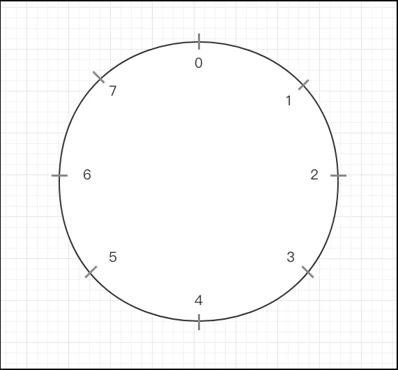
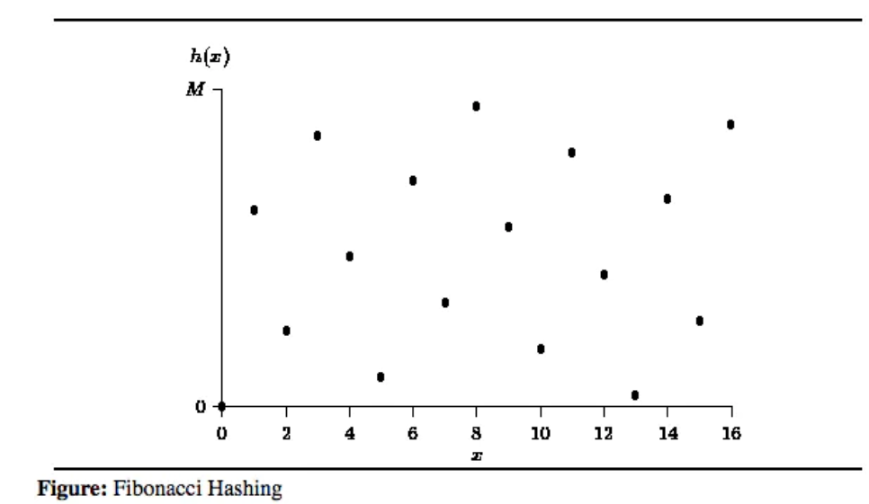

# 1. Hash 表

Hash 表又称为散列表，一般由 Hash 函数（散列函数）与链表结构共同实现。与离散化思想类似，当我们要对若干复杂信息进行统计时，可以用 Hash 函数把这些复杂信息映射到一个容易维护的值域内。因为值域变简单、范围变小，有可能造成两个不同的原始信息被 Hash 函数映射为相同的值，所以我们需要处理这种冲突情况。

有一种称为“开散列”的解决方案是，建立一个邻接表结构，以 Hash 函数的值域作为表头数组 head, 映射后的值相同的原始信息被分到同一类，构成一个链表接在对应的表头之后，链表的节点上可以保存原始信息和一些统计数据。

当 Hash 函数设计较好时，原始信息会被比较均匀地分配到各个表头之后，从而使每次查找、统计的时间降低到“原始信息总数除以表头数组长度”。若原始信息总数与表头数组长度都是 $\mathrm{O}(N)$ 级别且 Hash 函数分散均匀，几乎不产生冲突，那么每次査找、统计的时间复杂度期望为 $\mathrm{O}(1)$。

例如，我们要在一个长度为 $N$ 的随机整数序列 $A$ 中统计每个数出现了多少次。当数列 $A$ 中的值都比较小时，我们可以直接用一个数组计数（**建立一个大小等于值域的数组进行统计和映射，其实就是最简单的 Hash 思想**）。当数列 $A$ 中的值很大时，我们可以把排序后扫描统计。这里我们换一种思路，尝试一下 Hash 表的做法。

设计 Hash 函数为 $H(x) = (x\mod P) +1$, 其中 $P$ 是一个比较大的质数，但不超过 $N$。显然，这个 Hash 函数把数列 $A$ 分成 $P$ 类，我们可以依次考虑数列中的每个数 $A[i]$，定位到 $\mathrm{head}[H(A[i])]$ 这个表头所指向的链表。如果该链表中不包含 $A[i]$, 我们就在表头后插入一个新节点 $A[i]$, 并在该节点上记录出现了 1 次，否则我们就直接找到己经存在的 $A[i]$ 节点将其出现次数加 1。因为整数序列 $A$ 是随机的，所以最终所有的 $A[i]$ 会比较均匀地分散在各个表头之后，整个算法的时间复杂度可以近似达到 $\mathrm{O}(N)$。

## 1.1 哈希算法

一个好的 hash 函数应满足下列三个条件：

1. 一致性 —— 等价的 key 必然产生相等的 hash code
2. 高效性 —— 高效的计算
3. 均匀性 —— 均匀地散列所有的 key

### 1.1.1 除法哈希法

基本公式：$\mathrm{hash}(key) = key\ \%\ M$。在除法哈希法中，$M$ 通常为一个较大的素数。

#### 1.1.1.1 为什么是素数？

之所以使用素数，是因为素数在做取模运算时，余数的个数是最多的。使用素数可以让元素取模后的值， 更不容易发生冲撞。那么其中的原理是怎么样的呢？

首先我们需要了解合数和素数：合数即有两个以上的因数，素数（质数）即只有两个因数，分别为 1 和其本身。 如果对一个合数取模，那么对其某个因数取模，结果可能仍然一致。例如 10 对 8 取模，结果为 2，对 4 取模，结果也为 2。 而我们对一个素数取模，由于素数只有 1 和其本身两个素数，即不可能出现上述情形。

取余实际相当于一种映射。比如我们给定一个整数的集合 $A = \{a_1,a_2,\dots,a_i\}$，我们要对该集合里面的所有元素对数字 $j$ 取余，那么 $A$ 中所有元素取余后的值的集合 $B=\{0,1,\dots,j\}$，取余实际上就是将集合 $A$ 映射到集合 $B$，我们来看几个例子。

> 例 1

现取 $i=12,j=8$，则有
$$
A_0 = \{1,2,3,4,5,6,7,8,9,10,11,12\} \\
\downarrow f(a_i) = a_i\ \%\ j \\
f(A_0) = \{1,2,3,4,5,6,7,0,1,2,3,4\} \\
\Downarrow \\
\{0,1,2,3,4,5,6,7\}\quad \mathcal{VS}\quad B_0^{j=8} = \{0,1,2,3,4,5,6,7\}
$$

> 例 2

仍取 $i=12,j=8$，换一个集合，则有
$$
A_1 = \{10,8,12,4,6,32,20,24,26,32,34,28\} \\
\downarrow f(a_i) = a_i\ \%\ j \\
f(A_1) = \{2,0,4,4,0,0,4,0,2,0,2,4\} \\
\Downarrow \\
\{0,2,4\}\quad \mathcal{VS}\quad B_0^{j=8} = \{0,1,2,3,4,5,6,7\}
$$
这两个例子差别在哪呢？后面这个例子虽然映射前集合 $A$ 的元素数量仍然是12个，但是映射后的元素只出现了 0、2、4， 也就是说集合 $B$ 中的元素，有即超过一半多的元素根本就没有用上！

> 例 3

集合不变，我们把模换成素数试试，取 $i=12,j=7$
$$
A_1 = \{10,8,12,4,6,32,20,24,26,32,34,28\} \\
\downarrow f(a_i) = a_i\ \%\ j \\
f(A_1) = \{3,1,5,4,2,4,6,3,5,4,6,0\} \\
\Downarrow \\
\{0,1,2,3,4,5,6\}\quad \mathcal{VS}\quad B_1^{j=7} = \{0,1,2,3,4,5,6\}
$$
这里为了避免因模数改变过大而造成取余后的值分布范围增大，我们取了跟 8 最接近并且比它小的一个素数 7。可以看出，模数换成素数后， 原来的集合 $A$ 并没有改变，但是最终映射的结果却 100% 的利用了新的余数空间（而新的余数空间和旧余数空间大小只相差 1）。 也就是说，使用素数作为模数，可以提高余数空间的利用率！当然，如果原集合中的元素属于均匀分布或者接近均匀分布的话 （元素间的值差均匀且较小），模数用素数和非素数的差距并不大（第一个例子）。

#### 1.1.1.2 证明

设原有集合 $A = \{a_1,a_2,\dots,a_i\}, a_i\in \N^0$，取 $p\in A$ 以及模数 $q(q\in \N^+)$，$p,q$ 的最大公约数为 $k(k\in \N^+)$ （$\N^0$ 是 0 和正整数集合，$\N^+$ 是正整数集合。），分别记
$$
\left\{
\begin{array}{**lr**}
p = k\cdot m, & m \in \N^0 \\
q = k \cdot n, & n \in \N^+
\end{array}
\right. \tag1
$$
再设模运算后的商为 $d$，余数为 $r$（及 $p % q = r$），则有
$$
p = q\cdot d + r\quad r,d \in \N^0 \tag2
$$
将式(1)带入式(2)有
$$
k\cdot m = k\cdot n \cdot d + r \tag3
$$
化简后可得到余数 $r$ 的表达式为：
$$
r = k(m-nd)\quad k,n \in \N^+\ m,d \in \N^0 \tag4
$$
令 $c=m-nd,\ c \in \N^0$，则有 $r = k\cdot c$。

下面分情况讨论：

1. 特殊情况：
   1. 当 $p$ 是 $q$ 的倍数时，$k = q, n = 1, d = m$，而余数 $r = 0$。所以为 $q$ 的倍数的数 hash 之后会发生冲突。
   2. 当 $q$ 是 $p$ 的倍数时，$k = p, m = 1, d = 0$，而余数 $r = p$。
2. 当模数 $q$ 为合数时：
   1. 若此时集合中的元素 $p$ 为素数，则有 $k = 1$，也就是说此时余数可以遍取余数空间的所有值：$r = 0, 1, 2\dots$。 
   2. 若集合中的元素 $p$ 也为合数，则有 $k = 1, 2, 3,...$。也就是说余数有可能只能取余数空间中的部分值：
      - $r = 0, 2, 4,...\quad k = 2$
      - $r = 0, 3, 6,...\quad k = 3$
      - $...$
   3. 总结上述两点来说，当模数 $q$ 取合数时，如果原集合 $A$ 中的合数较多时，会导致大量的余数空间被浪费， 这种情况的另一个不利影响是加剧了余数之间的碰撞（重叠）。
3. 当模数 $q$ 为素数时，不管原集合 $A$ 中的元素 $p$ 取什么值，只要 $p$ 不是 $q$ 的倍数，则必有 $k=1$， 此时余数可以遍取余数空间的所有值：$r = 0, 1, 2,...$。也就是说，**只要我们的模数为素数，不管原集合 $A$ 中的素数和非素数的组成情况如何， 都能充分利用余数空间**。这就解释了为什么我们做模运算的时候，模数要选择素数。

#### 1.1.1.3 为什么要用大素数？

这个原因就比较简单了，**使用大的素数，可以尽量减小余数之间的碰撞**。仍以前面的例 3 来说，原集合大小为 12，余数空间大小为 7， 也就是说原集合中有12 - 7 = 5个元素因为余数空间的限制，跟其他元素的余数发生了碰撞（重叠）。

### 1.1.2 乘法哈希法

公式：$\mathrm{hash}(key) = (A \cdot key\ \%\ 2^w) >> (w - r)$。 其中：

1. $w$ 为计算机字长大小，例如 32 位、64 位。
2. $A$ 是一个等长于计算机字长的奇数，满足 $2^{w-1} < A < 2^w$。
3. $r$ 是一个与哈希表大小有关的常数，设哈希表长度为 $m$，$r = ⌈\log_2m⌉$。一般令 $m$ 为 2 的幂，此时 $m = 2^r$。

$A \cdot key$ 是一个 $2w$ 字长的数，对 $2^w$ 取余，结果是低 $w$ 位。接着向右偏移 $w - r$ 位，保留上一结果中 $w$ 位的高 $r$ 位。 之所以令 $2^{w-1} < A < 2^w$，道理和 2.1 节中使用大素数一样。一般的实现中我们不用对 $2^w$ 取余，高 $w$ 位会因为溢出截断。

#### 1.1.2.1 Knuth 乘法散列法

在弄懂上面算法的原理之前，我们先来看看 Knuth 乘法散列法的数学公式：$\mathrm{hash}(key) = ⌊m \cdot (key \cdot A\ \%\ 1)⌋$。 其中：

1. $m$ 是散列表长度，一般取 2 的幂 $2^r$。
2. $A$ 是一个常数，$0 < A < 1$。令 $A = s / 2^w$，其中 $0 < s < 2^w$，$w$ 是计算机字长。
3. 对 1 取余是取出 $k * A$ 的小数部分。

分析如下：

1. $key \cdot A$ 等于 $key \cdot s / 2^w$，而 $s = A \cdot 2^w$。
2. 乘积 $key\cdot s$ 结果可视为一个 $2w$ 位的值 $r_1 * 2^w + r_0$，其中 $r_1$ 是乘积高 $w$ 位字，$r_0$ 是乘积低 $w$ 位字。
3. 除以 $2^w$，得到 $r_1.r_0$，$r_0$ 被移到了小数部分。
4. 对 1 取余，得到小数部分 $0.r_0$。
5. 最后乘以 $m$ 向下取整，得到 $r_0$ 的高 $r$ 位。

可以看到，此方法和上面乘法哈希法原理一致，可以将上面乘法哈希法看作是 Knuth 乘法哈希法在程序中的实现。

#### 1.1.2.2 解释

我们设 $m = 2 ^ 3 = 8，r = 3$。取字长为 8 位，即 $w = 8$。设 $A = 0.10110010$，$key = 11010110$，$A \cdot key = 10010100.11001100$，取小数部分高 $r$ 位得 110，所以结果就是 $\mathrm{hash}(key) = 110 = 6$。

为了理解这个过程，我们画一个车轮，代表哈希表。因为 $m = 8$，将其 8 等分。如下图所示：



$A$ 乘以 $m$ 为 $101.1001$，约为 $5.5$。所以：

1. 当 $key = 1$ 时，$A \cdot key = A \cdot 1 = 5.5$，从下标 0 的位置开始顺时针转到 5.5 的位置。
2. 当 $key = 2$ 时，$A \cdot key = A \cdot 2 = 11$，大约绕到 11 % 8，略微超过 3 的位置。
3. 当 $key = 3$ 时，$A \cdot key = A \cdot 3 = 16.5$，大约绕到 16.5 % 8，即约 0.5 的位置。

每次多加一个 $A$，就会多加一段 $A$ 的弧长。如果 $A$ 为奇数，那么哈希的过程就类似于把键放入不同的槽中。如果 $key$ 很大， 就会绕几圈。

#### 1.1.2.3 斐波那契（Fibonacci）哈希法

当“乘法哈希法”的 $A  = 2^W / φ$, $1 / φ ≈ (√5-1)/2 = 0.618 033 988$ 时的情况，而 $(√5-1)/2$ 被称为黄金分割点。 此时，散列的效果最均匀。对于 32 位，$A$ 的值为 $2654435769$。

为什么选择黄金分割点效果最好呢？这与使用乘法对连续键进行散列时发生的情况有关。如图“斐波那契散列”所示， 连续的 $key$ 分布得很好。实际上，当我们使用 $A = 2^W / φ$ 对连续键进行哈希处理时， 每个后续键的哈希值都位于两个已经计算的最宽间距的哈希值之间。此外，黄金分割率 $φ$ 的一个特性是， 每个后续哈希值都会根据黄金分割率划分其落入的间隔。



### 1.1.3 Java 中的哈希

#### 1.1.3.1 Java 中的哈希算法

Java 中的 `hashCode` 函数被建议返回素数，这是因为在 Java 的 `HashMap`、`HashSet` 等哈希表数据结构中， 哈希表的大小是 2 的幂。根据 1.1.1.2 节所述，此时 $q$ 是个合数，那么我们需要让 $p$ 变为素数以充分利用余数空间， 减少冲突。为什么 Java 中的哈希表大小是 2 的幂呢？这是因为当 $n$ 是 2 的幂时，第一是可以使用 $p\ \&\ (n - 1)$ 代替 $p\ \%\ n$， 达到更高的计算效率；第二是 2 的幂扩容计算很简单。

#### 1.1.3.2 Java 中的哈希函数

Java 中哈希函数的结果等价于下面的等式：
$$
hash = s[0]*31^{n-1} + s[1]*31^{n-2} + ... + s[n-1]
$$
其中 $n$ 是因子个数，$s[i]$ 是第 $i$ 个参与散列计算的因子。可以看到，它们都乘以了 31 这个素数。

1. 上面 $hash$ 的计算表达式里相当于每项都有了素数，那么 $hash\ \%\ n$ 时也就近似相当于素数对 $n$ 取模， 这个时候余数也就会尽可能的多。
2. 通过相乘，位将向左移动。这将使用更多的哈希码可用空间，从而减少冲突。
3. 最右边的低位也会被填充（而不是变成 0），并与进入哈希的下一个数据混合。

既然素数越大越好，素数又那么多，为什么要选择31？之所以选择31：

1. 计算机计算 31 比较快（$m * 31$可以优化为 $(m << 5) - m$）
2. 大多数情况下我们都是采用 `String` 作为 key，而这又是英语国家写出来的语言，曾有人对超过 5W 个英文单词做了测试, 在常量取31情况下, 碰撞的次数都不超过 7 次。

## 1.2 习题 51：雪花[^1]

有 $N$ 片雪花，每片雪花由六个角组成，每个角都有长度。第 $i$ 片雪花六个角的长度从某个角开始顺时针依次记为 $a_{i,1},a_{i,2},…,a_{i,6}$。

因为雪花的形状是封闭的环形，所以从任何一个角开始顺时针或逆时针往后记录长度，得到的六元组都代表形状相同的雪花。

例如 $a_{i,1},a_{i,2},…,a_{i,6}$ 和 $a_{i,2},a_{i,3},…,a_{i,6},a_{i,1}$ 就是形状相同的雪花。$a_{i,1},a_{i,2},…,a_{i,6}$ 和 $a_{i,6},a_{i,5},…,a_{i,1}$ 也是形状相同的雪花。

我们称两片雪花形状相同，当且仅当它们各自从某一角开始顺时针或逆时针记录长度，能得到两个相同的六元组。

求这 $N$ 片雪花中是否存在两片形状相同的雪花。

- **输入格式**：

1. 第一行输入一个整数 $N$，代表雪花的数量。

2. 接下来 $N$ 行，每行描述一片雪花。

3. 每行包含 6 个整数，分别代表雪花的六个角的长度（这六个数即为从雪花的随机一个角顺时针或逆时针记录长度得到）。同行数值之间，用空格隔开。

- **输出格式**：

1. 如果不存在两片形状相同的雪花，则输出：

   ```
   No two snowflakes are alike.
   ```

2. 如果存在两片形状相同的雪花，则输出：

	```
	Twin snowflakes found.
	```

- **数据范围**：

1. $1≤N≤100000$
2. $0≤a_{i,j}<10000000$

- **输入样例**：

```
2
1 2 3 4 5 6
4 3 2 1 6 5
```

- **输出样例**：

```
Twin snowflakes found.
```

# 2. 字符串 Hash

下面介绍的字符串 Hash 函数把一个任意长度的字符串映射成一个非负整数，并且其冲突概率几乎为零。

取一固定值 $P$，把字符串看作 $P$ 进制数，并分配一个大于 0 的数值，代表每种字符。一般来说，我们选取一个大于字符集大小（即字符串中可能出现的字符种类的数目）的质数 $P$ 作为 base，再选取一个在字符串长度平方级别左右的质数 $M$ 作为 mod，产生哈希碰撞的概率就会很低。这又叫做 **Rabin-Karp 字符串哈希算法（滚动哈希）**。

一般来说，我们取 $P = 131$ 或 $P = 13331$, 此时 Hash 值产生冲突的概率极低，只要 Hash 值相同，我们就可以认为原字符串是相等的。**通常我们取 $M = 2^{64}$, 即直接使用 `unsigned long long` 类型存储这个 Hash 值，在计算时不处理算术溢出问题，产生溢出时相当于自动对 $2^{64}$ 取模，这样可以避免低效的取模运算**。

除了在极特殊构造的数据上，上述 Hash 算法很难产生冲突，一般情况下上述 Hash 算法完全可以出现在题目的标准解答中。我们还可以多取一些恰当的 $P$ 和 $M$ 的值（例如大质数)，多进行几组 Hash 运算，当结果都相同时才认为原字符串相等，就更加难以构造出使这个 Hash 产生错误的数据。

对字符串的各种操作，都可以直接对 $P$ 进制数进行算术运算反映到 Hash 值上。

如果我们已知字符串 $S$ 的 Hash 值为 $H(S)$, 那么在 $S$ 后添加一个字符 $c$ 构成的新字符串 $S +c$ 的 Hash 值就是 $H(S +c)=(H(S)* P + value [c]) \mod M$。其中乘 $P$ 就相当于 $P$ 进制下的左移运算，$value[c]$ 是我们为 $c$ 选定的代表数值。

如果我们己知字符串 $S$ 的 Hash 值为 $H(S)$, 字符串 $S + T$ 的 Hash 值为 $H(S +T )$, 那么字符串 $T$ 的 Hash 值 $H(T ) =(H(S+T) - H(S)*P^{len(T)})\mod M$。这就相当于通过 $P$ 进制下在 $S$ 后边补 0 的方式，把 $S$ 左移到与 $S + T$ 的左端对齐，然后二者相减就得到了 $H(T)$。

根据上面两种操作，我们可以通过 $\mathrm{O}(N)$ 的时间预处理字符串所有前缀 Hash 值，并在 $\mathrm{O}(1)$ 的时间内查询它的任意子串的 Hash 值。

## 2.1 习题 52：兔子与兔子[^2]

很久很久以前，森林里住着一群兔子。有一天，兔子们想要研究自己的 DNA 序列。

我们首先选取一个好长好长的 DNA 序列（小兔子是外星生物，DNA 序列可能包含 26 个小写英文字母）。然后我们每次选择两个区间，询问如果用两个区间里的 DNA 序列分别生产出来两只兔子，这两个兔子是否一模一样。

注意两个兔子一模一样只可能是他们的 DNA 序列一模一样。

- **输入格式**：

1. 第一行输入一个 DNA 字符串 $S$。
2. 第二行一个数字 $m$，表示 $m$ 次询问。
3. 接下来 $m$ 行，每行四个数字 $l_1,r_1,l_2,r_2$，分别表示此次询问的两个区间，注意字符串的位置从 1 开始编号。

- **输出格式**：

1. 对于每次询问，输出一行表示结果。
2. 如果两只兔子完全相同输出 `Yes`，否则输出 `No`（注意大小写）。

- **数据范围**：

1. $1≤length(S),m≤1000000$

- **输入样例**：

```
aabbaabb
3
1 3 5 7
1 3 6 8
1 2 1 2
```

- **输出样例**：

```
Yes
No
Yes
```

## 2.2 习题 53：回文子串的最大长度[^3]

如果一个字符串正着读和倒着读是一样的，则称它是回文的。

给定一个长度为 $N$ 的字符串 $S$，求他的最长回文子串的长度是多少。

- **输入格式**：

1. 输入将包含最多 30 个测试用例，每个测试用例占一行，以最多 1000000 个小写字符的形式给出。

2. 输入以一个以字符串 `END` 开头的行表示输入终止。

- **输出格式**：

1. 对于输入中的每个测试用例，输出测试用例编号和最大回文子串的长度（参考样例格式）。

2. 每个输出占一行。

- **输入样例**：

```
abcbabcbabcba
abacacbaaaab
END
```

- **输出样例**：

```
Case 1: 13
Case 2: 6
```

## 2.3 习题 54：后缀数组[^4]

后缀数组 (SA) 是一种重要的数据结构，通常使用倍增或者 DC3 算法实现。在本题中，我们希望使用快排、Hash 与二分实现一个简单的 $\mathrm{O}(n\log^2n)$ 的后缀数组求法。

详细地说，给定一个长度为 $n$ 的字符串 $S$（下标 $0∼n−1$），我们可以用整数 $k(0≤k<n)$ 表示字符串 $S$ 的后缀 $S(k∼n−1)$。

把字符串 $S$ 的所有后缀按照字典序排列，排名为 $i$ 的后缀记为 $SA[i]$。

额外地，我们考虑排名为 $i$ 的后缀与排名为 $i−1$ 的后缀，把二者的最长公共前缀的长度记为 $Height[i]$。

我们的任务就是求出 $SA$ 与 $Height$ 这两个数组。

- **输入格式**：

1. 输入一个字符串，其长度不超过 30 万。

2. 字符串由小写字母构成。

- **输出格式**：

1. 第一行为数组 $SA$，相邻两个整数用 1 个空格隔开。

2. 第二行为数组 $Height$，相邻两个整数用 1 个空格隔开，我们规定 $Height[1]=0$。

- **输入样例**：

```
ponoiiipoi
```

- **输出样例**：

```
9 4 5 6 2 8 3 1 7 0
0 1 2 1 0 0 2 1 0 2
```

# 题解

## 习题 51：雪花

定义 Hash 函数 $H(a_{i,1},a_{i,2},\dots,a_{i,6}) = \left(\sum_{j=1}^6a_{i,j} + \prod_{j=1}^6a_{i,j} \right)\mod P$，其中 $P$ 是我们自己选取的一个较大的质数。显然，对于两片形状相同的雪花，它们六个角的长度之和、长度之积都相等，因此它们的 Hash 函数值也相等。

建立一个 Hash 表，把 $N$ 片雪花依次插入。对于每片雪花 $a_{i,1},a_{i,2},…,a_{i,6}$，我们直接扫描表头对应的链表，检查是否存在与 $a_{i,1},a_{i,2},…,a_{i,6}$ 形状相同的雪花即可。对于随机数据，期望的时间复杂度为 $\mathrm{O}(N^2/P)$；取 $P$ 为最接近 $N$ 的质数，期望的时间复杂度为 $\mathrm{O}(N)$。在下一节中，我们将学习循环同构串的“最小表示法”，进一步提高判断两片雪花形状是否相同的效率。

```java
/**
 * 找到小于等于 n 的最大质数
 */
public static int floorPrime(int n) {
    int i = n;
    for (; i > 1; i--) {
        boolean isPrime = true;
        for (int j = 2; j * j <= i; j++) {
            if (i % j == 0) {
                isPrime = false;
                break;
            }
        }
        if (isPrime) {
            break;
        }
    }

    return i;
}

public static class SnowflakeHash {
    private final int[][] snowflakes;
    // head, next 存 snowflakes 的下标，表示链表
    private final int[] head, next;
    private final int prime;
    private int size;

    public SnowflakeHash(int n) {
        snowflakes = new int[n+1][];
        head = new int[n+1];
        next = new int[n+1];
        prime = floorPrime(n+1);
    }

    public boolean insert(int[] snowflake) {
        int hv = hash(snowflake);
        for (int i = head[hv]; i != 0; i = next[i]) {
            if (check(snowflakes[i], snowflake)) {
                return true;
            }
        }

        // size 是不断增长的，所以往 next 里面存的都是不一样的值，不会出现冲突
        // head 下标是 hash 值，里面存的还是 size
        snowflakes[++size] = snowflake;
        next[size] = head[hv];
        head[hv] = size;

        return false;
    }

    private boolean check(int[] a, int [] b) {
        final int len = a.length;
        // 轮询 a 的每个位置做开头
        for (int i = 0; i < len; i++) {
            boolean equal = true;
            // 让 a 和顺时针的 b 比较
            for (int j = 0; j < len; j++) {
                if (a[(i + j) % len] != b[j]) {
                    equal = false;
                    break;
                }
            }
            if (equal) {
                return true;
            }

            equal = true;
            // 让 a 和逆时针的 b 比较
            for (int j = 0; j < len; j++) {
                if (a[(i + j) % len] != b[len - 1 - j]) {
                    equal = false;
                    break;
                }
            }
            if (equal) {
                return true;
            }
        }

        return false;
    }

    private int hash(int[] snowflake) {
        int sum = 0;
        long product = 1;
        for (int i : snowflake) {
            sum = (sum + i) % prime;
            product = (product * i) % prime;
        }
        return (int) ((sum + product) % prime);
    }
}

public void sameSnowflake() {
    Scanner in = new Scanner(System.in);
    final int N = in.nextInt();
    SnowflakeHash hash = new SnowflakeHash(N);
    for (int i = 0; i < N; i++) {
        int[] snowflake = new int[6];
        for (int j = 0; j < 6; j++) {
            snowflake[j] = in.nextInt();
        }
        if (hash.insert(snowflake)) {
            System.out.println("Twin snowflakes found.");
            return;
        }
    }
    System.out.println("No two snowflakes are alike.");
}
```

## 习题 52：兔子与兔子

使用字符串 Hash 法如下

```java
public static class HashStr {

    private final long[][] hashes;
    private final long[][] basePow;

    public HashStr(char[] s, int[] primes) {
        hashes = new long[primes.length][s.length+1];
        basePow = new long[primes.length][s.length+1];
        for (int i = 0; i < primes.length; i++) {
            int p = primes[i];
            /*
            0  c0  c0*p+c1  c0*p^2+c1*p+c2  ...
            1  p^1 p^2      p^3             ...

            hashes[i] 表示 s[0..i) 的哈希值
            basePow[i] 表示 p^i
            */
            basePow[i][0] = 1;
            for (int j = 0; j < s.length; j++) {
                hashes[i][j+1] = hashes[i][j] * p + s[j] - 'a';
                basePow[i][j+1] = basePow[i][j] * p;
            }
        }
    }

    public boolean eq(int l1, int r1, int l2, int r2) {
        if (r1 - l1 != r2 - l2) {
            return false;
        } else if (l1 == l2) {
            return true;
        }
        for (int i = 0; i < hashes.length; i++) {
            /*
            注意，如果要取模的话：
            (hashes[i][r1] - hashes[i][l1-1] * basePow[i][r1 - l1 + 1]) % m

            减法那里取模需要改成下面这样，否则负数取模会出错：
            (hashes[i][r1] - hashes[i][l1-1] * basePow[i][r1 - l1 + 1] % m + m) % m
            */
            long hash1 = hashes[i][r1] - hashes[i][l1-1] * basePow[i][r1 - l1 + 1];
            long hash2 = hashes[i][r2] - hashes[i][l2-1] * basePow[i][r2 - l2 + 1];
            if (hash1 != hash2) {
                return false;
            }
        }
        return true;
    }
}

public void findSameRabbit() {
    Scanner in = new Scanner(System.in);
    char[] s = in.nextLine().toCharArray();
    HashStr hash = new HashStr(s, new int[]{31});
    final int n = in.nextInt();
    for (int o = 0; o < n; o++) {
        int l1 = in.nextInt(), r1 = in.nextInt();
        int l2 = in.nextInt(), r2 = in.nextInt();
        if (hash.eq(l1, r1, l2, r2)) {
            System.out.println("Yes");
        } else {
            System.out.println("No");
        }
    }
}
```

## 习题 53：回文子串的最大长度

写几个回文串观察它们的性质，我们可以发现回文串分为两类：

1. 奇回文串 $A[1\sim M]$，长度 $M$ 为奇数，并且 $A[1\sim M / 2 +1] = \mathrm{reverse}(A[M/2 +1\sim M] )$, 它的中心点是一个字符。其中 $\mathrm{reverse}(A)$ 表示把字符串 $A$ 倒过来。
2. 偶回文串 $B[1\sim M]$，长度 $M$ 为偶数，且 $B[1\sim M/2] = \mathrm{reverse}(B[M/2 +1\sim M])$，它的中心点是两个字符之间的夹缝。

于是在本题中，我们可以枚举 $S$ 的回文子串的中心位置 $i=1\sim N$，看从这个中心位置出发向左右两侧最长可以扩展出多长的回文串。也就是说：

1. 求出一个最大的整数 $p$ 使得 $S[i - p \sim i ] = \mathrm{reverse}(S[i\sim i+p])$, 那么以 $i$ 为中心的最长奇回文子串的长度就是 $2 *p +1$。
2. 求出一个最大的整数 $q$ 使得 $S[i - q\sim i-1] = \mathrm{reverse}(S[i\sim i + q - 1])$, 那么以 $i-1$ 和 $i$ 之间的夹缝为中心的最长偶回文子串的长度就是 $2 *q$。

根据上一道题目，我们己经知道在 $\mathrm{O}(N)$ 预处理前缀 Hash 值后，可以 $\mathrm{O}(1)$ 计算任意子串的 Hash 值。类似地，我们可以倒着做一遍预处理，就可以 $\mathrm{O}(1)$ 计算任意子串倒着读的 Hash 值。于是我们可以对 $p$ 和 $q$ 进行二分答案，用 Hash 值 $\mathrm{O}(1)$ 比较一个正着读的子串和一个倒着读的子串是否相等，从而在 $\mathrm{O}(\log N)$ 时间内求出最大的 $p$ 和 $q$。在枚举过的所有中心位置对应的奇、偶回文子串长度中取 $\max$ 就是整道题目
的答案，时间复杂度为 $\mathrm{O}(N\log N)$。

有一个名为 Manacher 的算法可以 $\mathrm{O}(N)$ 求解该问题，感兴趣的读者可以自行查阅相关资料。

```java
public static class HashStr {

    private final long[][] hashes;
    private final long[][] reverseHashes;
    private final long[][] basePow;

    public HashStr(char[] s, int[] primes) {
        final int n = s.length;
        hashes = new long[primes.length][n+1];
        reverseHashes = new long[primes.length][n+1];
        basePow = new long[primes.length][n+1];
        for (int i = 0; i < primes.length; i++) {
            int p = primes[i];
            basePow[i][0] = 1;
            for (int j = 0; j < n; j++) {
                hashes[i][j+1] = hashes[i][j] * p + s[j] - 'a';
                basePow[i][j+1] = basePow[i][j] * p;
            }
            // reverseHashes[i][j] 表示 s[j..n) 的反向哈希值
            for (int j = n - 1; j >= 0; j--) {
                reverseHashes[i][j] = reverseHashes[i][j+1] * p + s[j] - 'a';
            }
        }
    }

    public int maxPalindromeSize() {
        // abacacbaaaab
        final int n = hashes[0].length - 1;
        int ans = 0;
        for (int i = 1; i <= n; i++) {
            // 二分法求出中心点为 i 时，最长的奇回文串长度
            int lo = 0, hi = Math.min(i - 1, n - i);
            while (lo < hi) {
                int mi = (lo + hi + 1) >>> 1;
                if (isOddPalindrome(i, mi)) {
                    lo = mi;
                } else {
                    hi = mi - 1;
                }
            }
            ans = Math.max(ans, 2 * lo + 1);

            // 二分法求出中心点为 i 时，最长的偶回文串长度
            lo = 0;
            hi = Math.min(i - 1, n - i + 1);
            while (lo < hi) {
                int mi = (lo + hi + 1) >>> 1;
                if (isEvenPalindrome(i, mi)) {
                    lo = mi;
                } else {
                    hi = mi - 1;
                }
            }
            ans = Math.max(ans, 2 * lo);
        }

        return ans;
    }

    private boolean isOddPalindrome(int center, int p) {
        for (int i = 0; i < hashes.length; i++) {
            if (hash(i, center - p, center) != reverseHash(i, center, center + p)) {
                return false;
            }
        }
        return true;
    }

    private boolean isEvenPalindrome(int center, int q) {
        for (int i = 0; i < hashes.length; i++) {
            if (hash(i, center - q, center - 1) != reverseHash(i, center, center + q - 1)) {
                return false;
            }
        }
        return true;
    }

    private long hash(int i, int l, int r) {
        return hashes[i][r] - hashes[i][l-1] * basePow[i][r - l + 1];
    }

    private long reverseHash(int i, int l, int r) {
        return reverseHashes[i][l-1] - reverseHashes[i][r] * basePow[i][r - l + 1];
    }
}

public void longestPalindrome() {
    Scanner in = new Scanner(System.in);
    int[] primes = {31};
    int i = 1;
    for (String s = in.nextLine(); !s.equals("END"); s = in.nextLine()) {
        HashStr hash = new HashStr(s.toCharArray(), primes);
        System.out.println("Case " + i++ + ": " + hash.maxPalindromeSize());
    }
}
```

## 习题 54：后缀数组

S的所有后缀的总长度在 $\mathrm{O}(n^2)$ 级别，如果我们直接对这 $n$ 个后缀进行快排，对于两个字符串的大小比较采取逐字符扫描的方式，最坏情况下时间复杂度将达到 $\mathrm{O}(n^2\log n)$。

在上一道题目中，我们已经知道如何求出一个字符串的所有前缀 Hash 值，并进一步在 $\mathrm{O}(1)$ 的时间内查询任意一个区间子串的 Hash 值。所以在快速排序需要比较两个后缀 $p$ 和 $q$ 时，我们就可以使用二分法，每次二分时利用 Hash 值 $\mathrm{O}(1)$ 地比较 $S[p \sim p +mid-1]$ 与 $S[q \sim q + mid -1]$ 这两段是否相等，最终求出 $S[p\sim n]$ 与 $S[q\sim n]$ 的最长公共前缀的长度，记为 $len$。于是 $S[p + len]$ 和 $S[q + len]$ 就是这两个后缀第一个不相等的位置，直接比较这两个字符的大小就可以确定 $S[p\sim n]$ 与 $S[q\sim n]$ 的大小关系。从而每次比较的总复杂度就是 $\mathrm{O}(n\log n)$, 整个快排求出 SA 数组的过程的复杂度就是 $O(n\log^2n)$。

在排序完成后，我们对于每对排名相邻的后缀执行与上述相同的二分过程，就可以求出 Height 数组了。

```java
public static class Suffix implements Comparable<Suffix> {
    public final int k;
    private final char[] s;
    private final Hash hash;

    public Suffix(int k, char[] s, Hash hash) {
        this.k = k;
        this.s = s;
        this.hash = hash;
    }

    @Override
    public int compareTo(Suffix o) {
        int len = maxPrefixLen(o);
        if (len == len()) {
            return o.len() > len ? -1 : 0;
        } else if (len == o.len()) {
            return len() > len ? 1 : 0;
        } else {
            return s[k + len] - s[o.k + len];
        }
    }

    public int len() {
        return s.length - k;
    }

    public int maxPrefixLen(Suffix o) {
        int lo = 0, hi = Math.min(len(), o.len());
        while (lo < hi) {
            int mi = (lo + hi + 1) >>> 1;
            if (hash.hash(k + 1, k + mi) ==
                hash.hash(o.k + 1, o.k + mi)) {
                lo = mi;
            } else {
                hi = mi - 1;
            }
        }
        return lo;
    }
}

public static class Hash {
    private final long[] hashes;
    private final long[] pow;
    private final int p;

    public Hash(char[] s, int p) {
        hashes = new long[s.length + 1];
        pow = new long[s.length + 1];
        pow[0] = 1;
        this.p = p;
        for (int i = 0; i < s.length; i++) {
            hashes[i + 1] = hashes[i] * p + s[i] - 'a';
            pow[i + 1] = pow[i] * p;
        }
    }

    // l、r 从 1 开始
    public long hash(int l, int r) {
        return hashes[r] - hashes[l - 1] * pow[r - l + 1];
    }
}

public void suffixArray() {
    Scanner in = new Scanner(System.in);
    char[] s = in.nextLine().toCharArray();
    if (s.length == 0) {
        return;
    } else if (s.length == 1) {
        System.out.println("0");
        return;
    }

    Hash hash = new Hash(s, 31);
    Suffix[] suffixes = new Suffix[s.length];
    for (int i = 0; i < s.length; i++) {
        suffixes[i] = new Suffix(i, s, hash);
    }
    Arrays.parallelSort(suffixes);
    StringBuilder sb = new StringBuilder(suffixes.length * 6);
    sb.append(suffixes[0].k);
    for (int i = 1; i < suffixes.length; i++) {
        sb.append(' ').append(suffixes[i].k);
    }
    System.out.println(sb);

    sb.setLength(0);
    sb.append('0');
    for (int i = 1; i < suffixes.length; i++) {
        sb.append(' ').append(suffixes[i-1].maxPrefixLen(suffixes[i]));
    }
    System.out.println(sb);
}
```


[^1]: https://www.acwing.com/problem/content/139/
[^2]: https://www.acwing.com/problem/content/140/
[^3]: https://www.acwing.com/problem/content/141/
[^4]: https://www.acwing.com/problem/content/142/