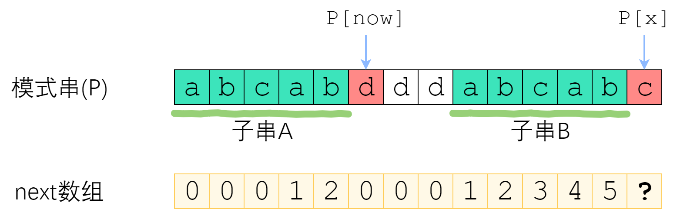
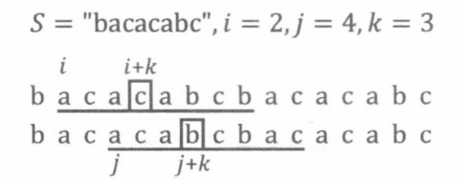

# KMP 模式匹配

KMP 算法，又称模式匹配算法，能够在线性时间内判定字符串 $A[1\sim N]$ 是否为字符串 $B[1\sim M]$ 的子串，并求出字符串 $A$ 在字符串 $B$ 中各次出现的位置。

首先，一个 $\mathrm{O}(NM)$ 的朴素做法是，尝试枚举字符串 $B$ 中的每个位置 $i$，把字符串 $A$ 与字符串 $B$ 的后缀 $B[i\sim M]$ 对齐，向后扫描逐一比较 $A[1]$ 与 $B[i]$, $A[2]$ 与 $B[i+1]$ 是否相等。我们把这种比较过程称为 $A$ 与 $B$ 尝试进行“匹配”。

其次，这个问题使用字符串 Hash 也能在线性时间内求解。通过上一节中的“兔子与兔子”这道例题，我们己经知道：可以在 $\mathrm{O}(N)$ 的时间内预处理一个字符串的所有前缀 Hash 值，并在 $\mathrm{O}(1)$ 的时间内查询该字符串任意一个子串的 Hash 值。所以，一个很直接的想法是：枚举字符串 $B$ 中的每个位置 $i(N \le i \le M)$，检査字符串 $A$ 的 Hash 值与字符串 $B$ 的子串 $B[i-N + 1\sim i]$ 的 Hash 值是否相同，即可得到该问题的解。

KMP 算法能够更高效、更准确地处理这个问题，并且能为我们提供一些额外的信息。

下面的内容来自 https://www.zhihu.com/question/21923021/answer/1032665486。

## 字符串匹配问题

 所谓字符串匹配，是这样一种问题：“字符串 P 是否为字符串 S 的子串？如果是，它出现在 S 的哪些位置？” 其中 $S$ 称为**主串**；$P$ 称为**模式串**。下面的图片展示了一个例子。


最朴素的字符串匹配算法 Brute-Force 如下：

1. 枚举 $i = 0, 1, 2 ... , len(S)-len(P)$

2. 将 $S[i : i+len(P)]$ 与 $P$ 作比较。如果一致，则找到了一个匹配。

现在我们来模拟 Brute-Force 算法，对主串 “AAAAAABC” 和模式串 “AAAB” 做匹配：


这是一个清晰明了的算法，实现也极其简单：

```java
void bruteForce(String S, String P) {
    for (int i = 0; i < S.length() - P.length() + 1; i++) {
        if (S.substring(i, i + P.length()).equals(P)) {
            System.out.println("pos = " + i);
        }
    }
}
```

考虑“字符串比较”这个小任务的复杂度。最坏情况发生在：两个字符串唯一的差别在最后一个字符。这种情况下，字符串比较必须走完整个字符串，才能给出结果，因此复杂度是 $\mathrm{O}(len)$ 的。　　

由此，不难想到 Brute-Force 算法所面对的最坏情况：主串形如“AAAAAAAAAAA...B”，而模式串形如“AAAAA...B”。每次字符串比较都需要付出 $|P|$ 次字符比较的代价，总共需要比较 $|S| - |P| + 1$次，因此总时间复杂度是  $\mathrm{O}(|P|\cdot (|S| - |P| + 1) )$ . 考虑到主串一般比模式串长很多，故 Brute-Force 的复杂度是 $\mathrm{O}(|P| \cdot |S|)$ ，也就是 $\mathrm{O}(nm)$ 的。这太慢了！

## Brute-Force 的改进思路

我们很难降低字符串比较的复杂度。因此，我们考虑**降低比较的趟数**。如果比较的趟数能降到足够低，那么总的复杂度也将会下降很多。要优化一个算法，首先要回答的问题是“我手上有什么信息？”　我们手上的信息是否足够、是否有效，决定了我们能把算法优化到何种程度。请记住：**尽可能利用残余的信息，是KMP算法的思想所在**。

在 Brute-Force 中，如果从 $S[i]$ 开始的那一趟比较失败了，算法会直接开始尝试从 $S[i+1]$ 开始比较。这种行为，属于典型的“没有从之前的错误中学到东西”。我们应当注意到，一次失败的匹配，会给我们提供宝贵的信息——如果 $S[i : i+len(P)]$ 与 $P$ 的匹配是在第 $r$ 个位置失败的，那么从 $S[i]$ 开始的 $r-1$ 个连续字符，一定与 $P$ 的前 $r-1$ 个字符一模一样！


需要实现的任务是“字符串匹配”，而每一次失败都会给我们换来一些信息——**能告诉我们，主串的某一个子串等于模式串的某一个前缀**。但是这又有什么用呢？

## 跳过不可能成功的字符串比较

有些趟字符串比较是有可能会成功的；有些则毫无可能。我们刚刚提到过，优化 Brute-Force 的路线是“尽量减少比较的趟数”，而如果我们跳过那些**绝不可能成功的**字符串比较，则可以希望复杂度降低到能接受的范围。

那么，哪些字符串比较是不可能成功的？来看一个例子。已知信息如下：

1. 模式串 $P = \,''abcab''$。
2. 和主串从 $S[0]$ 开始匹配时，在 $P[5]$ 处失配。


首先，利用上一节的结论。既然是在 $P[5]$ 失配的，那么说明 $S[0:5]$ 等于 $P[0:5]$，即 "abcab". 现在我们来考虑：从 $S[1]、S[2]、S[3]$ 开始的匹配尝试，有没有可能成功？

从 $S[1]$ 开始肯定没办法成功，因为 $S[1] = P[1] = \,'b'$，和 P[0] 并不相等。从 S[2] 开始也是没戏的，因为 $S[2] = P[2] = \,'\!c'$，并不等于 $P[0]$. 但是从 $S[3]$ 开始是有可能成功的——至少按照已知的信息，我们推不出矛盾。


带着“跳过不可能成功的尝试”的思想，我们来看 next 数组。

## next 数组

next 数组是对于模式串而言的。$P$ 的 next 数组定义为：$next[i]$ 表示 $P[0] \sim P[i]$ 这一个子串，使得**前 $k$ 个字符恰等于后 $k$ 个字符**的最大的 $k$. 特别地，k不能取 $i+1$（因为这个子串一共才 $i+1$ 个字符，自己肯定与自己相等，就没有意义了）。


如果把模式串视为一把标尺，在主串上移动，那么 Brute-Force 就是每次失配之后只右移一位；改进算法则是**每次失配之后，移很多位**，跳过那些不可能匹配成功的位置。但是该如何确定要移多少位呢？


在 $S[0]$ 尝试匹配，失配于 $S[3] \Leftrightarrow P[3]$ 之后，我们直接把模式串往右移了两位，让 $S[3]$ 对准 P[1]. 接着继续匹配，失配于 $S[8] \Leftrightarrow P[6]$, 接下来我们把 $P$ 往右平移了三位，把 $S[8]$ 对准 $P[3]$. 此后继续匹配直到成功。

我们应该如何移动这把标尺？**很明显，如图中蓝色箭头所示，旧的后缀要与新的前缀一致**（如果不一致，那就肯定没法匹配上了）！

回忆 next 数组的性质：$P[0]$ 到 $P[i]$ 这一段子串中，前 $next[i]$ 个字符与后 $next[i]$ 个字符一模一样。既然如此，如果失配在 $P[r]$, 那么 $P[0]\sim P[r-1]$ 这一段里面，**前 $next[r-1]$ 个字符恰好和后 $next[r-1]$ 个字符相等**——也就是说，我们可以拿长度为 $next[r-1]$ 的那一段前缀，来顶替当前后缀的位置，让匹配继续下去！


如上图所示，绿色部分是成功匹配，失配于红色部分。深绿色手绘线条标出了相等的前缀和后缀，**其长度为 next[右端]**. 由于手绘线条部分的字符是一样的，所以直接把前面那条移到后面那条的位置。因此说，**next 数组为我们如何移动标尺提供了依据**。接下来，我们实现这个优化的算法。

## 利用 next 数组进行匹配

了解了利用 next 数组加速字符串匹配的原理，我们接下来代码实现之。分为两个部分：**建立 next 数组、利用 next 数组进行匹配**。

首先是建立 next 数组。我们暂且用最朴素的做法，以后再回来优化：

```java
// 获取 next[i]
int getNextI(String P, int i) {
    for (int j = i; j > 0; j--) {
        if (P.substring(0, j) == P.substring(i - j + 1, i + 1)) {
            return j;
        }
    }
    return 0;
}

int[] getNext(String P) {
    int[] next = new int[P.length()];
    for (int i = 0; i < P.length(); i++) {
        next[i] = getNextI(P, i);
    }
    return next;
}
```

如上图代码所示，直接根据 next 数组的定义来建立 next 数组。不难发现它的复杂度是 $\mathrm{O}(m^2)$ 的。

接下来，实现利用 next 数组加速字符串匹配。代码如下：

```java
void search(String S, String P, int[] next) {
    int tar = 0; // tar: 主串中将要匹配的位置
    int pos = 0; // pos: 模式串中简要匹配的位置
    
    while (tar < S.length()) {
        // 若两个字相等，则 tar、pos 各进一步
        if (S.charAt(tar) == P.charAt(pos)) {
            tar++;
            pos++;
        } else if (pos != 0) { // 失配了。若 pos != 0，则依据 next 数组移动标尺
            pos = next[pos-1];
        } else { // next[0] 失配了，把标尺右移一位
            tar++;
        }
        
        // pos 走到了 P.length()，匹配成功
        if (pos == P.length()) {
            // 输出主串匹配起点，也就是 tar - pos
            System.out.println("pos = " + (tar - pos));
            // 移动标尺
            pos = next[pos-1];
        }
    }
}
```

如何分析这个字符串匹配的复杂度呢？乍一看，$pos$ 值可能不停地变成 $next[pos-1]$，代价会很高；但我们使用摊还分析，在上面代码的 while 循环中，$pos$ 的值不断减小，$pos = next[pos-1]$ 的执行次数不会超过每次开始失配开始时 $pos$ 的值与 $next[0]$ 失配了时 $pos$ 的值之差。而在每次 while 循环中，$pos$ 的值至多增加 1。因为 $pos$ 始终非负，所以在整个计算过程中，$pos$ 减小的幅度总和不会超过 $pos$ 增加的幅度总和。故 $pos$ 的总变化次数至多为 $2(n + m )$。

由此，复杂度是可以接受的，整个匹配算法的时间复杂度：$\mathrm{O}(n+m)$。

## 快速求 next 数组

终于来到了我们最后一个问题——如何快速构建 next 数组。首先说一句：快速构建 next 数组，是KMP算法的精髓所在，核心思想是“**P自己与自己做匹配**”。为什么这样说呢？回顾 next 数组的完整定义：

1. 定义 “$k$-前缀” 为一个字符串的前 $k$ 个字符； “$k$-后缀” 为一个字符串的后 $k$ 个字符。$k$ 必须小于字符串长度。
2. $next[x]$ 定义为： $P[0]~P[x]$ 这一段字符串，使得**$k$-前缀恰等于$k$-后缀**的最大的 $k$.

这个定义中，不知不觉地就包含了一个匹配——前缀和后缀相等。接下来，我们考虑采用递推的方式求出 next 数组。如果 $next[0], next[1], ... next[x-1]$ 均已知，那么如何求出 $next[x]$ 呢？

来分情况讨论。首先，已经知道了 $next[x-1]$（以下记为 $now$），如果 $P[x]$ 与 $P[now]$ 一样，那最长相等前后缀的长度就可以扩展一位，很明显 $next[x] = now + 1$. 图示如下。


刚刚解决了 $P[x] = P[now]$ 的情况。那如果 $P[x]$ 与 $P[now]$ 不一样，又该怎么办？



如图。长度为 $now$ 的子串 $A$ 和子串 $B$ 是 $P[0]~P[x-1]$ 中最长的公共前后缀。可惜 $A$ 右边的字符和 $B$ 右边的那个字符不相等，$next[x]$不能改成 $now+1$ 了。因此，我们应该**缩短这个now**，把它改成小一点的值，再来试试 $P[x]$ 是否等于 $P[now]$.

$now$ 该缩小到多少呢？显然，我们不想让 $now$ 缩小太多。因此我们决定，在保持“$P[0]\sim P[x-1]$ 的 $now$-前缀仍然等于 $now$-后缀”的前提下，让这个新的 $now$ 尽可能大一点。 $P[0]\sim P[x-1]$ 的公共前后缀，前缀一定落在串 $A$ 里面、后缀一定落在串 $B$ 里面。换句话讲：接下来 $now$ 应该改成：使得 **$A$ 的 $k$-前缀**等于 **$B$ 的 $k$-后缀** 的最大的 $k$.

您应该已经注意到了一个非常强的性质——**串 $A$ 和串 $B$ 是相同的**！$B$ 的后缀等于 $A$ 的后缀！因此，使得 $A$ 的 $k$-前缀等于 $B$ 的 $k$-后缀的最大的 $k$，其实就是串 $A$ 的最长公共前后缀的长度 —— $next[now-1]$！


来看上面的例子。当 $P[now]$ 与 $P[x]$ 不相等的时候，我们需要缩小 $now$——把 $now$ 变成 $next[now-1]$，直到 $P[now]=P[x]$ 为止。$P[now]=P[x]$ 时，就可以直接向右扩展了。代码实现如下：

```java
int[] buildNext(String P) {
    int[] next = new int[P.length()];
    for (int x = 1, now = 0; x < P.length();) {
        // 如果 P[now] == P[x]，则可以向右扩展一位
        if (P.charAt(now) == P.charAt(x)) {
            now++;
            next[x++] = now;
        } else if (now != 0) { // 缩小 now
            now = next[now-1];
        } else { // 无法再缩小，则 next[x] = 0
            x++;
        }
    }
    
    return next;
}
```

应用与之前类似的摊还分析，不难证明构建 next 数组的时间复杂度是 $\mathrm{O}(m)$ 的。至此，我们以 $\mathrm{O}(n+m)$ 的时间复杂度，实现了构建 next 数组、利用 next 数组进行字符串匹配。

需要注意 KMP 算法仅当模式串与主串存在许多部分匹配的情况下才显得比朴素匹配算法快得多。

## 习题 55：周期[^1]

如果一个字符串 $S$ 是由一个字符串 $T$ 重复 $K$ 次形成的，则称 $K$ 是 $S$ 的循环元。使 $K$ 最大的字符串 $T$ 称为 $S$ 的最小循环元，此时的 $K$ 称为最大循环次数。

我们希望知道一个 $N$ 位字符串 $S$，对于每一个从头开始的长度为 $i(i>1)$ 的前缀，前缀是否具有最小循环元。

- **输入格式**：

1. 输入包括多组测试数据，每组测试数据包括两行。

2. 第一行输入字符串 $S$ 的长度 $N$。

3. 第二行输入字符串 $S$。

4. 输入数据以只包括一个 0 的行作为结尾。

- **输出格式**：

1. 对于每组测试数据，第一行输出 `Test case #` 和测试数据的编号。

2. 接下来的每一行，输出具有循环节的前缀的长度 $i$ 和其对应 $K$，中间用一个空格隔开。

3. 前缀长度需要升序排列。

4. 在每组测试数据的最后输出一个空行。

- **数据范围**：

1. $2≤N≤1000000$

- 输入样例：

```
3
aaa
4
abcd
12
aabaabaabaab
0
```

- 输出样例：

```
Test case #1
2 2
3 3

Test case #2

Test case #3
2 2
6 2
9 3
12 4

```

## 拓展练习

1. [LeetCode 214. 最短回文串](https://leetcode-cn.com/problems/shortest-palindrome/)

# 最小表示法

给定一个字符串 $S[1\sim n]$, 如果我们不断把它的最后一个字符放到开头，最终会得到 $n$ 个字符串，称这 $n$ 个字符串是循环同构的。这些字符串中字典序最小的一个，称为字符串 $S$ 的最小表示。

例如 $S = \,^"\!abca^"$, 那么它的 4 个循环同构字符串为 $\,^"\!abca^",\,^"\!aabc^",\,^"\!caab^",\,^"\!bcaa^"$, $S$ 的最小表示为 $^"\!aabc^"$。与 $S$ 循环同构的字符串可以用该字符串在 $S$ 中的起始下标表示，因此我们用 $B[i]$ 来表示从 $i$ 开始的循环同构字符串，即 $S[i\sim n] +S[1\sim i-1]$。

如何求出一个字符串的最小表示？最朴素的方法是：按照定义，依次比较这 $n$ 个循环同构的字符串，找到其中字典序最小的一个。比较两个循环同构字符串 $B[i]$ 与 $B[j]$ 时，我们也采用直接向后扫描的方式，依次取 $k = 0,1,2,\cdots$，比较 $B[i+k]$ 与 $B[j + k]$ 是否相等，直至找到一个不相等的位置，从而确定 $B[i]$ 与 $B[j]$ 的大小关系。

实际上，一个字符串的最小表示可以在 $\mathrm{O}(n)$ 的线性时间内求出。我们首先把 $S$ 复制一份接在它的结尾，得到的字符串记为 $SS$。显然，$B[i] = SS[i\sim i+n-1]$。对于任意的 $i,j$，我们仔细观察 $B[i]$ 与 $B[j]$ 的比较过程：



如果在 $i + k$ 与 $j + k$ 处发现不相等，假设 $SS[i + k ] > SS[j + k]$, 那么我们当然可以得知 $B[i]$ 不是 $S$ 的最小表示（因为存在一个更小的循环同构串 $B[j]$）。除此之外，我们还可以得知 $B[i + 1]$, $B[i + 2]$, $\cdots$, $B[i + k ]$ 也都不是 $S$ 的最小表示。这是因为对于 $1 \le p \le k$，存在一个比 $B[i + p]$ 更小的循环同构串 $B[j + p]$（从 $i+p$ 与 $j+p$ 开始向后扫描，同样会在 $p = k$ 时发现不相等，并且 $SS[i + k] > SS[j + k]$）。

同理，如果 $SS[i+k]<SS[j + k]$，那么 $B[j],B[j + 1],\cdots,B[j+k]$ 都不是 $S$ 的最小表示，直接跳过这些位置，一定不会遗漏最小表示。

下面是求解最小表示法的过程：

1. 初始化 $i= 1,j=2$。
2. 通过直接向后扫描的方法，比较 $B[i]$ 与 $B[j]$ 两个循环同构串。
   1. 如果扫描了 $n$ 个字符后仍然相等，说明 $S$ 有更小的循环元（例如 $catcat$ 有循环元 $cat$)，并且该循环元已扫描完成，$B[min(i,j)]$ 即为最小表示，算法结束。
   2. 如果在 $i + k$ 与 $j + k$ 处发现不相等：
      1. 若 $SS[i + k ] > SS[j + k]$，令 $i=i+k+1$。若此时 $i=j$，再令 $i=i+1$。
      2. 若 $SS[i+k]<SS[j+k]$，令 $j=j+k+1$。若此时 $i=j$，再令 $j=j+1$。
3. 若 $i>n$ 或 $j >n$，则 $B[min(i,j)]$ 为最小表示；否则重复第 2 步。

该算法通过两个指针不断向后移动的形式，尝试比较每两个循环同构串的大小。利用上面的性质，及时排除掉不可能的选项。当其中一个移动到结尾时，就考虑过了所有可能的二元组 $(B[i],B[j])$, 从而得到了最小表示。

如果每次比较向后扫描了 $k$ 的长度，则 $i$ 或 $j$ 二者之一会向后移动 $k$, 而 $i$ 和 $j$ 合计一共最多向后移动 $2n$ 的长度，因此该算法的复杂度为  $\mathrm{O}(n)$。

```java
int i = 0, j = 1;
while (i < n && j < n) {
    int k = 0;
    for (; k < n && s[(i+k)%n] == s[(j+k)%n]; k++);
    if (k == n) // s 形如"catcat"，它的循环元己扫描完成
        break;
    if (s[(i+k)%n] > s[(j+k)%n) {
        i = i + k;
        if (i == j)
            i++;
    } else {
        j = j + k;
        if (i == j)
            j++;
    }
}
ans = min(i, j); // B[ans]是最小表示
```

# 拓展练习

1. [LeetCode 6. Z 字形变换](https://leetcode-cn.com/problems/zigzag-conversion/)
1. [LeetCode 43. 字符串相乘](https://leetcode-cn.com/problems/multiply-strings/)
1. [LeetCode 151. 翻转字符串里的单词](https://leetcode-cn.com/problems/reverse-words-in-a-string/)
1. [LeetCode 247. 中心对称数 II](https://leetcode-cn.com/problems/strobogrammatic-number-ii/)
1. [LeetCode 392. 判断子序列](https://leetcode-cn.com/problems/is-subsequence/)
1. [LeetCode 459. 重复的子字符串](https://leetcode-cn.com/problems/repeated-substring-pattern/)

# 题解

## 习题 55：周期

对字符串 $S$ 自匹配求出 $next$ 数组，根据定义，对于每个 $i$，$S[i - next[i] +1\sim i]$ 与 $S[1\sim next[i]]$ 是相等的，并且不存在更大的 $next$ 值满足这个条件。

$S[l\sim i]$ 具有长度为 $len <i$ 的循环元的充要条件是 $len$ 能整除 $i$ 并且 $S[len +1\sim i] = S[1\sim i-len]$。下面是证明：

先证必要性。设 $S[1\sim i]$ 具有长度为 $len$ 的循环元，显然 $len$ 能整除 $i$，并且 $S[1\sim i- len]$ 和 $S[len + 1\sim i]$ 都是由 $i /len-1$ 个循环元构成的。故 $S[1\sim i-len] = S[len +1\sim i]$。

再证充分性。设 $len$ 能整除 $i$ 并且 $S[len +1\sim i] = S[1\sim i-len]$。因为 $len <i$，所以 $S[1\sim i -len]$ 和 $S[len +1\sim i]$ 的长度不小于 $len$ 且是 $len$ 的倍数。二者各取前 $len$ 个字符，有 $S[1-len] = S[len +1\sim 2 * len]$ 依此类推，不断向后取 $len$ 个字符，可以发现 $S[1\sim i-len]$ 和 $S[len +1\sim i]$ 是以 $len$ 为间隔错位对齐的，如下图所示。故 $S[1\sim len]$ 是 $S$ 的循环元。


根据引理，当 $i-next[i]$ 能整除 $i$ 时， $S[1\sim i-next[i]]$ 就是 $S[1\sim i]$ 的最小循环元。它的最大循环次数就是 $i/(i-next[i])$, 其中 $i - next[i]$ 能整除 $i$ 的条件是为了保证循环元每次重复的完整性。例如上图中 $i= 7$ 时，最小循环元 "ab" 的 第 4 次重复就尚未完成。

进一步地，如果 $i-next[next[i]]$ 能整除 $i$，那么 $S[1\sim i-next[next[i]]]$就是 $S[1\sim i]$ 的次小循环元。依此类推，我们还可以找出 $S[1\sim i]$ 所有可能的循环元。


值得指出的一个性质是，一个字符串的任意循环元的长度必然是最小循环元长度的倍数。

```java
public void findCycleMetas() {
    Scanner in = new Scanner(System.in);
    for (int len = in.nextInt(), caseNum = 1; len != 0; len = in.nextInt()) {
        System.out.println("Test case #" + caseNum++);
        in.nextLine();
        char[] s = in.nextLine().toCharArray();
        int[] next = findNext(s);
        for (int i = 1; i < len; i++) {
            int l = i + 1, meta = l - next[i];
            if (next[i] > 0 && next[i] % meta == 0) {
                System.out.println(l + " " + l / meta);
            }
        }
        System.out.println();
    }
}

public static int[] findNext(char[] s) {
    final int n = s.length;
    int[] next = new int[n];
    for (int t = 1, nxt = 0; t < n;) {
        if (s[t] == s[nxt]) {
            next[t++] = ++nxt;
        } else if (nxt != 0) {
            nxt = next[nxt - 1];
        } else {
            t++;
        }
    }

    return next;
}
```


[^1]: https://www.acwing.com/problem/content/143/
