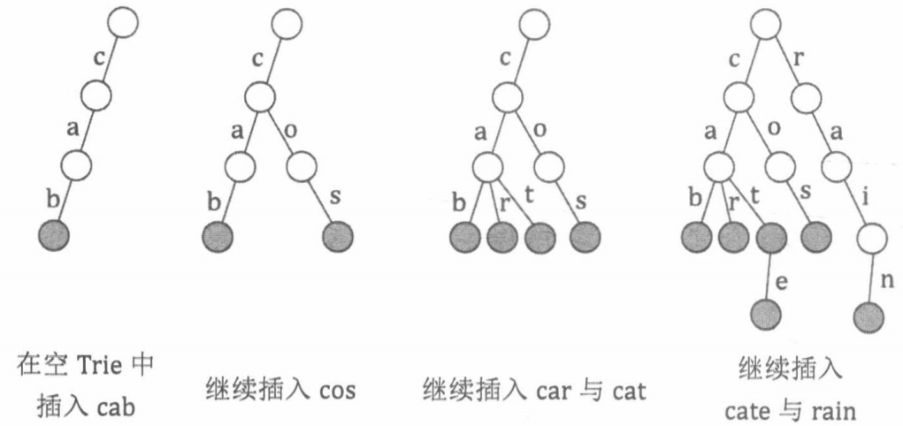

# 介绍

Trie（字典树）是一种用于实现字符串快速检索的多叉树结构。Trie 的每个节点都拥有若干个字符指针，若在插入或检穿字符串时扫描到一个字符 $c$，就沿着当前节点的 $c$ 字符指针，走向该指针指向的节点。下面我们来详细讨论 Trie 的基本操作过程。

## 初始化

一棵空 Trie 仅包含一个根节点，该点的字符指针均指向空。

## 插入

当需要插入一个字符串 $S$ 时，我们令一个指针 $P$ 起初指向根节点。然后，依次扫描 $S$ 中的每个字符 $c$：

1. 若 $P$ 的 $c$ 字符指针指向一个己经存在的节点 $Q$，则令 $P = Q$。
2. 若 $P$ 的 $c$ 字符指针指向空，则新建一个节点 $Q$，令 $P$ 的 $c$ 字符指针指向 $Q$，然后令 $P = Q$。

当 $S$ 中的字符扫描完毕时，在当前节点 $P$ 上标记它是一个字符串的末尾。

## 检索

当需要检索一个字符串 $S$ 在 Trie 中是否存在时，我们令一个指针 $P$ 起初指向根节点，然后依次扫描 $S$ 中的每个字符 $c$：

1. 若 $P$ 的 $c$ 字符指针指向空，则说明 $S$ 没有被插入过 Trie, 结束检索。
2. 若 $P$ 的 $c$ 字符指针指向一个己经存在的节点 $Q$，则令 $P = Q$。

当 $S$ 中的字符扫描完毕时，若当前节点 $P$ 被标记为一个字符串的末尾，则说明 $S$ 在 Trie 中存在，否则说明 $S$ 没有被插入过 Trie。

## 结论



在上图所示的例子中，需要插入和检索的字符串都由小写字母构成，所以 Trie 的每个节点具有 26 个字符指针，分别为 $a$ 到 $z$。上图展示了在一棵空 Trie 中依次插入 “cab” “cos” “car” “cat” “cate” 和 “rain” 后的 Trie 的形态，灰色标记了单词的末尾节点。

可以看出在 Trie 中，字符数据都体现在树的边（指针）上，树的节点仅保存—些额外信息，例如单词结尾标记等。其空间复杂度是 $\mathrm{O}(NC)$, 其中 $N$ 是节点个数, $C$ 是字符集的大小。

下面是 Trie 的代码：

```java
int[][] trie = new int[SIZE][26];
boolean[] end = new boolean[SIZE];
int tot = 1;

void insert(String s) {
    int len = s.length(), p = 1;
    for (int k = 0; k < len; k++) {
        int ch = s.charAt(k) - 'a';
        if (trie[p][ch] == 0) {
            trie[p][ch] = ++tot;
        }
        p = trie[p][ch];
    }
    end[p] = true;
}

boolean search(String s) {
    int len = s.length(), p = 1;
    for (int k = 0; k < len; k++) {
        p = trie[p][s.charAt(k) - 'a'];
        if (p == 0) {
            return false;
        }
    }
    return end[p];
}
```

也可以使用链式结构和 Map 构造。

# 例题

## 习题 56：前缀统计[^1]

给定 $N$ 个字符串 $S_1,S_2…S_N$，接下来进行 $M$ 次询问，每次询问给定一个字符串 $T$，求 $S_1∼S_N$ 中有多少个字符串是 $T$ 的前缀。

输入字符串的总长度不超过 $10^6$，仅包含小写字母。

**输入格式**：

1. 第一行输入两个整数 $N$，$M$。

2. 接下来 $N$ 行每行输入一个字符串 $S_i$。

3. 接下来 $M$ 行每行一个字符串 $T$ 用以询问。

**输出格式**：

1. 对于每个询问，输出一个整数表示答案。

2. 每个答案占一行。

**数据范围**：

1. $1≤N,M≤10^5$

**输入样例**：

```
3 2
ab
bc
abc
abc
efg
```

**输出样例**：

```
2
0
```


# 题解

## 习题 56：前缀统计


[^1]: https://www.acwing.com/problem/content/144/